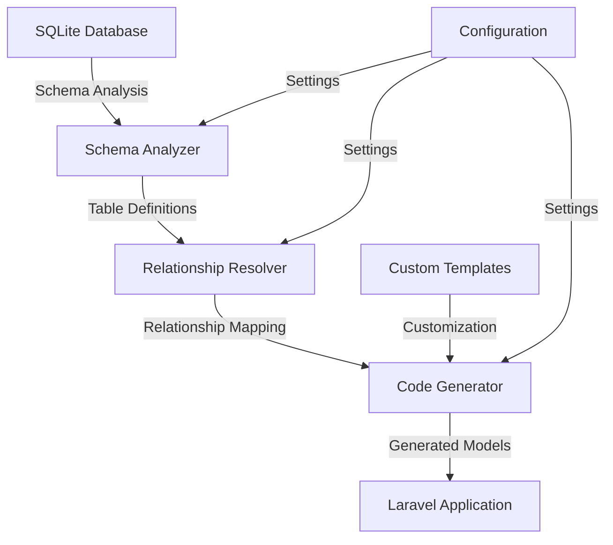
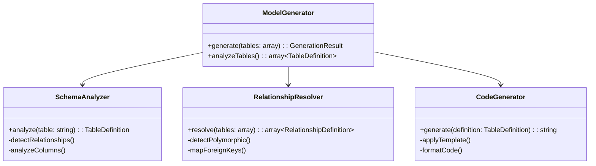
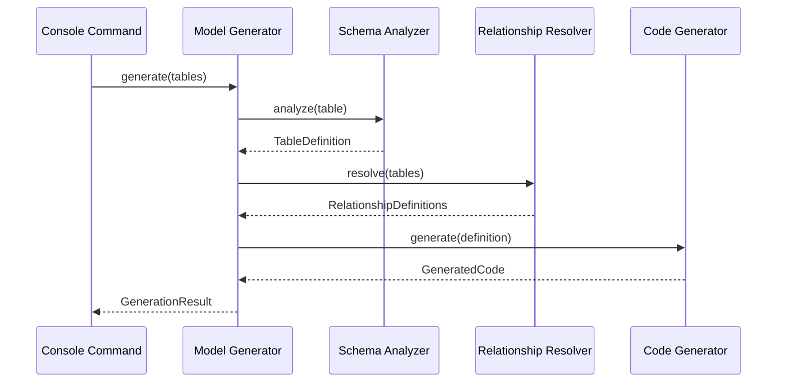

# SAC Eloquent Model Generator Documentation

## Table of Contents

1. [Overview and Architecture](#1-overview-and-architecture)
   1.1. [Introduction](#11-introduction)
   1.2. [Key Features](#12-key-features)
   1.3. [Architecture Overview](#13-architecture-overview)
   1.4. [Design Principles](#14-design-principles)

2. [Getting Started](#2-getting-started)
   2.1. [System Requirements](#21-system-requirements)
   2.2. [Installation](#22-installation)
   2.3. [Quick Start Guide](#23-quick-start-guide)
   2.4. [Basic Usage](#24-basic-usage)

3. [Technical Design](#3-technical-design)
   3.1. [Core Components](#31-core-components)
   3.2. [Domain Model](#32-domain-model)
   3.3. [Service Layer](#33-service-layer)
   3.4. [Integration Points](#34-integration-points)

4. [Features and Capabilities](#4-features-and-capabilities)
   4.1. [Schema Analysis](#41-schema-analysis)
   4.2. [Model Generation](#42-model-generation)
   4.3. [Relationship Detection](#43-relationship-detection)
   4.4. [Documentation Generation](#44-documentation-generation)

5. [Implementation Guide](#5-implementation-guide)
   5.1. [Configuration](#51-configuration)
   5.2. [Custom Templates](#52-custom-templates)
   5.3. [Event Handling](#53-event-handling)
   5.4. [Error Handling](#54-error-handling)

6. [API Reference](#6-api-reference)
   6.1. [Public Interfaces](#61-public-interfaces)
   6.2. [Service Contracts](#62-service-contracts)
   6.3. [Value Objects](#63-value-objects)
   6.4. [Events](#64-events)

7. [Advanced Usage](#7-advanced-usage)
   7.1. [Custom Type Mappings](#71-custom-type-mappings)
   7.2. [Relationship Customization](#72-relationship-customization)
   7.3. [Queue Integration](#73-queue-integration)
   7.4. [Extension Points](#74-extension-points)

8. [Testing and Quality](#8-testing-and-quality)
   8.1. [Testing Strategy](#81-testing-strategy)
   8.2. [Test Coverage](#82-test-coverage)
   8.3. [Performance Testing](#83-performance-testing)
   8.4. [Security Testing](#84-security-testing)

9. [Development Workflow](#9-development-workflow)
   9.1. [Setup Development Environment](#91-setup-development-environment)
   9.2. [Coding Standards](#92-coding-standards)
   9.3. [Git Workflow](#93-git-workflow)
   9.4. [CI/CD Pipeline](#94-cicd-pipeline)

10. [Troubleshooting](#10-troubleshooting)
    10.1. [Common Issues](#101-common-issues)
    10.2. [Error Messages](#102-error-messages)
    10.3. [Debug Mode](#103-debug-mode)
    10.4. [Support Channels](#104-support-channels)

11. [Contributing](#11-contributing)
    11.1. [Contribution Guidelines](#111-contribution-guidelines)
    11.2. [Development Setup](#112-development-setup)
    11.3. [Pull Request Process](#113-pull-request-process)
    11.4. [Code Review Guidelines](#114-code-review-guidelines)

12. [Security](#12-security)
    12.1. [Security Policy](#121-security-policy)
    12.2. [Best Practices](#122-best-practices)
    12.3. [Vulnerability Reporting](#123-vulnerability-reporting)
    12.4. [Security Updates](#124-security-updates)

13. [Performance](#13-performance)
    13.1. [Optimization Guidelines](#131-optimization-guidelines)
    13.2. [Benchmarks](#132-benchmarks)
    13.3. [Memory Management](#133-memory-management)
    13.4. [Scaling Strategies](#134-scaling-strategies)

14. [Migration Guide](#14-migration-guide)
    14.1. [Version Compatibility](#141-version-compatibility)
    14.2. [Breaking Changes](#142-breaking-changes)
    14.3. [Upgrade Steps](#143-upgrade-steps)
    14.4. [Rollback Procedures](#144-rollback-procedures)

15. [Release Notes](#15-release-notes)
    15.1. [Version History](#151-version-history)
    15.2. [Current Release](#152-current-release)
    15.3. [Deprecation Notices](#153-deprecation-notices)
    15.4. [Future Roadmap](#154-future-roadmap)

## 1. Overview and Architecture

### 1.1. Introduction

The SAC Eloquent Model Generator is a powerful Laravel package designed to automate the generation of Eloquent models by analyzing your SQLite database schema. It provides a robust, extensible solution for maintaining your application's data layer with minimal manual intervention.

### 1.2. Key Features

- **Automated Schema Analysis**: Introspects SQLite database structure
- **Smart Relationship Detection**: Identifies and maps table relationships
- **Polymorphic Support**: Handles complex polymorphic relationships
- **Custom Templates**: Supports customizable model generation templates
- **Documentation Generation**: Produces comprehensive model documentation
- **Queue Integration**: Supports background processing for large schemas
- **Event System**: Provides hooks for custom processing logic
- **Extensible Architecture**: Allows for custom type mappings and relationships

### 1.3. Architecture Overview

The package follows a Domain-Driven Design approach with clear separation of concerns:

### 1.4. Design Principles

The package adheres to the following design principles:

1. **Single Responsibility**: Each component has a focused purpose
2. **Open/Closed**: Extensible through interfaces and contracts
3. **Interface Segregation**: Clean, focused service contracts
4. **Dependency Inversion**: Flexible dependency management
5. **Immutable Value Objects**: Thread-safe data structures

[Continue to Getting Started →](./getting-started.md)
