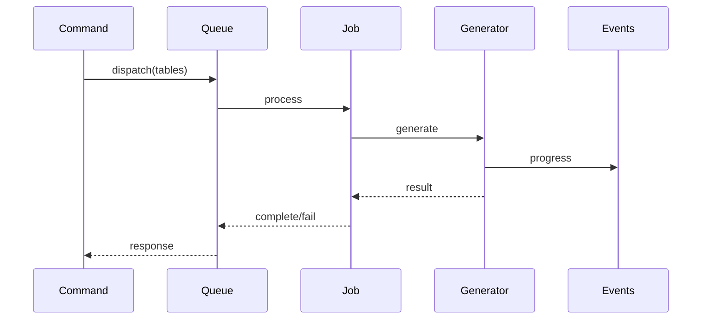

# Advanced Usage

## 7.1. Custom Type Mappings

### Database Type Mapping

Define custom database type to PHP type mappings:

```php
// config/model-generator.php
return [
    'type_mappings' => [
        'database_types' => [
            'point' => 'array',
            'geometry' => 'array',
            'json_array' => 'array',
            'enum' => 'string',
        ],
        'custom_casts' => [
            'point' => 'App\\Casts\\PointCast',
            'geometry' => 'App\\Casts\\GeometryCast',
            'money' => 'App\\Casts\\MoneyCast',
        ],
    ],
];
```

### Custom Cast Implementation

```php
namespace App\Casts;

use Illuminate\Contracts\Database\Eloquent\CastsAttributes;

class PointCast implements CastsAttributes
{
    public function get($model, string $key, $value, array $attributes)
    {
        if ($value === null) {
            return null;
        }

        $coordinates = json_decode($value, true);
        return new Point($coordinates['x'], $coordinates['y']);
    }

    public function set($model, string $key, $value, array $attributes)
    {
        if ($value === null) {
            return null;
        }

        return json_encode([
            'x' => $value->x,
            'y' => $value->y,
        ]);
    }
}
```

## 7.2. Relationship Customization

### Custom Relationship Detection

```php
namespace App\Services;

use SAC\EloquentModelGenerator\Services\Contracts\RelationshipResolverInterface;

class CustomRelationshipResolver implements RelationshipResolverInterface
{
    public function resolve(array $tables): array
    {
        return array_map(function ($table) {
            return $this->detectCustomRelationships($table);
        }, $tables);
    }

    private function detectCustomRelationships($table): array
    {
        // Custom relationship detection logic
        return [
            new RelationshipDefinition(
                type: RelationType::CUSTOM,
                localKey: 'id',
                foreignKey: 'reference_id',
                relatedTable: 'related_table'
            ),
        ];
    }
}
```

### Relationship Templates

```php
// resources/views/vendor/model-generator/relationships/custom.stub
/**
 * Custom relationship with {{ relatedModel }}.
 *
 * @return \Illuminate\Database\Eloquent\Relations\Custom
 */
public function {{ methodName }}()
{
    return $this->custom({{ parameters }});
}
```

## 7.3. Queue Integration

### Job Configuration

```php
namespace App\Jobs;

use SAC\EloquentModelGenerator\Jobs\GenerateModelJob;

class CustomGenerateModelJob extends GenerateModelJob
{
    public $timeout = 300;
    public $tries = 3;
    public $backoff = [60, 120, 300];
    public $maxExceptions = 3;

    public function tags()
    {
        return ['model-generator', ...$this->tables];
    }

    public function middleware()
    {
        return [new WithoutOverlapping($this->tables[0])];
    }
}
```

### Queue Processing



### Progress Monitoring

```php
use SAC\EloquentModelGenerator\Events\ModelGenerationProgressEvent;

class ProgressMonitor
{
    public function handle(ModelGenerationProgressEvent $event)
    {
        $progress = round($event->getProgress());
        $remaining = $event->getRemainingCount();

        if ($event->isComplete) {
            $this->notifyCompletion($event->result);
        } else {
            $this->updateProgress($progress, $remaining);
        }
    }
}
```

## 7.4. Extension Points

### Custom Model Generator

```php
namespace App\Services;

use SAC\EloquentModelGenerator\Contracts\ModelGeneratorInterface;
use SAC\EloquentModelGenerator\Domain\ValueObjects\GenerationResult;

class CustomModelGenerator implements ModelGeneratorInterface
{
    public function generate(array $tables, array $options = []): GenerationResult
    {
        // Custom generation logic
        return new GenerationResult(
            generatedFiles: $files,
            errors: $errors,
            metadata: [
                'custom_data' => $customData,
            ],
        );
    }

    public function analyzeTables(): array
    {
        // Custom analysis logic
        return array_map(
            fn ($table) => $this->analyzeTable($table),
            $this->getTables()
        );
    }
}
```

### Custom Code Generator

```php
namespace App\Services;

use SAC\EloquentModelGenerator\Services\Contracts\CodeGeneratorInterface;

class CustomCodeGenerator implements CodeGeneratorInterface
{
    public function generate(TableDefinition $definition): string
    {
        // Load custom template
        $template = $this->loadTemplate('custom-model');

        // Apply custom transformations
        $transformations = [
            '{{ namespace }}' => $this->getNamespace(),
            '{{ className }}' => $this->getClassName($definition),
            '{{ customLogic }}' => $this->generateCustomLogic($definition),
        ];

        return $this->applyTransformations($template, $transformations);
    }
}
```

### Service Provider Registration

```php
namespace App\Providers;

use Illuminate\Support\ServiceProvider;
use SAC\EloquentModelGenerator\Contracts\ModelGeneratorInterface;
use App\Services\CustomModelGenerator;

class ModelGeneratorServiceProvider extends ServiceProvider
{
    public function register(): void
    {
        $this->app->bind(ModelGeneratorInterface::class, function ($app) {
            return new CustomModelGenerator(
                analyzer: $app->make(CustomSchemaAnalyzer::class),
                resolver: $app->make(CustomRelationshipResolver::class),
                generator: $app->make(CustomCodeGenerator::class),
            );
        });
    }
}
```

### Custom Event Listeners

```php
namespace App\Listeners;

use SAC\EloquentModelGenerator\Events\ModelGenerationProgressEvent;
use Illuminate\Contracts\Queue\ShouldQueue;

class ModelGenerationListener implements ShouldQueue
{
    public function handle(ModelGenerationProgressEvent $event): void
    {
        if ($event->isComplete) {
            $this->handleCompletion($event);
        } elseif (!$event->isSuccessful()) {
            $this->handleError($event);
        } else {
            $this->handleProgress($event);
        }
    }

    private function handleCompletion(ModelGenerationProgressEvent $event): void
    {
        $result = $event->getResult();

        // Process completion
        foreach ($result->generatedFiles as $file) {
            // Post-processing
        }
    }
}
```

[← Back to API Reference](./api-reference.md) | [Continue to Testing and Quality →](./testing.md)
