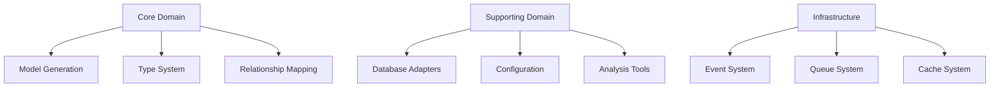

# Architecture

This section explains the architectural design and principles of the Eloquent Model Generator.

## Core Architecture

### [Design Overview](./design.md)
Understand the overall architecture and design decisions.
- Domain-Driven Design
- SOLID principles
- Laravel integration
- Package structure

### [Event Architecture](./event-architecture.md)
Learn about the event-driven system.
- Domain events
- Event listeners
- Queue system
- Event sourcing

### [Functional Patterns](./functional-patterns.md)
Explore functional programming patterns used.
- Immutability
- Pure functions
- Function composition
- Error handling

## Architectural Principles

### Domain-Driven Design


### SOLID Principles

1. **Single Responsibility**
```php
// Each class has one reason to change
class TypeResolver
{
    public function resolveType(Column $column): Type
    {
        // Type resolution logic only
    }
}
```

2. **Open/Closed**
```php
// Extend through abstractions
interface DatabaseAdapter
{
    public function getSchema(): SchemaDefinition;
}

class MySQLAdapter implements DatabaseAdapter
{
    public function getSchema(): SchemaDefinition
    {
        // MySQL-specific implementation
    }
}
```

3. **Liskov Substitution**
```php
// Subtypes are substitutable
class BaseAdapter implements DatabaseAdapter
{
    public function getSchema(): SchemaDefinition
    {
        return $this->analyzeSchema();
    }
}

class PostgreSQLAdapter extends BaseAdapter
{
    protected function analyzeSchema(): SchemaDefinition
    {
        // PostgreSQL-specific analysis
    }
}
```

4. **Interface Segregation**
```php
interface SchemaAnalyzer
{
    public function analyzeTable(string $table): TableDefinition;
}

interface RelationshipDetector
{
    public function detectRelationships(string $table): array;
}
```

5. **Dependency Inversion**
```php
class ModelGenerator
{
    public function __construct(
        private readonly TypeResolver $typeResolver,
        private readonly RelationshipDetector $relationshipDetector
    ) {}
}
```

## Component Interaction

### Service Layer
- Command handling
- Event dispatching
- Queue processing
- Cache management

### Domain Layer
- Model generation
- Type resolution
- Relationship mapping
- Validation rules

### Infrastructure Layer
- Database adapters
- File system
- Event system
- Cache system

## Best Practices

1. Code Organization
   - Clear boundaries
   - Proper namespacing
   - Consistent structure
   - Dependency management

2. Event Handling
   - Domain events
   - Event sourcing
   - Queue processing
   - Error handling

3. Testing Strategy
   - Unit tests
   - Integration tests
   - Event testing
   - Performance testing

## Implementation Guidelines

1. Service Implementation
   - Use dependency injection
   - Follow SOLID principles
   - Implement interfaces
   - Document behavior

2. Event Implementation
   - Define clear events
   - Handle failures
   - Queue long operations
   - Maintain consistency

3. Testing Implementation
   - Test each layer
   - Mock dependencies
   - Check edge cases
   - Verify events

## Next Steps

- Explore [Features](../features/index.md)
- Read [Development Guide](../development/index.md)
- Check [Advanced Topics](../advanced/index.md)
