# Architecture Overview

## System Architecture

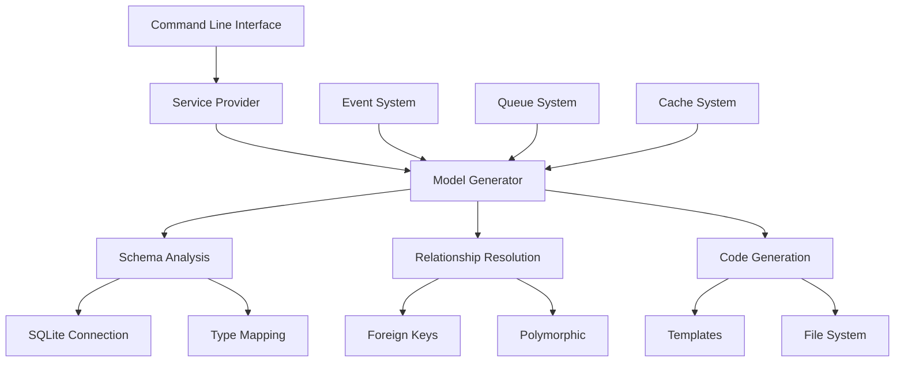

## Core Components

### Domain Layer

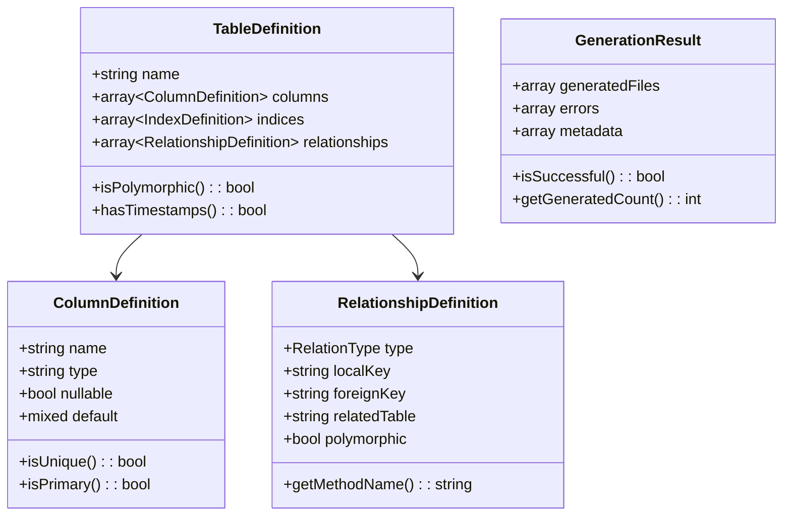

### Service Layer

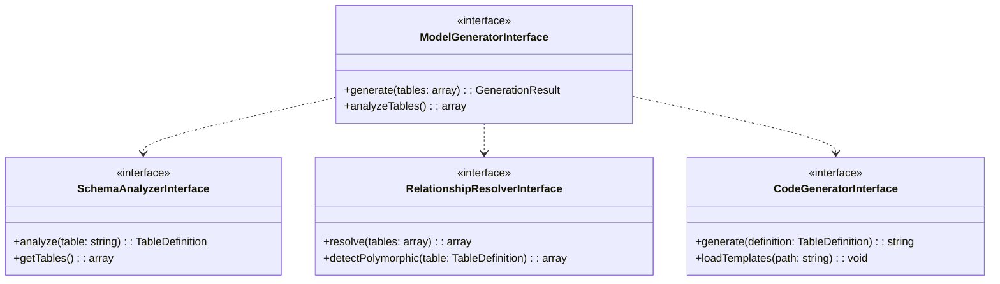

## Data Flow

### Model Generation Process

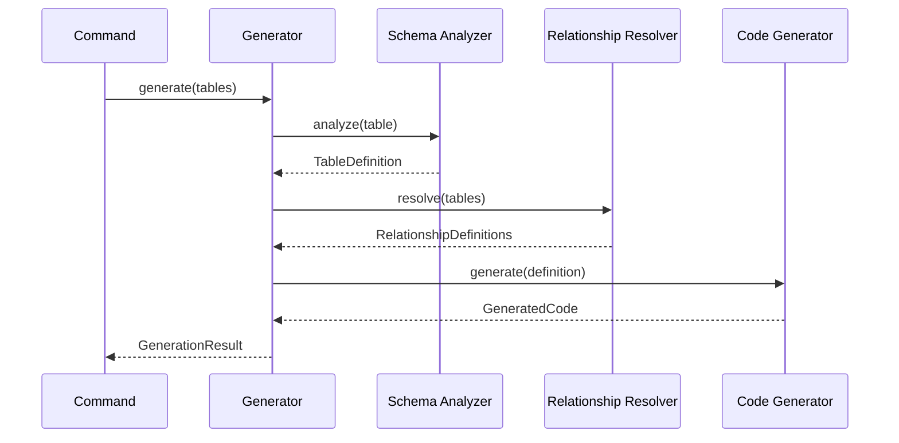

## Integration Points

### Laravel Integration

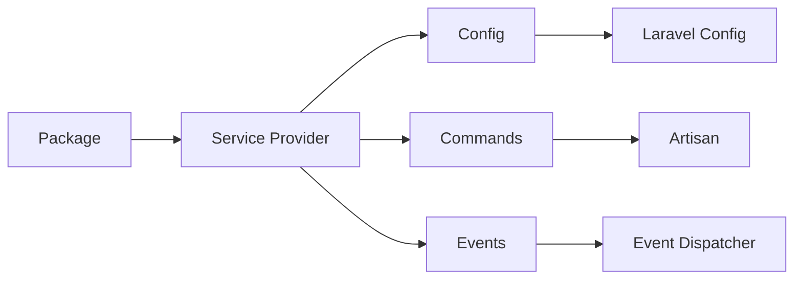

### Event System

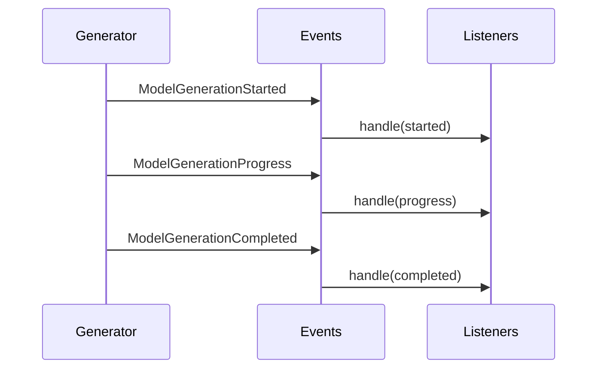

## Security Architecture

### File System Security

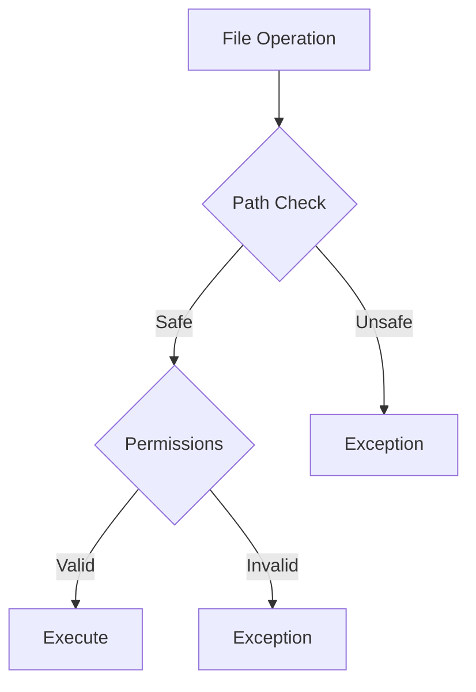

### Input Validation

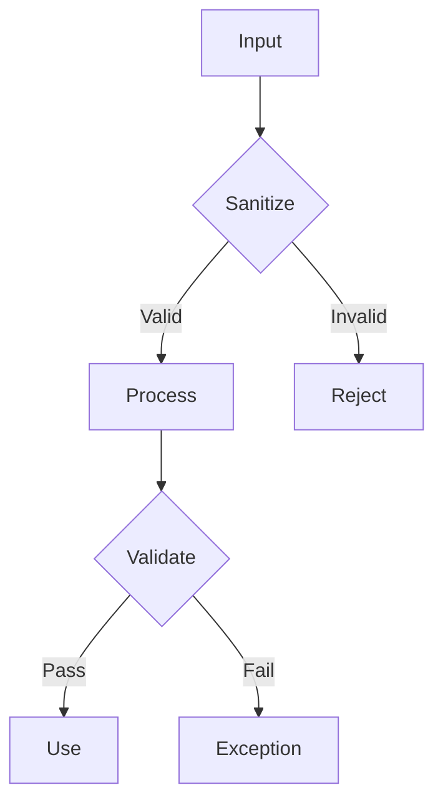

## Performance Considerations

### Memory Management

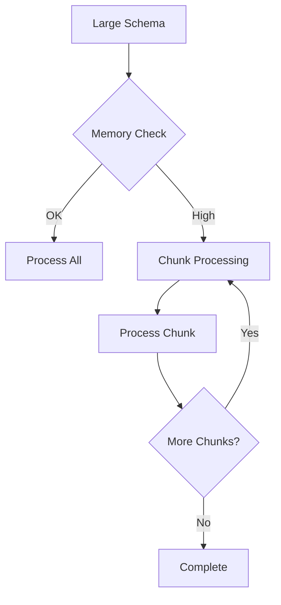

### Caching Strategy

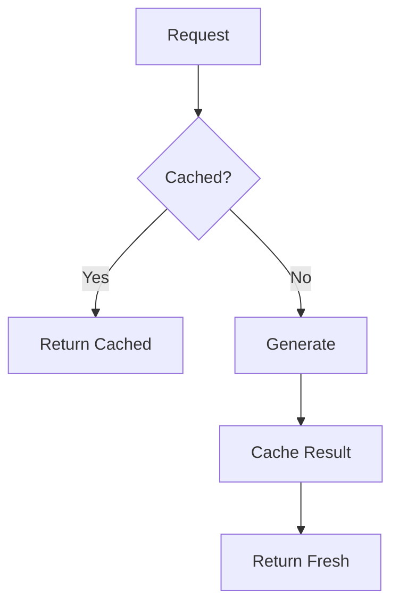

## Configuration Architecture

### Configuration Hierarchy

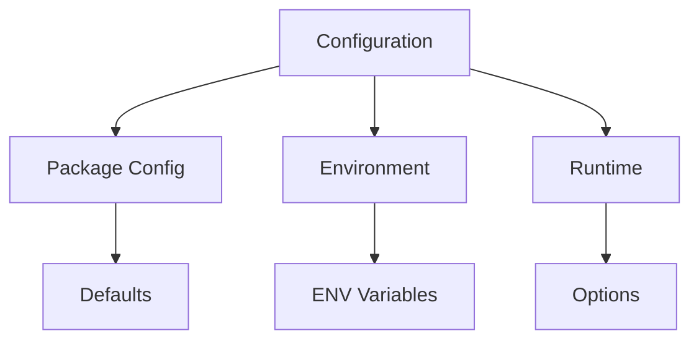

## Testing Architecture

### Test Pyramid

```mermaid
pyramid-schema
    Unit Tests: 60
    Integration Tests: 30
    End-to-End Tests: 10
```

[← Back to Documentation](../index.md) | [Continue to Components →](components.md)
