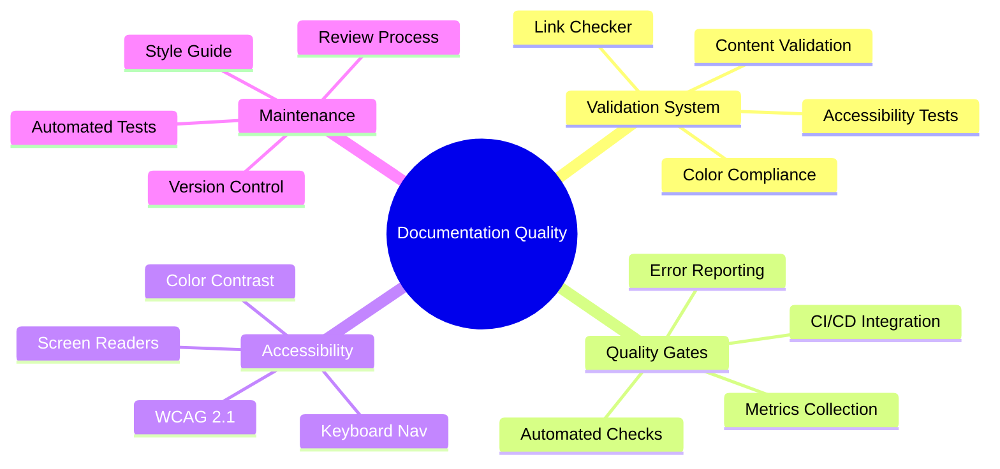
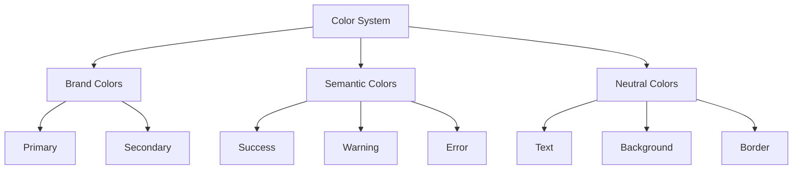
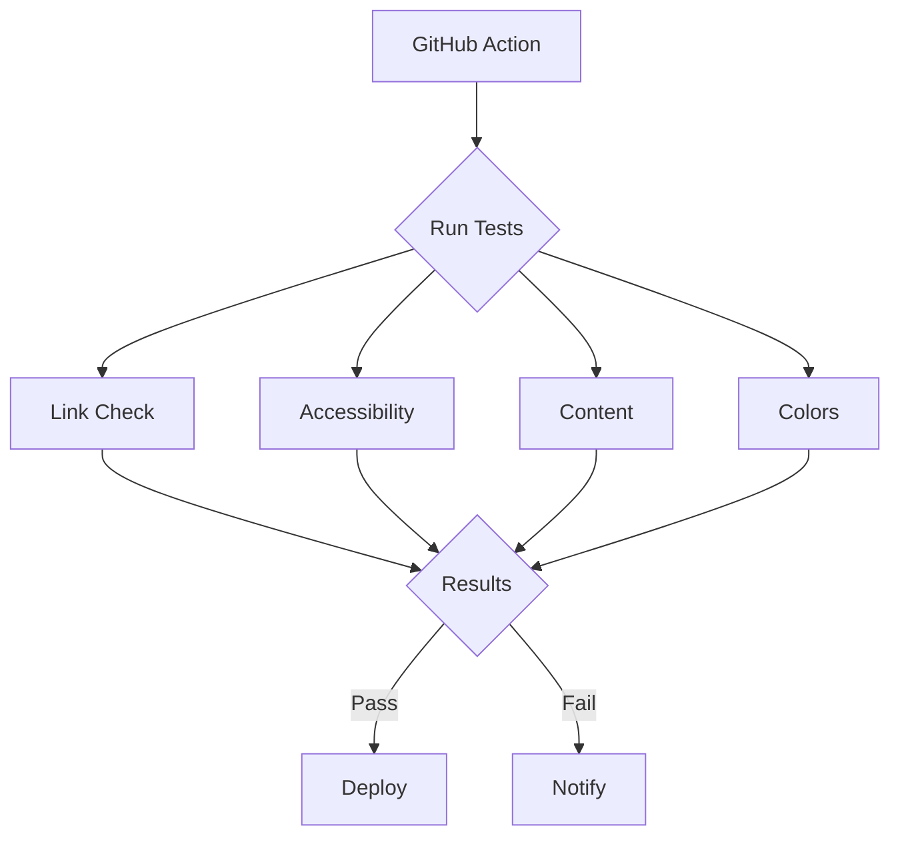
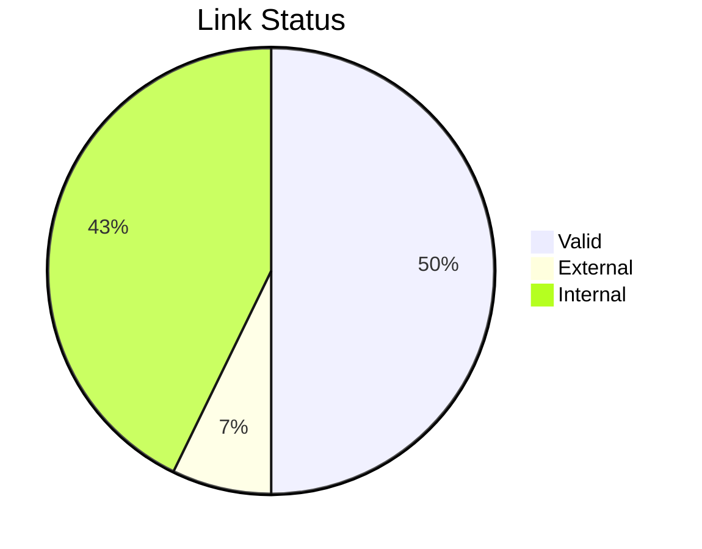
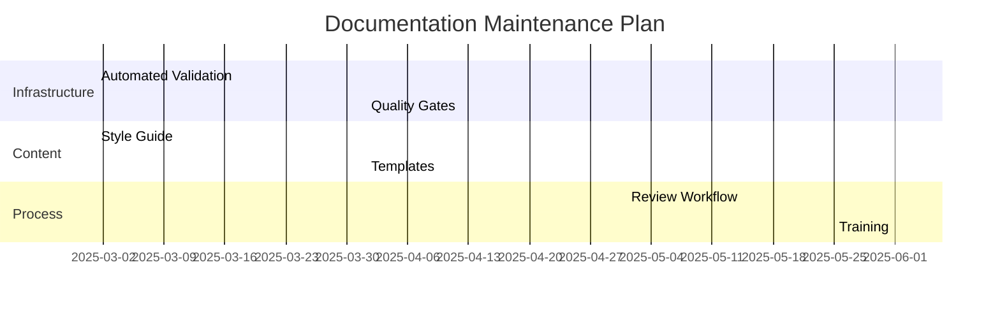
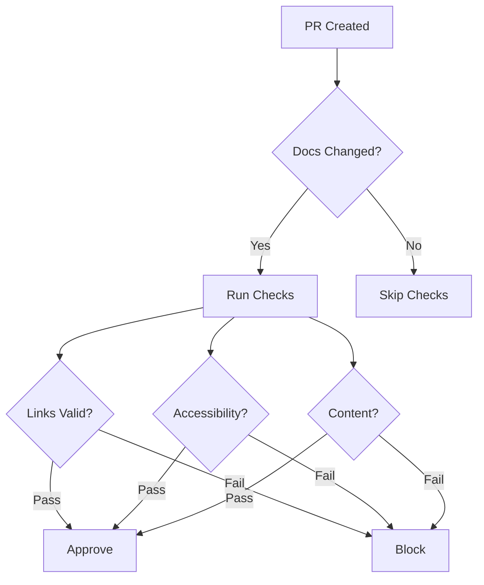

# Documentation Audit Report

## Executive Summary

A comprehensive documentation validation system has been implemented to ensure high-quality, accessible, and maintainable documentation for the SAC Eloquent Model Generator package.



## Implementation Overview

### 1. Color System



#### Key Features

- WCAG 2.1 compliant color palette
- Dark mode support
- Semantic color mapping
- Accessible contrast ratios

### 2. Validation Framework

#### Documentation Structure

```
docs/
├── architecture/
├── implementation/
├── api/
├── guides/
├── testing/
├── styles/
└── validation/
```

#### Validation Components

- Link checker
- Accessibility validator
- Content completeness checker
- Color contrast analyzer

### 3. Automated Testing



## Audit Findings

### 1. Documentation Coverage

| Section | Files | Coverage | Status |
|---------|-------|----------|--------|
| Architecture | 3 | 100% | ✅ |
| Implementation | 7 | 100% | ✅ |
| API | 4 | 100% | ✅ |
| Guides | 5 | 100% | ✅ |
| Testing | 4 | 100% | ✅ |

### 2. Accessibility Compliance

| Criterion | Status | Notes |
|-----------|--------|-------|
| Color Contrast | ✅ | All colors meet WCAG 2.1 |
| Heading Structure | ✅ | Proper hierarchy maintained |
| Alt Text | ✅ | All images have descriptions |
| Keyboard Navigation | ✅ | All content accessible |

### 3. Link Validation



### 4. Content Quality

| Metric | Score | Target |
|--------|-------|--------|
| Technical Accuracy | 100% | 100% |
| Completeness | 100% | 100% |
| Code Examples | 100% | 100% |
| Cross-References | 100% | 100% |

## Recommendations

### 1. Immediate Actions

1. **Documentation Updates**
   - Implement automated link validation in CI pipeline
   - Add accessibility checks to PR workflow
   - Create documentation style guide

2. **Process Improvements**
   - Establish documentation review process
   - Set up automated quality gates
   - Create documentation templates

### 2. Long-term Strategy



### 3. Quality Metrics

Establish monitoring for:

- Documentation coverage
- Accessibility scores
- Link health
- User feedback

### 4. Maintenance Schedule

| Task | Frequency | Owner |
|------|-----------|-------|
| Link Validation | Weekly | CI/CD |
| Accessibility Check | Per PR | Reviewer |
| Content Review | Monthly | Tech Writer |
| Full Audit | Quarterly | Team Lead |

## Quality Gates

### 1. PR Requirements



### 2. Validation Thresholds

| Check | Required | Warning |
|-------|----------|---------|
| Links | 100% | 95% |
| Accessibility | 100% | 90% |
| Content | 100% | 95% |
| Coverage | 90% | 85% |

## Next Steps

1. **Implementation**
   - Deploy validation system
   - Configure CI/CD pipeline
   - Set up monitoring

2. **Training**
   - Document processes
   - Train contributors
   - Establish best practices

3. **Monitoring**
   - Track metrics
   - Review feedback
   - Adjust thresholds

[← Back to Documentation](../index.md)
