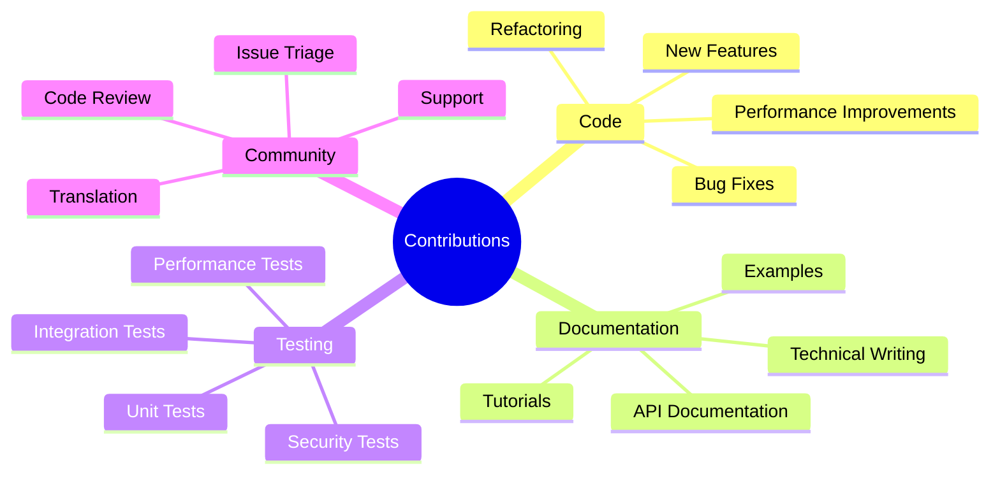
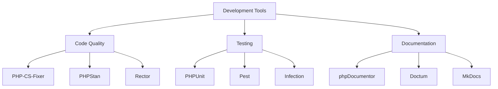
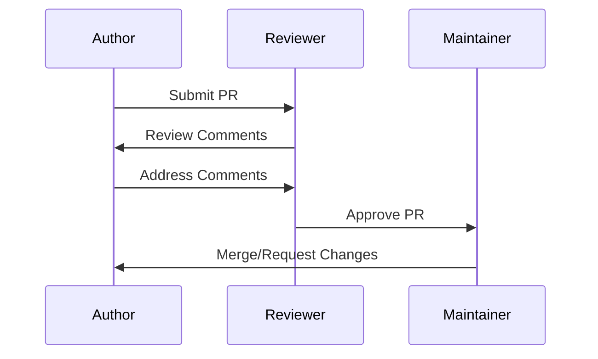

# Contributing

## 11.1. Contribution Guidelines

### Code of Conduct

We are committed to fostering an open and welcoming environment. All participants in our project are expected to adhere to our Code of Conduct:

- Be respectful and inclusive
- Exercise empathy and kindness
- Focus on constructive feedback
- Maintain professional discourse
- Respect project decisions

### Types of Contributions



## 11.2. Development Setup

### Local Environment

1. **Fork and Clone**

```bash
# Fork the repository on GitHub
git clone https://github.com/your-username/eloquent-model-generator.git
cd eloquent-model-generator
```

2. **Install Dependencies**

```bash
composer install
composer install-dev-tools
```

3. **Set Up Development Environment**

```bash
# Create test database
touch database/database.sqlite

# Configure environment
cp .env.example .env
php artisan key:generate

# Set up git hooks
composer setup-hooks
```

### Development Tools



## 11.3. Pull Request Process

### Step-by-Step Guide

1. **Create Feature Branch**

```bash
git checkout -b feature/your-feature-name
```

2. **Make Changes**

- Follow coding standards
- Write tests
- Update documentation

3. **Commit Changes**

```bash
# Stage changes
git add .

# Commit with conventional commit message
git commit -m "feat(scope): description"
```

4. **Push Changes**

```bash
git push origin feature/your-feature-name
```

5. **Create Pull Request**

- Use PR template
- Link related issues
- Add description

### PR Checklist

```markdown
- [ ] Tests added/updated
- [ ] Documentation updated
- [ ] Changelog updated
- [ ] Code style checked
- [ ] Static analysis passed
- [ ] Security checks passed
```

## 11.4. Code Review Guidelines

### Review Process



### Review Criteria

1. **Code Quality**

```php
// Good
final class ModelGenerator
{
    public function __construct(
        private readonly SchemaAnalyzerInterface $analyzer,
    ) {}
}

// Bad
class ModelGenerator
{
    private $analyzer;

    public function __construct($analyzer)
    {
        $this->analyzer = $analyzer;
    }
}
```

2. **Test Coverage**

```php
class ModelGeneratorTest extends TestCase
{
    #[Test]
    public function it_generates_models(): void
    {
        // Arrange
        $generator = new ModelGenerator($analyzer);

        // Act
        $result = $generator->generate(['users']);

        // Assert
        expect($result->isSuccessful())->toBeTrue();
        expect($result->generatedFiles)->toHaveCount(1);
    }
}
```

3. **Documentation**

```php
/**
 * Generate Eloquent models from table definitions.
 *
 * @param array<string> $tables Table names to generate models for
 * @param array<string, mixed> $options Generation options
 * @return GenerationResult The generation result
 * @throws ModelGenerationException If generation fails
 */
public function generate(array $tables, array $options = []): GenerationResult;
```

### Review Comments

- Be specific and constructive
- Explain the reasoning
- Provide examples
- Link to documentation
- Be respectful

Example:

```markdown
Consider using a value object for the options parameter to make the API more type-safe and self-documenting:

```php
public function generate(
    array $tables,
    GenerationOptions $options = new GenerationOptions(),
): GenerationResult;
```

This would:

1. Make options more discoverable
2. Provide better type hints
3. Allow for validation at construction

```

### After Review

1. **Address Feedback**
- Respond to all comments
- Make requested changes
- Update tests
- Push new commits

2. **Request Re-review**
- Tag reviewers
- Summarize changes
- Link to specific commits

3. **Prepare for Merge**
- Rebase if needed
- Squash commits
- Update changelog

[← Back to Troubleshooting](./troubleshooting.md) | [Continue to Security →](./security.md)
