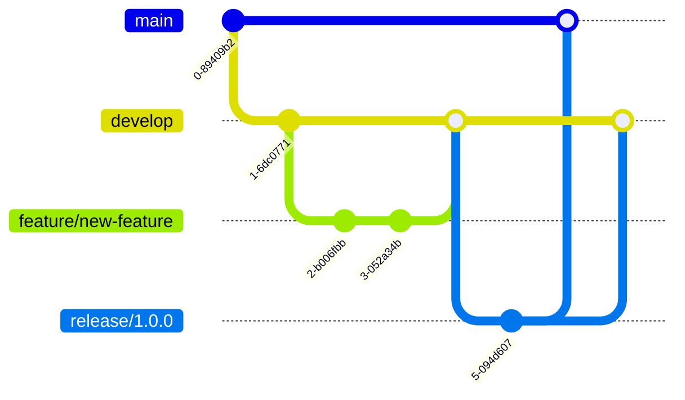

# Development Workflow

## 9.1. Setup Development Environment

### Prerequisites

- PHP 8.2+
- Composer 2.0+
- Git
- SQLite 3.8.8+
- Node.js 16+ (for documentation)

### Initial Setup

```bash
# Clone the repository
git clone https://github.com/s-a-c/eloquent-model-generator.git

# Install dependencies
composer install

# Install development tools
composer install-dev-tools

# Set up git hooks
composer setup-hooks

# Run tests to verify setup
composer test
```

### Development Tools


## 9.2. Coding Standards

### PHP Code Style

We follow PSR-12 with additional rules:

```php
declare(strict_types=1);

namespace SAC\EloquentModelGenerator;

use SAC\EloquentModelGenerator\Contracts\ModelGeneratorInterface;
use SAC\EloquentModelGenerator\Domain\ValueObjects\GenerationResult;

final class ModelGenerator implements ModelGeneratorInterface
{
    public function __construct(
        private readonly SchemaAnalyzerInterface $analyzer,
        private readonly RelationshipResolverInterface $resolver,
        private readonly CodeGeneratorInterface $generator,
    ) {}

    public function generate(array $tables): GenerationResult
    {
        return new GenerationResult(
            generatedFiles: $this->generateModels($tables),
        );
    }
}
```

### Naming Conventions


## 9.3. Git Workflow

### Branch Strategy



### Commit Message Format

```
<type>(<scope>): <subject>

<body>

<footer>
```

Types:

- feat: New feature
- fix: Bug fix
- docs: Documentation
- style: Code style
- refactor: Code refactoring
- test: Tests
- chore: Build tasks, etc.

Example:

```
feat(generator): add support for custom type mappings

- Add configuration option for custom type mappings
- Implement custom type resolver
- Update documentation

Closes #123
```

### Pull Request Process

1. Create feature branch
2. Implement changes
3. Write/update tests
4. Update documentation
5. Create pull request
6. Pass CI checks
7. Get code review
8. Merge to develop

## 9.4. CI/CD Pipeline

### GitHub Actions Workflow

```yaml
name: CI/CD

on:
  push:
    branches: [ main, develop ]
  pull_request:
    branches: [ main, develop ]

jobs:
  test:
    runs-on: ubuntu-latest
    strategy:
      matrix:
        php-version: ['8.2', '8.3']

    steps:
    - uses: actions/checkout@v3

    - name: Setup PHP
      uses: shivammathur/setup-php@v2
      with:
        php-version: ${{ matrix.php-version }}
        extensions: pdo_sqlite

    - name: Install Dependencies
      run: composer install --prefer-dist --no-progress

    - name: Run Tests
      run: composer test

    - name: Upload Coverage
      uses: codecov/codecov-action@v3

  static-analysis:
    runs-on: ubuntu-latest
    steps:
    - uses: actions/checkout@v3

    - name: PHPStan
      run: composer stan

    - name: PHP-CS-Fixer
      run: composer cs:check

  security:
    runs-on: ubuntu-latest
    steps:
    - uses: actions/checkout@v3

    - name: Security Check
      run: composer security-check

  deploy:
    needs: [test, static-analysis, security]
    if: github.ref == 'refs/heads/main'
    runs-on: ubuntu-latest
    steps:
    - name: Deploy Documentation
      run: composer deploy-docs
```

### Quality Gates


### Release Process

1. Create release branch
2. Update version numbers
3. Generate changelog
4. Build documentation
5. Create release tag
6. Deploy to packagist
7. Update documentation site

[← Back to Testing](./testing.md) | [Continue to Troubleshooting →](./troubleshooting.md)
