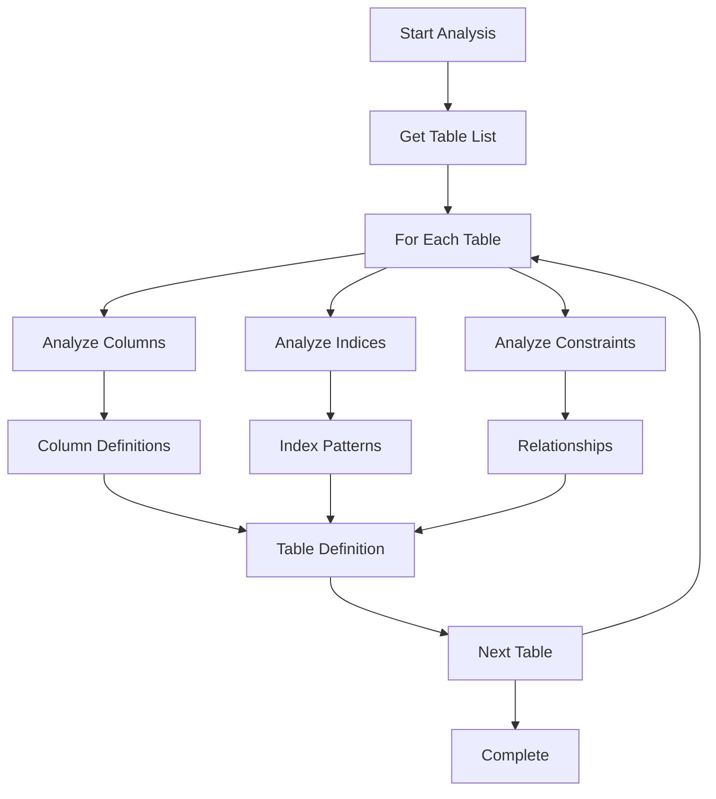
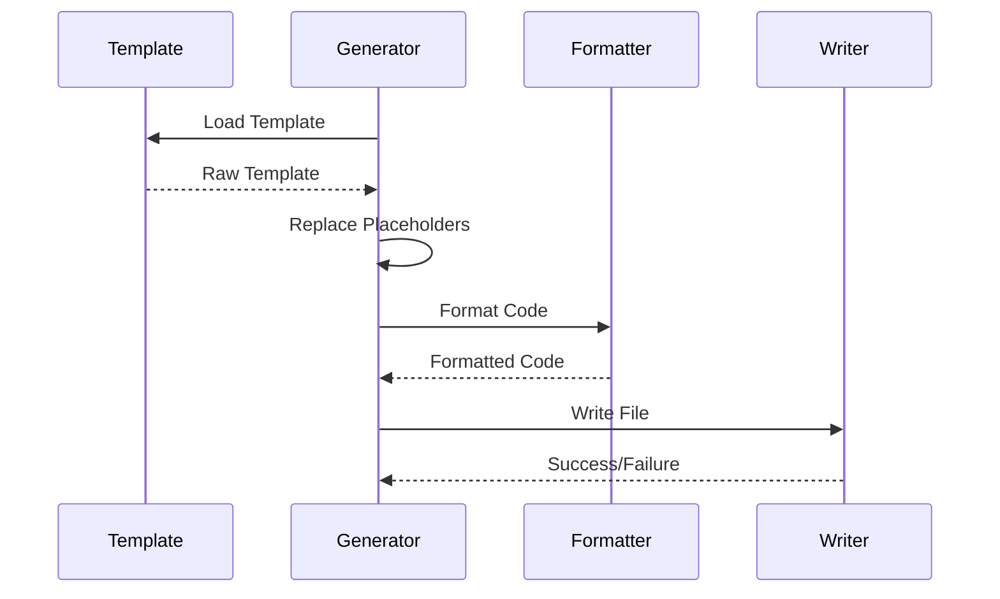
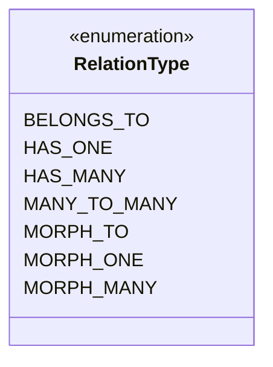
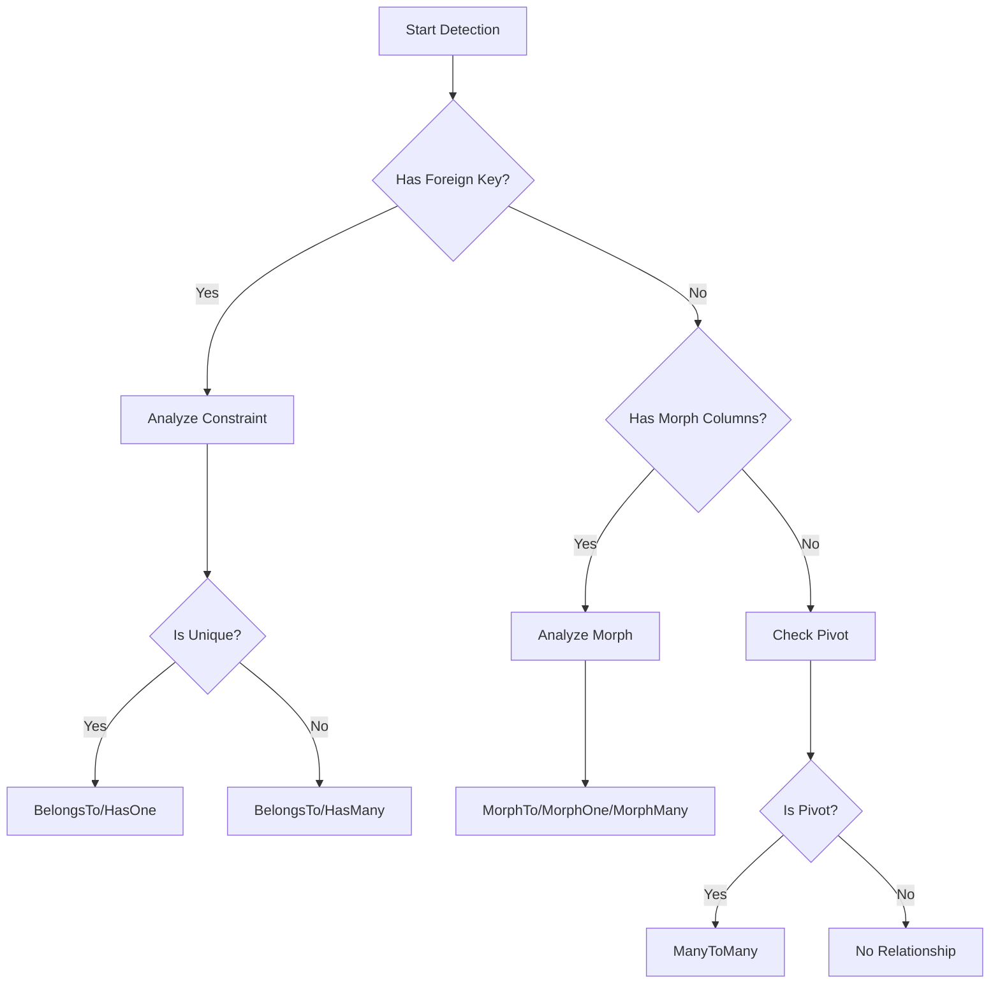
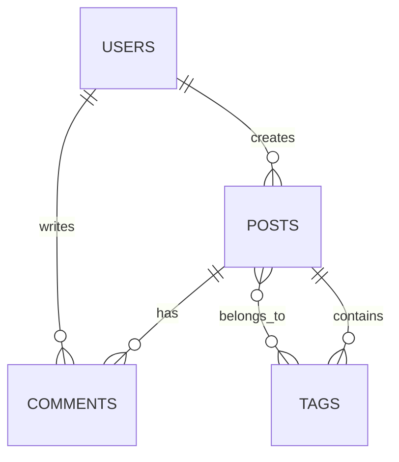

# Features and Capabilities

## 4.1. Schema Analysis

The schema analysis component provides comprehensive SQLite database introspection:

### Table Analysis



### Column Type Detection

The package automatically maps SQLite types to PHP types:

| SQLite Type | PHP Type | Eloquent Cast |
|-------------|----------|---------------|
| INTEGER     | int      | integer       |
| REAL        | float    | float         |
| TEXT        | string   | string        |
| BLOB        | resource | binary        |
| BOOLEAN     | bool     | boolean       |
| DATETIME    | DateTime | datetime      |
| DATE        | DateTime | date          |
| JSON        | array    | array         |

### Index Recognition

Detects and maps various index types:

```php
class IndexAnalyzer
{
    public const TYPES = [
        'PRIMARY' => 'primary key',
        'UNIQUE' => 'unique index',
        'INDEX' => 'index',
        'SPATIAL' => 'spatial index',
        'FULLTEXT' => 'fulltext index',
    ];

    // Index pattern detection
    public function detectPatterns(array $indices): array
    {
        return [
            'unique' => $this->findUniqueIndices($indices),
            'compound' => $this->findCompoundIndices($indices),
            'foreign' => $this->findForeignKeyIndices($indices),
        ];
    }
}
```

## 4.2. Model Generation

### Template System

The package uses a flexible template system for model generation:

```php
/**
 * Base model template with customization points.
 */
class {{ className }} extends {{ baseClassName }}
{
    /**
     * The table associated with the model.
     *
     * @var string
     */
    protected $table = '{{ tableName }}';

    /**
     * The attributes that are mass assignable.
     *
     * @var array<string>
     */
    protected $fillable = [
        {{ fillable }}
    ];

    /**
     * The attributes that should be hidden for serialization.
     *
     * @var array<string>
     */
    protected $hidden = [
        {{ hidden }}
    ];

    /**
     * The attributes that should be cast.
     *
     * @var array<string, string>
     */
    protected $casts = [
        {{ casts }}
    ];

    {{ relationships }}

    {{ methods }}
}
```

### Code Generation Process



## 4.3. Relationship Detection

### Relationship Types

The package detects various relationship types:



### Detection Process



### Polymorphic Relationships

The package supports Laravel's polymorphic relationships:

```php
/**
 * Example of detected polymorphic relationship.
 */
class Image extends Model
{
    public function imageable()
    {
        return $this->morphTo();
    }
}

class Post extends Model
{
    public function images()
    {
        return $this->morphMany(Image::class, 'imageable');
    }
}
```

## 4.4. Documentation Generation

### Model Documentation

Generates comprehensive model documentation:

```php
/**
 * @property int $id
 * @property string $title
 * @property string $content
 * @property int $user_id
 * @property \Carbon\Carbon $created_at
 * @property \Carbon\Carbon $updated_at
 * @property-read \App\Models\User $user
 * @property-read \Illuminate\Database\Eloquent\Collection|\App\Models\Comment[] $comments
 */
```

### Relationship Documentation



### API Documentation

Generates API documentation for models:

```markdown
## Post Model

### Properties

| Name       | Type     | Description           |
|------------|----------|-----------------------|
| id         | int      | Primary key          |
| title      | string   | Post title           |
| content    | string   | Post content         |
| user_id    | int      | Author reference     |
| created_at | datetime | Creation timestamp   |
| updated_at | datetime | Last update timestamp|

### Relationships

- `user()`: BelongsTo relationship with User model
- `comments()`: HasMany relationship with Comment model
- `tags()`: BelongsToMany relationship with Tag model

### Methods

- `scopePublished()`: Query scope for published posts
- `markAsFeatured()`: Mark post as featured
- `getExcerpt(int $length = 100)`: Get post excerpt
```

[← Back to Technical Design](./technical-design.md) | [Continue to Implementation Guide →](./implementation.md)
