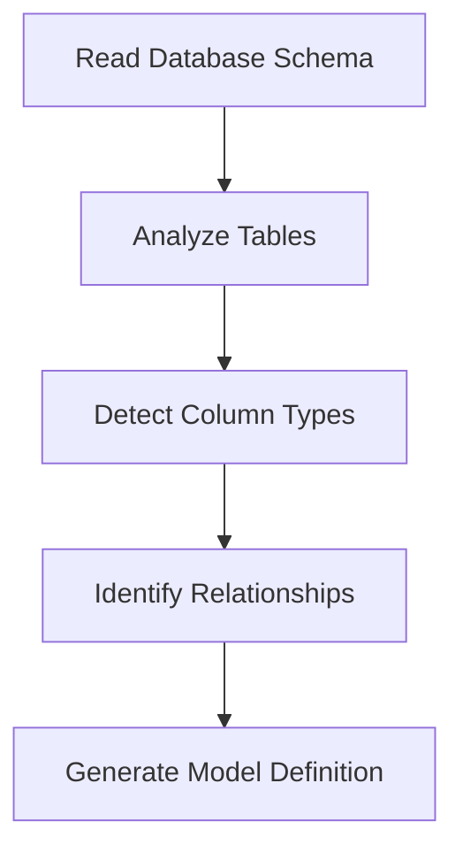

# Model Generation

## Overview

The Eloquent Model Generator analyzes your database schema to generate fully typed Eloquent models with proper relationships, validation rules, and PHPDoc annotations.

## Generation Process

### 1. Schema Analysis


### 2. Type Resolution
- Maps database types to PHP types
- Handles nullable columns
- Supports custom type mappings
- Generates proper type hints

### 3. Relationship Detection
- Analyzes foreign keys
- Detects relationship types
- Handles polymorphic relations
- Supports custom naming

## Command Usage

### Basic Generation

```bash
# Generate a single model
php artisan model:generate User

# Generate multiple models
php artisan model:generate User,Post,Comment

# Generate all models
php artisan model:generate --all
```

### Advanced Options

```bash
# Custom namespace
php artisan model:generate User --namespace="App\Models\Auth"

# Custom path
php artisan model:generate User --path="app/Models/Auth"

# Custom base class
php artisan model:generate User --extends="App\Models\BaseModel"

# Specific connection
php artisan model:generate User --connection=mysql
```

## Generated Model Example

For a typical users table:

```sql
CREATE TABLE users (
    id BIGINT UNSIGNED AUTO_INCREMENT PRIMARY KEY,
    name VARCHAR(255) NOT NULL,
    email VARCHAR(255) NOT NULL UNIQUE,
    role_id BIGINT UNSIGNED,
    settings JSON,
    active BOOLEAN DEFAULT true,
    last_login_at TIMESTAMP NULL,
    created_at TIMESTAMP NULL,
    updated_at TIMESTAMP NULL,
    FOREIGN KEY (role_id) REFERENCES roles(id)
);
```

The generator produces:

```php
<?php

namespace App\Models;

use Illuminate\Database\Eloquent\Model;
use Illuminate\Database\Eloquent\Relations\BelongsTo;

/**
 * @property int $id
 * @property string $name
 * @property string $email
 * @property int|null $role_id
 * @property array|null $settings
 * @property bool $active
 * @property \Carbon\Carbon|null $last_login_at
 * @property \Carbon\Carbon|null $created_at
 * @property \Carbon\Carbon|null $updated_at
 * @property-read \App\Models\Role|null $role
 */
class User extends Model
{
    protected $fillable = [
        'name',
        'email',
        'role_id',
        'settings',
        'active',
        'last_login_at',
    ];

    protected $casts = [
        'id' => 'integer',
        'role_id' => 'integer',
        'settings' => 'array',
        'active' => 'boolean',
        'last_login_at' => 'datetime',
        'created_at' => 'datetime',
        'updated_at' => 'datetime',
    ];

    public static function rules(): array
    {
        return [
            'name' => 'required|string|max:255',
            'email' => 'required|string|email|max:255|unique:users',
            'role_id' => 'nullable|integer|exists:roles,id',
            'settings' => 'nullable|json',
            'active' => 'boolean',
            'last_login_at' => 'nullable|date',
        ];
    }

    public function role(): BelongsTo
    {
        return $this->belongsTo(Role::class);
    }
}
```

## Customization

### 1. Type Mappings

Configure custom type mappings in `config/eloquent-model-generator.php`:

```php
'type_mappings' => [
    'mysql' => [
        'point' => 'Point',
        'geometry' => 'Geometry',
    ],
],
```

### 2. Templates

Create custom templates in `resources/views/vendor/eloquent-model-generator`:

```php
// model.blade.php
namespace {{ $namespace }};

{!! $imports !!}

/**
{!! $phpdoc !!}
 */
class {{ $className }} extends {{ $baseClass }}
{
    {!! $properties !!}

    {!! $relationships !!}

    {!! $methods !!}
}
```

### 3. Validation Rules

Customize validation rule generation:

```php
'validation_rules' => [
    'string' => 'max:255',
    'integer' => 'min:0',
    'email' => 'email:rfc,dns',
],
```

## Events

The generator dispatches events during the generation process:

```php
// Model generation started
ModelGenerationStarted::class

// Model generated successfully
ModelGenerated::class

// Model generation failed
ModelGenerationFailed::class
```

Listen for events in your `EventServiceProvider`:

```php
protected $listen = [
    ModelGenerated::class => [
        GenerateFactoryListener::class,
        UpdateDocumentationListener::class,
    ],
];
```

## Best Practices

### 1. Database Schema
- Use proper column types
- Define foreign keys
- Set nullable constraints
- Add unique constraints

### 2. Model Organization
- Group related models
- Use namespaces effectively
- Follow naming conventions
- Document relationships

### 3. Generation Strategy
- Generate models selectively
- Review generated code
- Version control changes
- Update related tests

## Common Issues

### 1. Relationship Detection
- Verify foreign key names
- Check table names
- Review relationship types
- Validate constraints

### 2. Type Inference
- Check column definitions
- Verify type mappings
- Review nullable settings
- Check custom types

### 3. File Generation
- Verify write permissions
- Check namespace configuration
- Review path settings
- Backup existing files

## Next Steps

- [Type System](./type-system.md)
- [Relationship Mapping](./relationships.md)
- [Validation Rules](./validation.md)
- [Custom Types](../advanced/custom-types.md)
