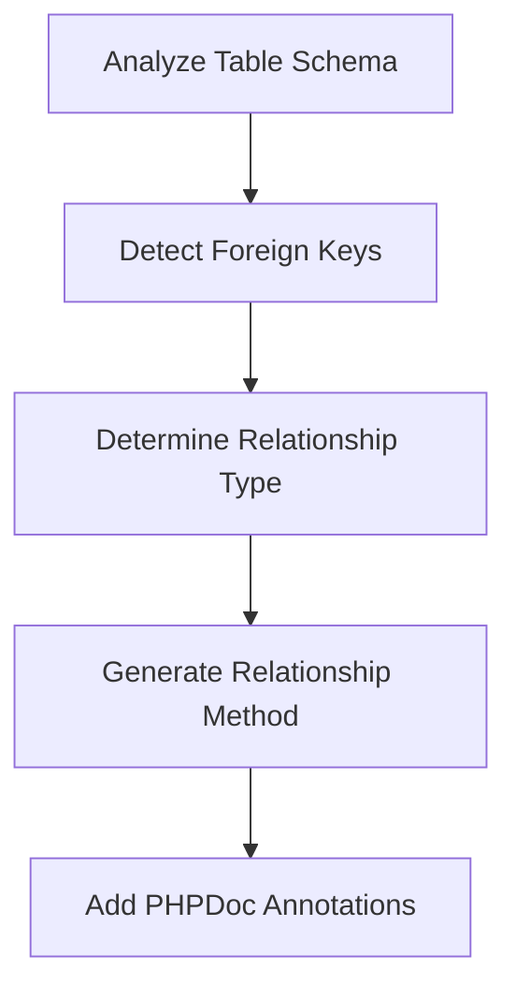

# Relationship Mapping

## Overview

The Eloquent Model Generator automatically detects and generates proper Eloquent relationships based on database schema analysis. It supports all Laravel relationship types and handles complex scenarios like polymorphic relationships.

## Supported Relationships

### One-to-One
```php
// users
id BIGINT PRIMARY KEY
// profiles
id BIGINT PRIMARY KEY
user_id BIGINT FOREIGN KEY

// Generated Models
class User extends Model
{
    public function profile(): HasOne
    {
        return $this->hasOne(Profile::class);
    }
}

class Profile extends Model
{
    public function user(): BelongsTo
    {
        return $this->belongsTo(User::class);
    }
}
```

### One-to-Many
```php
// users
id BIGINT PRIMARY KEY
// posts
id BIGINT PRIMARY KEY
user_id BIGINT FOREIGN KEY

// Generated Models
class User extends Model
{
    public function posts(): HasMany
    {
        return $this->hasMany(Post::class);
    }
}

class Post extends Model
{
    public function user(): BelongsTo
    {
        return $this->belongsTo(User::class);
    }
}
```

### Many-to-Many
```php
// users
id BIGINT PRIMARY KEY
// roles
id BIGINT PRIMARY KEY
// role_user
user_id BIGINT FOREIGN KEY
role_id BIGINT FOREIGN KEY

// Generated Models
class User extends Model
{
    public function roles(): BelongsToMany
    {
        return $this->belongsToMany(Role::class);
    }
}

class Role extends Model
{
    public function users(): BelongsToMany
    {
        return $this->belongsToMany(User::class);
    }
}
```

### Polymorphic Relationships
```php
// images
id BIGINT PRIMARY KEY
imageable_id BIGINT
imageable_type VARCHAR

// Generated Models
class Image extends Model
{
    public function imageable(): MorphTo
    {
        return $this->morphTo();
    }
}

class User extends Model
{
    public function images(): MorphMany
    {
        return $this->morphMany(Image::class, 'imageable');
    }
}
```

## Detection Process

### 1. Foreign Key Analysis


### 2. Naming Conventions
- Foreign key: `{table_singular}_id`
- Pivot table: `{table1_singular}_{table2_singular}`
- Polymorphic type: `{relation_name}_type`
- Polymorphic ID: `{relation_name}_id`

## Configuration

### Custom Naming
```php
// config/eloquent-model-generator.php
return [
    'relationships' => [
        // Custom foreign key format
        'foreign_key_format' => '{table}_{key}',

        // Custom pivot table format
        'pivot_table_format' => '{table1}_{table2}',

        // Custom polymorphic type format
        'polymorphic_type_format' => '{relation}_type',
    ],
];
```

### Relationship Options
```php
return [
    'relationships' => [
        // Enable/disable relationship detection
        'enabled' => true,

        // Include timestamps on pivot tables
        'with_timestamps' => true,

        // Default eager loading
        'default_eager_load' => false,

        // Soft deletes on relationships
        'with_soft_deletes' => true,
    ],
];
```

## Advanced Features

### 1. Custom Pivot Models
```php
class Role extends Model
{
    public function users(): BelongsToMany
    {
        return $this->belongsToMany(User::class)
            ->using(RoleUser::class);
    }
}
```

### 2. Relationship Constraints
```php
class Post extends Model
{
    public function activeComments(): HasMany
    {
        return $this->hasMany(Comment::class)
            ->where('status', 'active');
    }
}
```

### 3. Default Attributes
```php
class User extends Model
{
    public function posts(): HasMany
    {
        return $this->hasMany(Post::class)
            ->withDefault([
                'title' => 'Draft Post',
            ]);
    }
}
```

## Best Practices

### 1. Database Design
- Use consistent naming
- Define foreign keys
- Set up indexes
- Use proper constraints

### 2. Relationship Methods
- Use descriptive names
- Add return types
- Document relationships
- Consider eager loading

### 3. Performance
- Index foreign keys
- Consider lazy loading
- Use eager loading
- Cache relationships

## Common Issues

### 1. Detection Problems
- Check naming conventions
- Verify foreign keys
- Review table structure
- Check constraints

### 2. Performance Issues
- Monitor N+1 queries
- Review eager loading
- Check indexes
- Profile queries

### 3. Integrity Issues
- Verify cascading
- Check constraints
- Test deletions
- Handle orphans

## Debugging

### 1. Relationship Analysis
```bash
php artisan model:analyze-relationships User
```

### 2. Schema Verification
```bash
php artisan model:verify-schema
```

### 3. Relationship Testing
```php
class UserTest extends TestCase
{
    /** @test */
    public function it_has_proper_relationships(): void
    {
        $user = User::factory()->create();
        $post = Post::factory()->create(['user_id' => $user->id]);

        $this->assertTrue($user->posts->contains($post));
        $this->assertEquals($user->id, $post->user->id);
    }
}
```

## Next Steps

- [Model Generation](./model-generation.md)
- [Type System](./type-system.md)
- [Validation Rules](./validation.md)
- [Performance Optimization](../advanced/performance.md)
