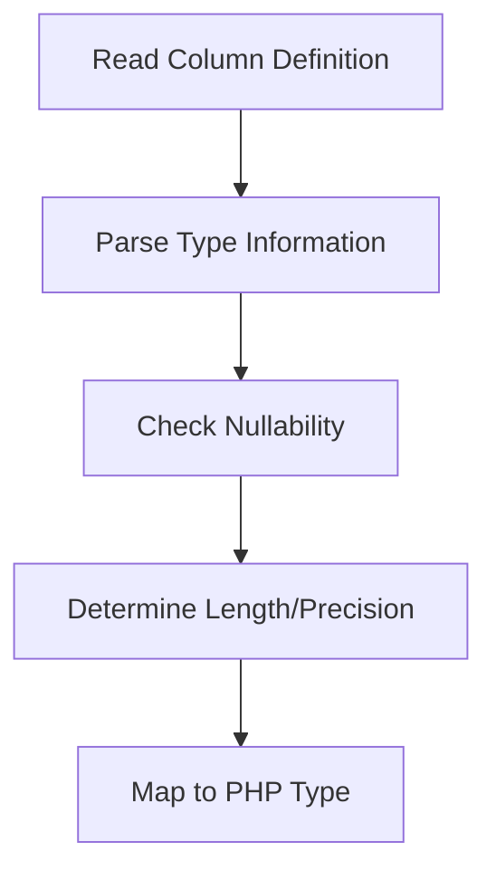

# Type System

## Overview

The Eloquent Model Generator implements a robust type system that maps database column types to PHP types, ensuring type safety and proper static analysis support.

## Type Mapping Process

### 1. Database Type Analysis


## Supported Types

### MySQL Types

| Database Type | PHP Type | Cast Type | Notes |
|--------------|----------|----------|-------|
| tinyint(1) | bool | boolean | Used for boolean flags |
| tinyint | int | integer | Small integers |
| smallint | int | integer | |
| mediumint | int | integer | |
| int | int | integer | |
| bigint | int | integer | |
| decimal | float/string | decimal | Based on precision |
| float | float | float | |
| double | float | float | |
| varchar | string | string | |
| char | string | string | |
| text | string | string | |
| json | array | array | |
| datetime | \Carbon\Carbon | datetime | |
| timestamp | \Carbon\Carbon | datetime | |
| date | \Carbon\Carbon | date | |
| time | \Carbon\Carbon | datetime | |
| year | int | integer | |
| enum | string | string | |
| set | array | array | |

### PostgreSQL Types

| Database Type | PHP Type | Cast Type | Notes |
|--------------|----------|----------|-------|
| boolean | bool | boolean | |
| smallint | int | integer | |
| integer | int | integer | |
| bigint | int | integer | |
| decimal | float/string | decimal | Based on precision |
| real | float | float | |
| double precision | float | float | |
| character varying | string | string | |
| character | string | string | |
| text | string | string | |
| json | array | array | |
| jsonb | array | array | |
| timestamp | \Carbon\Carbon | datetime | |
| timestamptz | \Carbon\Carbon | datetime | With timezone |
| date | \Carbon\Carbon | date | |
| time | \Carbon\Carbon | datetime | |
| interval | \DateInterval | datetime | |
| uuid | string | string | |
| array | array | array | |

## Type Resolution

### Basic Resolution

```php
final class TypeResolver
{
    public function resolveType(Column $column): Type
    {
        return match ($column->type) {
            'string', 'varchar', 'text' => Type::string(),
            'integer', 'int' => Type::integer(),
            'boolean', 'bool' => Type::boolean(),
            'datetime' => Type::dateTime(),
            'json' => Type::array(),
            default => Type::mixed(),
        };
    }
}
```

### Nullability Handling

```php
final class Type
{
    private function __construct(
        private readonly string $name,
        private readonly bool $nullable
    ) {}

    public static function string(bool $nullable = false): self
    {
        return new self('string', $nullable);
    }

    public function toPhpType(): string
    {
        return $this->nullable ? "?{$this->name}" : $this->name;
    }

    public function toDocType(): string
    {
        return $this->nullable
            ? "{$this->name}|null"
            : $this->name;
    }
}
```

## Custom Types

### 1. Define Custom Type

```php
final class Point extends Type
{
    public static function create(bool $nullable = false): self
    {
        return new self('Point', $nullable);
    }

    public function toCast(): string
    {
        return 'point';
    }
}
```

### 2. Register Type Mapping

```php
// config/eloquent-model-generator.php
return [
    'type_mappings' => [
        'mysql' => [
            'point' => Point::class,
        ],
    ],
];
```

### 3. Implement Cast

```php
final class PointCast implements CastsAttributes
{
    public function get($model, string $key, $value, array $attributes)
    {
        return $value ? Point::fromWkt($value) : null;
    }

    public function set($model, string $key, $value, array $attributes)
    {
        return $value ? $value->toWkt() : null;
    }
}
```

## PHPDoc Generation

### Property Documentation

```php
/**
 * @property int $id
 * @property string $name
 * @property string|null $description
 * @property \Carbon\Carbon|null $created_at
 * @property \Carbon\Carbon|null $updated_at
 */
```

### Relationship Documentation

```php
/**
 * @property-read \App\Models\User $user
 * @property-read \Illuminate\Database\Eloquent\Collection|\App\Models\Comment[] $comments
 */
```

## Type Safety

### 1. Static Analysis

The generator produces code that works well with static analyzers:

```php
// PHPStan Level 8 compliant
final class User extends Model
{
    /** @var array<string, string> */
    protected $casts = [
        'id' => 'integer',
        'active' => 'boolean',
        'settings' => 'array',
    ];

    public function profile(): HasOne
    {
        return $this->hasOne(Profile::class);
    }
}
```

### 2. IDE Support

Generated models provide excellent IDE support:

- Property completion
- Type inference
- Method return types
- Relationship navigation

## Best Practices

### 1. Type Mapping
- Use specific types when possible
- Handle nullability explicitly
- Document custom types
- Test type conversions

### 2. Custom Types
- Create value objects
- Implement proper casting
- Add validation
- Write unit tests

### 3. Performance
- Cache type resolutions
- Optimize complex types
- Profile type conversions
- Monitor memory usage

## Common Issues

### 1. Type Inference
- Check column definitions
- Verify type mappings
- Review nullability
- Test edge cases

### 2. Custom Types
- Validate input data
- Handle serialization
- Test null values
- Document usage

### 3. Performance
- Monitor type conversion
- Cache complex types
- Optimize memory usage
- Profile critical paths

## Next Steps

- [Model Generation](./model-generation.md)
- [Relationship Mapping](./relationships.md)
- [Custom Types](../advanced/custom-types.md)
- [Performance Optimization](../advanced/performance.md)
