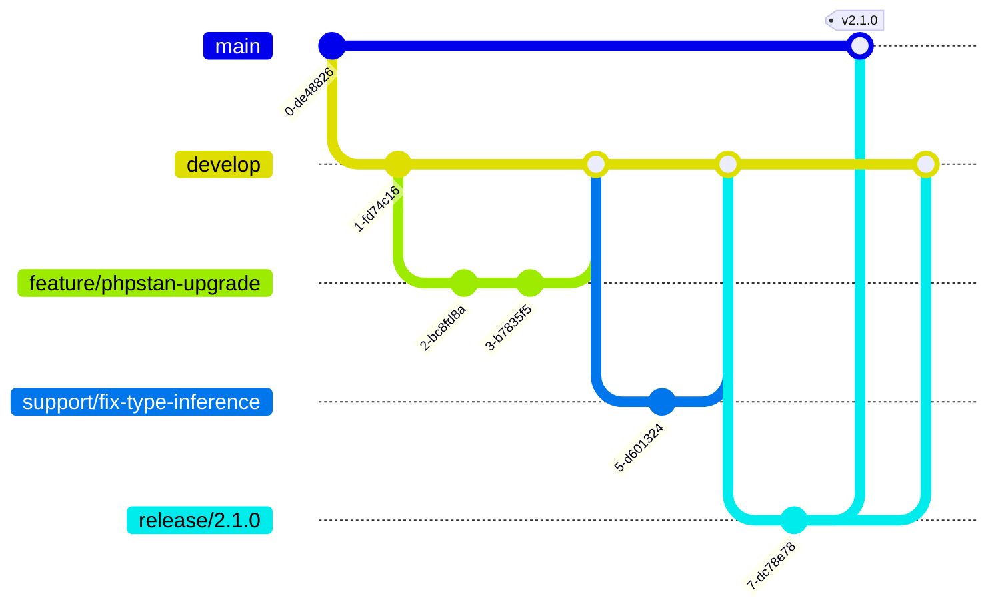

# Git Flow Implementation Guide

## Branch Structure



## Branch Types and Lifecycle

### 1. Main Branches

- `main` - Production code
  - Always contains production-ready code
  - Tagged with version numbers
  - Protected from direct pushes
  - Only accepts merges from release/*and hotfix/* branches

- `develop` - Development code
  - Integration branch for features and support work
  - Base branch for feature/*, support/*, and release/* branches
  - Protected from direct pushes
  - Requires pull request reviews

### 2. Supporting Branches

#### Feature Branches (`feature/*`)

- Purpose: New feature development
- Naming: `feature/[issue-number]-descriptive-name`
- Branch from: `develop`
- Merge to: `develop`
- Delete after: Merge completion
- Example: `feature/123-phpstan-upgrade`

#### Support Branches (`support/*`)

- Purpose: Maintenance work and issue fixes
- Naming: `support/[issue-number]-descriptive-name`
- Branch from: `develop`
- Merge to: `develop`
- Delete after: Merge completion
- Example: `support/456-fix-type-inference`

#### Hotfix Branches (`hotfix/*`)

- Purpose: Urgent production fixes
- Naming: `hotfix/[version]-description`
- Branch from: `main`
- Merge to: `main` and `develop`
- Delete after: Merge completion
- Example: `hotfix/2.1.1-critical-type-error`

#### Release Branches (`release/*`)

- Purpose: Release preparation
- Naming: `release/[version]`
- Branch from: `develop`
- Merge to: `main` and `develop`
- Delete after: Merge completion
- Example: `release/2.1.0`

## Development Workflow

### 1. Feature Development

```bash
# Start feature
git flow feature start phpstan-upgrade
# or
git checkout -b feature/phpstan-upgrade develop

# Make changes and commit
git add .
git commit -m "feat(static-analysis): implement PHPStan level 10

- Add strict type checking
- Configure extension management
- Optimize analysis settings

Closes #123"

# Update from develop
git checkout develop
git pull origin develop
git checkout feature/phpstan-upgrade
git rebase develop

# Push for review
git push origin feature/phpstan-upgrade
```

### 2. Support Work

```bash
# Start support branch
git flow support start fix-type-inference
# or
git checkout -b support/fix-type-inference develop

# Make changes and commit
git add .
git commit -m "fix(types): resolve type inference issues

- Fix nullable type handling
- Update return type declarations
- Add missing type hints

Fixes #456"

# Update from develop
git checkout develop
git pull origin develop
git checkout support/fix-type-inference
git rebase develop

# Push for review
git push origin support/fix-type-inference
```

### 3. Release Process

```bash
# Start release
git flow release start 2.1.0
# or
git checkout -b release/2.1.0 develop

# Update version and changelog
composer config version 2.1.0
git add composer.json CHANGELOG.md
git commit -m "chore(release): prepare 2.1.0"

# Finish release
git checkout main
git merge --no-ff release/2.1.0
git tag -a v2.1.0 -m "Release version 2.1.0"
git checkout develop
git merge --no-ff release/2.1.0
```

## Quality Gates

### 1. Branch Protection Rules

- All branches require pull request reviews
- Status checks must pass before merging
- Linear history required
- Force pushes disabled
- Branch deletion protected

### 2. Required Reviews

- feature/* branches: 1 reviewer
- support/* branches: 1 reviewer
- hotfix/* branches: 2 reviewers
- release/* branches: 1 reviewer + release manager

### 3. Status Checks

- Static analysis (PHPStan level 10)
- Unit tests
- Integration tests
- Code style checks
- Branch naming convention
- Commit message format

## Commit Message Format

```
<type>(<scope>): <subject>

<body>

<footer>
```

Types:

- feat: New feature
- fix: Bug fix
- docs: Documentation
- style: Code style
- refactor: Code refactoring
- test: Tests
- chore: Build tasks

Example:

```
feat(static-analysis): implement PHPStan level 10

- Add strict type checking
- Configure extension management
- Optimize analysis settings

Closes #123
```

## Version Tagging

### 1. Version Format

- Follow semantic versioning: MAJOR.MINOR.PATCH
- Tag format: v2.1.0

### 2. Tag Message

```bash
git tag -a v2.1.0 -m "Release version 2.1.0

Major changes:
- PHPStan upgrade to level 10
- Support branch workflow
- Strict type checking
- Extension management"
```

## Automation

### 1. Git Flow Script

- `./git-flow.sh start-feature <name>`
- `./git-flow.sh finish-feature`
- `./git-flow.sh start-support <name>`
- `./git-flow.sh finish-support`
- `./git-flow.sh start-release <version>`
- `./git-flow.sh finish-release`

### 2. GitHub Actions

- Branch name validation
- Commit message validation
- Quality gates enforcement
- Release validation
- Merge protection

## Best Practices

1. **Branch Management**
   - Keep branches short-lived
   - Rebase frequently
   - Delete branches after merge

2. **Commit Strategy**
   - Atomic commits
   - Clear commit messages
   - Reference issues

3. **Code Review**
   - Review before merge
   - Address all comments
   - Verify test coverage

4. **Release Process**
   - Update changelog
   - Version bump
   - Tag releases
   - Merge to both main and develop

[← Back to Documentation](index.md)
