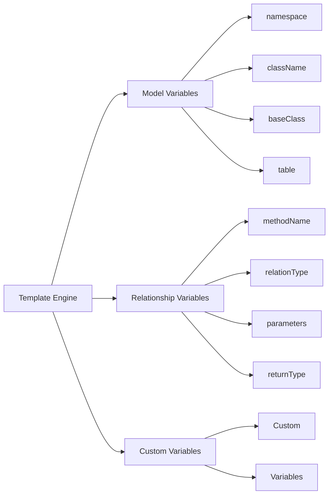
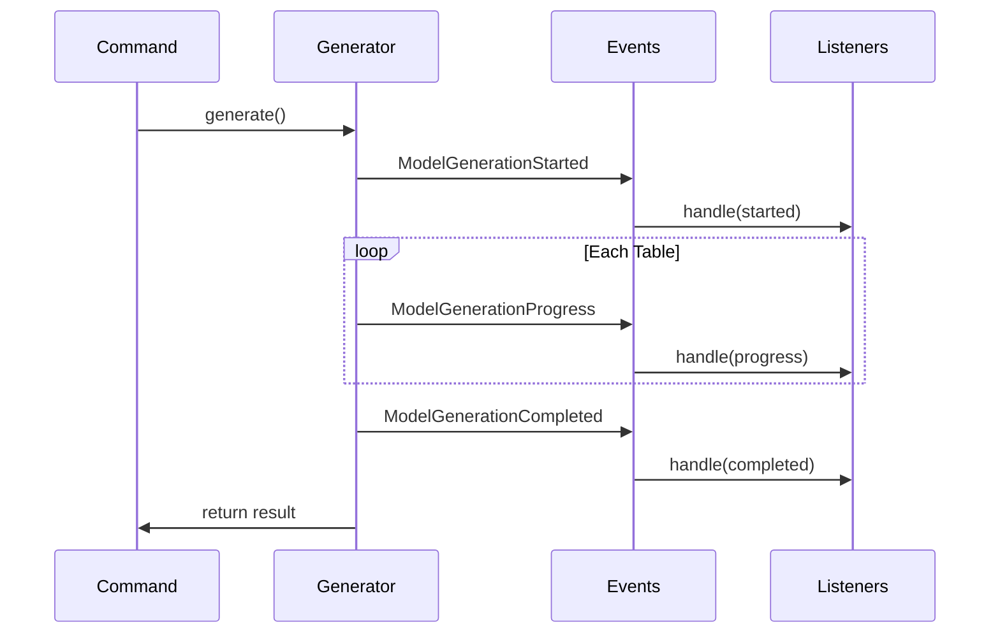
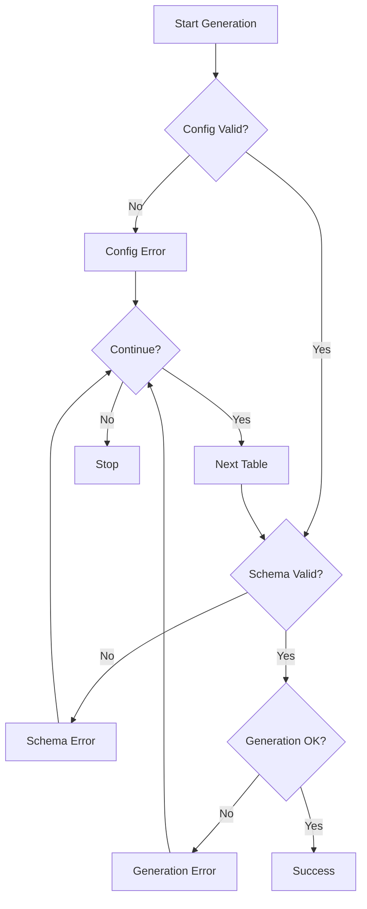

# Implementation Guide

## 5.1. Configuration

### Configuration File Structure

The package's configuration is managed through `config/model-generator.php`:

```php
return [
    'schema' => [
        // Database schema analysis settings
        'chunk_size' => env('MODEL_GENERATOR_CHUNK_SIZE', 100),
        'analyze_indexes' => env('MODEL_GENERATOR_ANALYZE_INDEXES', true),
        'detect_polymorphic' => env('MODEL_GENERATOR_DETECT_POLYMORPHIC', true),
        'exclude_tables' => explode(',', env('MODEL_GENERATOR_EXCLUDE_TABLES', 'migrations,jobs')),
    ],

    'generation' => [
        // Model generation settings
        'namespace' => env('MODEL_GENERATOR_NAMESPACE', 'App\\Models'),
        'path' => env('MODEL_GENERATOR_PATH', 'app/Models'),
        'base_class' => env('MODEL_GENERATOR_BASE_CLASS', 'Illuminate\\Database\\Eloquent\\Model'),
        'generate_phpdoc' => env('MODEL_GENERATOR_PHPDOC', true),
        'generate_type_hints' => env('MODEL_GENERATOR_TYPE_HINTS', true),
        'timestamps' => env('MODEL_GENERATOR_TIMESTAMPS', true),
        'soft_deletes' => env('MODEL_GENERATOR_SOFT_DELETES', false),
    ],

    'documentation' => [
        // Documentation generation settings
        'enabled' => env('MODEL_GENERATOR_DOCS', true),
        'output_path' => env('MODEL_GENERATOR_DOCS_PATH', 'docs/models'),
        'format' => env('MODEL_GENERATOR_DOCS_FORMAT', 'markdown'),
    ],

    'error_handling' => [
        // Error handling settings
        'continue_on_error' => env('MODEL_GENERATOR_CONTINUE_ON_ERROR', false),
        'log_errors' => env('MODEL_GENERATOR_LOG_ERRORS', true),
    ],
];
```

### Environment Variables

Example `.env` configuration:

```env
MODEL_GENERATOR_NAMESPACE=App\\Domain\\Models
MODEL_GENERATOR_PATH=app/Domain/Models
MODEL_GENERATOR_EXCLUDE_TABLES=migrations,jobs,failed_jobs
MODEL_GENERATOR_ANALYZE_INDEXES=true
MODEL_GENERATOR_DETECT_POLYMORPHIC=true
MODEL_GENERATOR_DOCS=true
MODEL_GENERATOR_DOCS_PATH=docs/models
```

## 5.2. Custom Templates

### Template Location

Custom templates should be placed in:

```
resources/views/vendor/model-generator/
```

### Available Templates

1. **Model Template** (`model.stub`):

```php
<?php

namespace {{ namespace }};

use {{ baseClass }};
{{ uses }}

/**
 * {{ className }} Model
 *
{{ properties }}
{{ relations }}
 */
class {{ className }} extends {{ baseClassName }}
{
    /**
     * The table associated with the model.
     *
     * @var string
     */
    protected $table = '{{ table }}';

    /**
     * The attributes that are mass assignable.
     *
     * @var array<string>
     */
    protected $fillable = [
        {{ fillable }}
    ];

    /**
     * The attributes that should be cast.
     *
     * @var array<string, string>
     */
    protected $casts = [
        {{ casts }}
    ];

    {{ relationships }}

    {{ methods }}
}
```

2. **Relationship Template** (`relationship.stub`):

```php
/**
 * {{ description }}
 *
 * @return \{{ returnType }}
 */
public function {{ methodName }}()
{
    return $this->{{ relationType }}({{ parameters }});
}
```

### Template Variables



## 5.3. Event Handling

### Available Events

1. **ModelGenerationStarted**:

```php
use SAC\EloquentModelGenerator\Events\ModelGenerationStarted;

class ModelGenerationListener
{
    public function handle(ModelGenerationStarted $event): void
    {
        $tables = $event->tables;
        $options = $event->options;
    }
}
```

2. **ModelGenerationProgress**:

```php
use SAC\EloquentModelGenerator\Events\ModelGenerationProgress;

class ProgressListener
{
    public function handle(ModelGenerationProgress $event): void
    {
        $current = $event->current;
        $total = $event->total;
        $progress = $event->getProgress();

        if ($event->isSuccessful()) {
            $result = $event->getResult();
        }
    }
}
```

3. **ModelGenerationCompleted**:

```php
use SAC\EloquentModelGenerator\Events\ModelGenerationCompleted;

class CompletionListener
{
    public function handle(ModelGenerationCompleted $event): void
    {
        $result = $event->result;
        $duration = $event->duration;
    }
}
```

### Event Flow



## 5.4. Error Handling

### Error Types

1. **Configuration Errors**:

```php
use SAC\EloquentModelGenerator\Exceptions\InvalidConfigurationException;

try {
    $config->validate();
} catch (InvalidConfigurationException $e) {
    $option = $e->getOption();
    $message = $e->getMessage();
    $context = $e->getContext();
}
```

2. **Schema Analysis Errors**:

```php
use SAC\EloquentModelGenerator\Exceptions\SchemaAnalysisException;

try {
    $analyzer->analyze($table);
} catch (SchemaAnalysisException $e) {
    $table = $e->getTable();
    $reason = $e->getReason();
    $context = $e->getContext();
}
```

3. **Generation Errors**:

```php
use SAC\EloquentModelGenerator\Exceptions\ModelGenerationException;

try {
    $generator->generate($tables);
} catch (ModelGenerationException $e) {
    $table = $e->getTable();
    $message = $e->getMessage();
    $context = $e->getContext();
}
```

### Error Recovery



[← Back to Features](./features.md) | [Continue to API Reference →](./api-reference.md)
