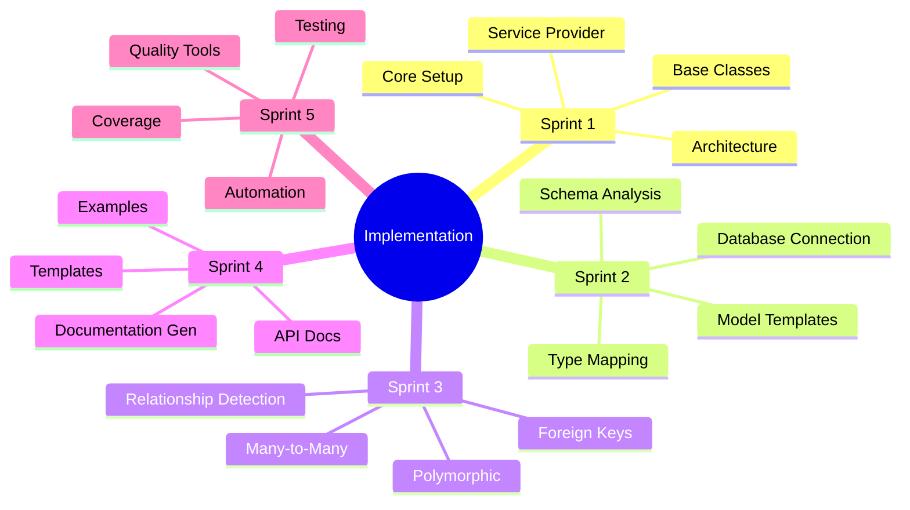
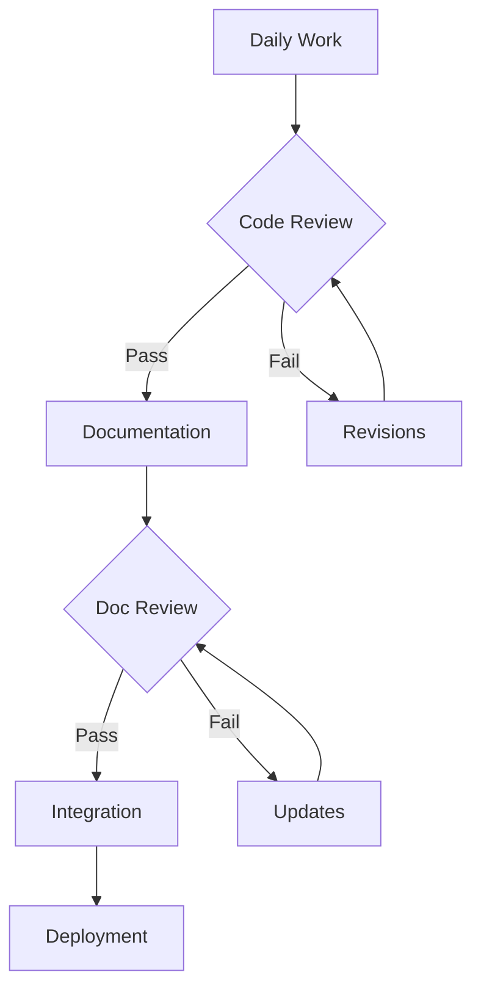
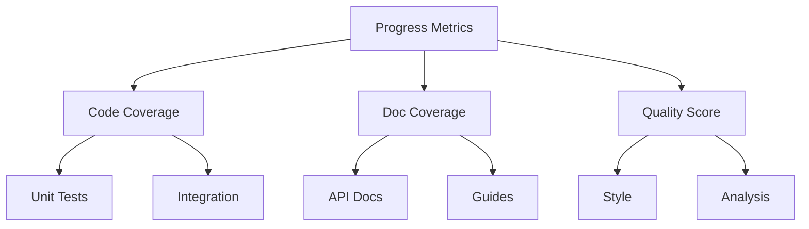

# Implementation Guide

## Project Implementation Strategy



## Implementation Checklist

### Prerequisites

- [ ] Development environment setup
- [ ] Required PHP extensions
- [ ] Composer configuration
- [ ] Git repository access
- [ ] Documentation tools

### Quality Gates

- [ ] Code style compliance
- [ ] Static analysis passing
- [ ] Test coverage >= 90%
- [ ] Documentation coverage
- [ ] Security checks

## Resource Allocation

### Development Tools

```php
return [
    'required' => [
        'php' => '^8.2',
        'composer' => '^2.0',
        'git' => '^2.0',
        'sqlite' => '^3.8.8',
    ],
    'recommended' => [
        'ide' => 'PhpStorm|VSCode',
        'extensions' => [
            'php-cs-fixer',
            'phpstan',
            'pest',
        ],
    ],
];
```

### Documentation Tools

```php
return [
    'required' => [
        'mkdocs' => '^1.0',
        'phpdoc' => '^3.0',
        'doctum' => '^5.0',
    ],
    'optional' => [
        'mermaid-cli',
        'markdown-lint',
        'link-checker',
    ],
];
```

## Sprint Structure

### Daily Schedule

```mermaid
gantt
    title Daily Development Schedule
    dateFormat HH:mm
    axisFormat %H:%M

    section Morning
    Code Review     :09:00, 30m
    Development     :09:30, 150m
    section Afternoon
    Documentation   :13:00, 120m
    Testing        :15:00, 120m
    Planning       :17:00, 30m
```



### Review Process



## Documentation Standards

### File Structure

```
docs/
├── architecture/
│   ├── index.md
│   ├── components.md
│   └── decisions.md
├── implementation/
│   ├── index.md
│   └── sprints/
│       ├── sprint-1.md
│       └── ...
├── api/
│   ├── index.md
│   └── endpoints.md
├── guides/
│   ├── index.md
│   └── setup.md
└── testing/
    ├── index.md
    └── plans.md
```

### Document Template

```markdown
# Document Title

## Overview
Brief description of the document's purpose

## Technical Details
Detailed technical information

## Examples
Code examples and usage scenarios

## Related Documents
Links to related documentation

## Review Status
- [ ] Technical review
- [ ] Documentation review
- [ ] Stakeholder approval
```

## Sprint Navigation

### Current Sprint

- [Sprint 1: Core Setup & Architecture](sprints/sprint-1.md)

### Upcoming Sprints

- [Sprint 2: Schema Analysis & Models](sprints/sprint-2.md)
- [Sprint 3: Relationship Detection](sprints/sprint-3.md)
- [Sprint 4: Documentation Generation](sprints/sprint-4.md)
- [Sprint 5: Testing & Quality](sprints/sprint-5.md)

## Progress Tracking

### Metrics Dashboard



### Quality Metrics

| Metric | Target | Current | Status |
|--------|--------|---------|--------|
| Code Coverage | 90% | - | 📅 |
| Doc Coverage | 95% | - | 📅 |
| Style Compliance | 100% | - | 📅 |
| Static Analysis | 0 errors | - | 📅 |

[← Back to Documentation](../index.md) | [Continue to Sprint 1 →](sprints/sprint-1.md)
