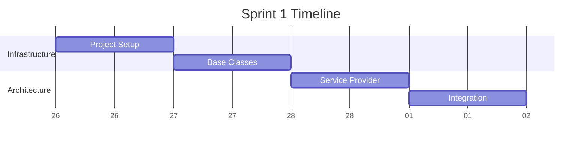
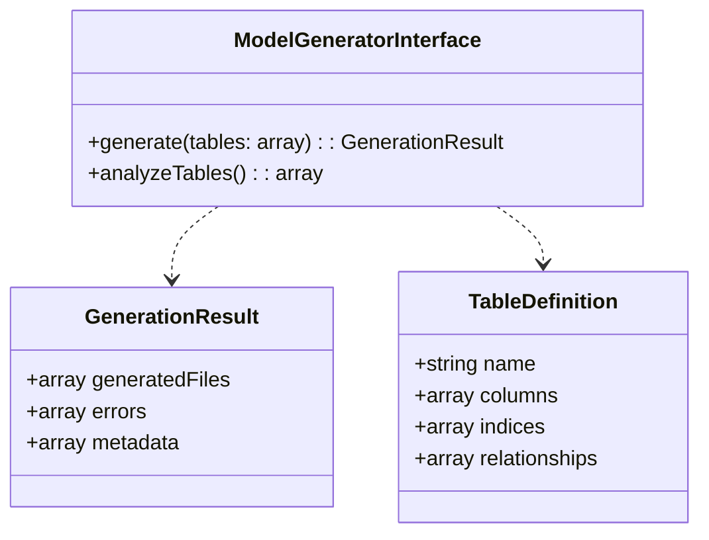
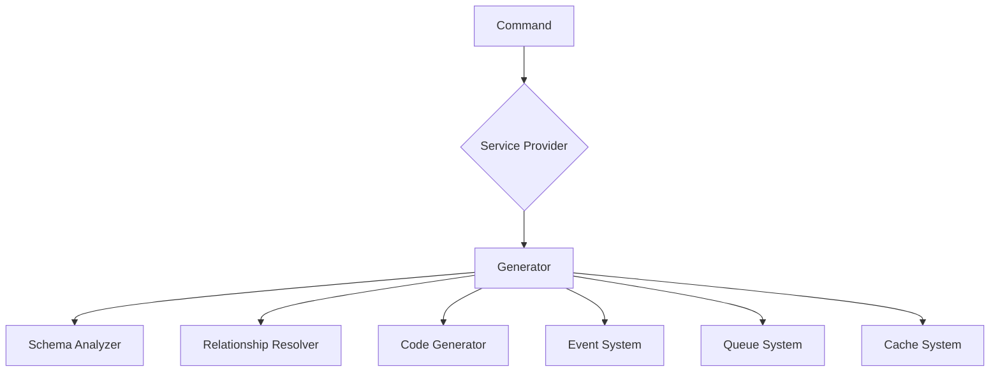

# Sprint 1: Core Setup & Architecture

## Sprint Overview

**Duration**: 4 days (Feb 26 - Mar 1, 2025)
**Focus**: Basic infrastructure and architecture setup
**Story Points**: 13



## Daily Tasks

### Day 1: Project Setup

- [ ] Initialize package structure
- [ ] Configure Composer
- [ ] Set up development tools
- [ ] Create base documentation

#### Technical Dependencies

```json
{
    "require": {
        "php": "^8.2",
        "illuminate/support": "^10.0",
        "illuminate/database": "^10.0"
    },
    "require-dev": {
        "orchestra/testbench": "^8.0",
        "phpunit/phpunit": "^10.0",
        "phpstan/phpstan": "^1.0"
    }
}
```

#### Success Criteria

- Package structure follows PSR-4
- All development tools installed and configured
- Base documentation structure created
- CI pipeline initialized

### Day 2: Base Classes

- [ ] Create value objects
- [ ] Define interfaces
- [ ] Implement base exceptions
- [ ] Set up test infrastructure

#### Class Structure



#### Success Criteria

- All base interfaces defined
- Value objects implemented with tests
- Exception hierarchy established
- Test infrastructure working

### Day 3: Service Provider

- [ ] Create service provider
- [ ] Configure service bindings
- [ ] Set up configuration
- [ ] Implement commands

#### Service Registration

```php
class ModelGeneratorServiceProvider extends ServiceProvider
{
    public function register(): void
    {
        $this->app->singleton(ModelGeneratorInterface::class, function ($app) {
            return new ModelGenerator(
                $app->make(SchemaAnalyzerInterface::class),
                $app->make(RelationshipResolverInterface::class),
                $app->make(CodeGeneratorInterface::class)
            );
        });
    }
}
```

#### Success Criteria

- Service provider registered
- All services properly bound
- Configuration published
- Commands registered

### Day 4: Integration

- [ ] Set up event system
- [ ] Configure queue support
- [ ] Implement caching
- [ ] Write integration tests

#### Integration Architecture



#### Success Criteria

- Event system working
- Queue jobs processing
- Cache implemented
- Integration tests passing

## Technical Dependencies

### Development Environment

```bash
# Required PHP extensions
php -m | grep -E 'pdo_sqlite|json|tokenizer|fileinfo'

# Install development tools
composer global require friendsofphp/php-cs-fixer
composer global require phpstan/phpstan
composer global require infection/infection

# Set up git hooks
cp hooks/pre-commit .git/hooks/
chmod +x .git/hooks/pre-commit
```

### Documentation Tools

```bash
# Install MkDocs
pip install mkdocs mkdocs-material

# Install PHP documentation tools
composer global require phpdocumentor/phpdocumentor
composer global require code-lts/doctum
```

## Quality Gates

### Code Quality

- PHPStan level 8 passing
- PHP CS Fixer checks passing
- No PHP Mess Detector warnings
- Infection MSI score > 90%

### Documentation Quality

- All public APIs documented
- README updated
- Architecture diagrams current
- Examples provided

### Test Coverage

- Unit test coverage > 90%
- Integration test coverage > 85%
- Mutation score > 90%
- No critical paths untested

## Risk Assessment

| Risk | Likelihood | Impact | Mitigation |
|------|------------|--------|------------|
| PHP Version Compatibility | Medium | High | Version checks in CI |
| Laravel Integration Issues | Low | High | Integration test suite |
| Performance Bottlenecks | Medium | Medium | Benchmarking suite |
| Documentation Gaps | Low | Medium | Doc coverage checks |

## Review Checklist

### Technical Review

- [ ] Code follows PSR standards
- [ ] Architecture matches design
- [ ] Tests are comprehensive
- [ ] Performance is acceptable

### Documentation Review

- [ ] All features documented
- [ ] Examples are clear
- [ ] Architecture diagrams updated
- [ ] API documentation complete

### Security Review

- [ ] Input validation complete
- [ ] File operations secure
- [ ] Dependencies checked
- [ ] Error handling proper

## Next Steps

1. Complete all Day 1 tasks
2. Review and adjust timeline if needed
3. Prepare for Day 2 dependencies
4. Update documentation continuously

[← Back to Implementation Guide](../index.md) | [Continue to Sprint 2 →](sprint-2.md)
