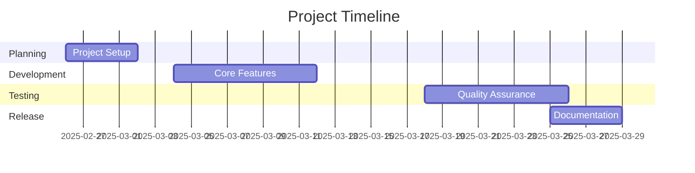
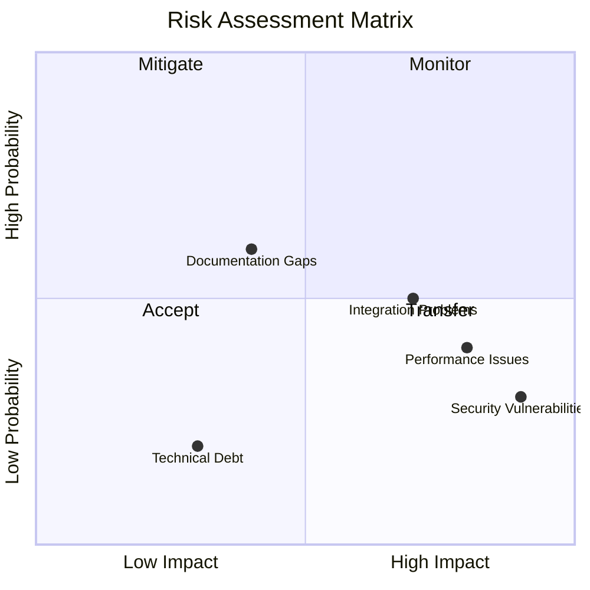
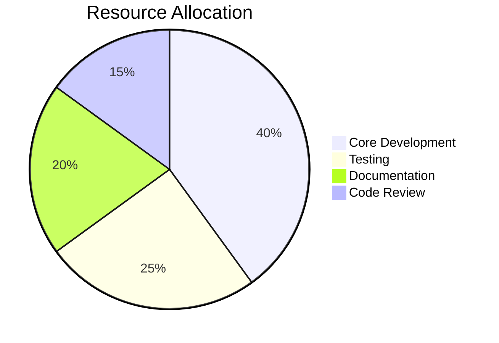
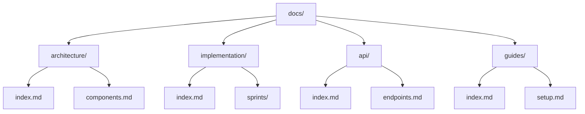
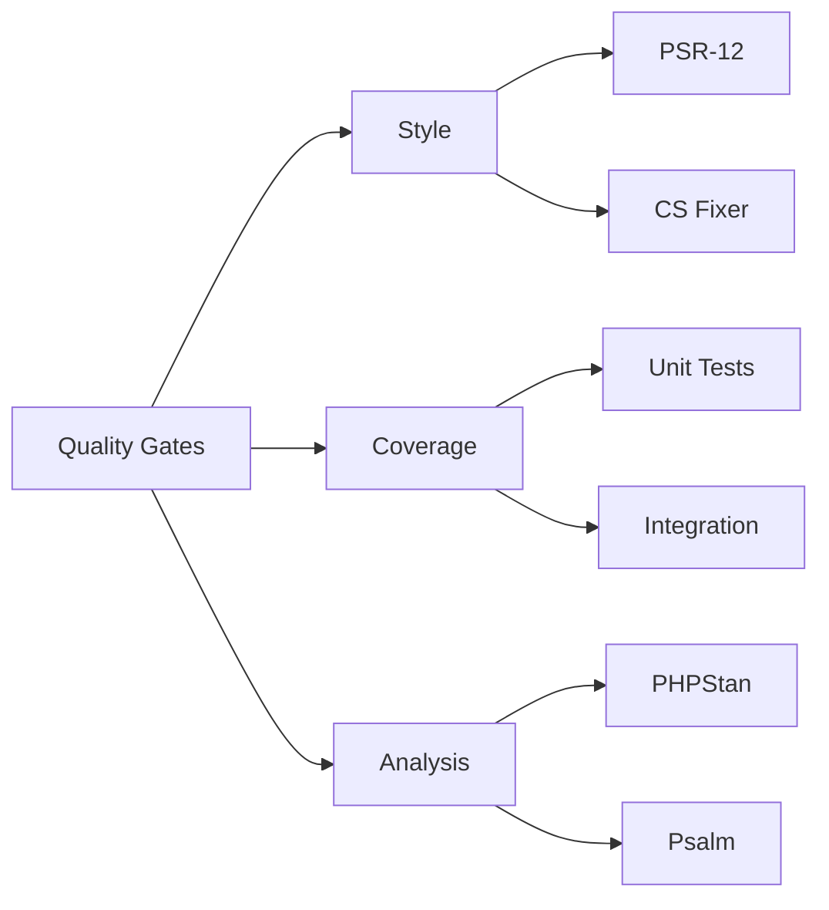
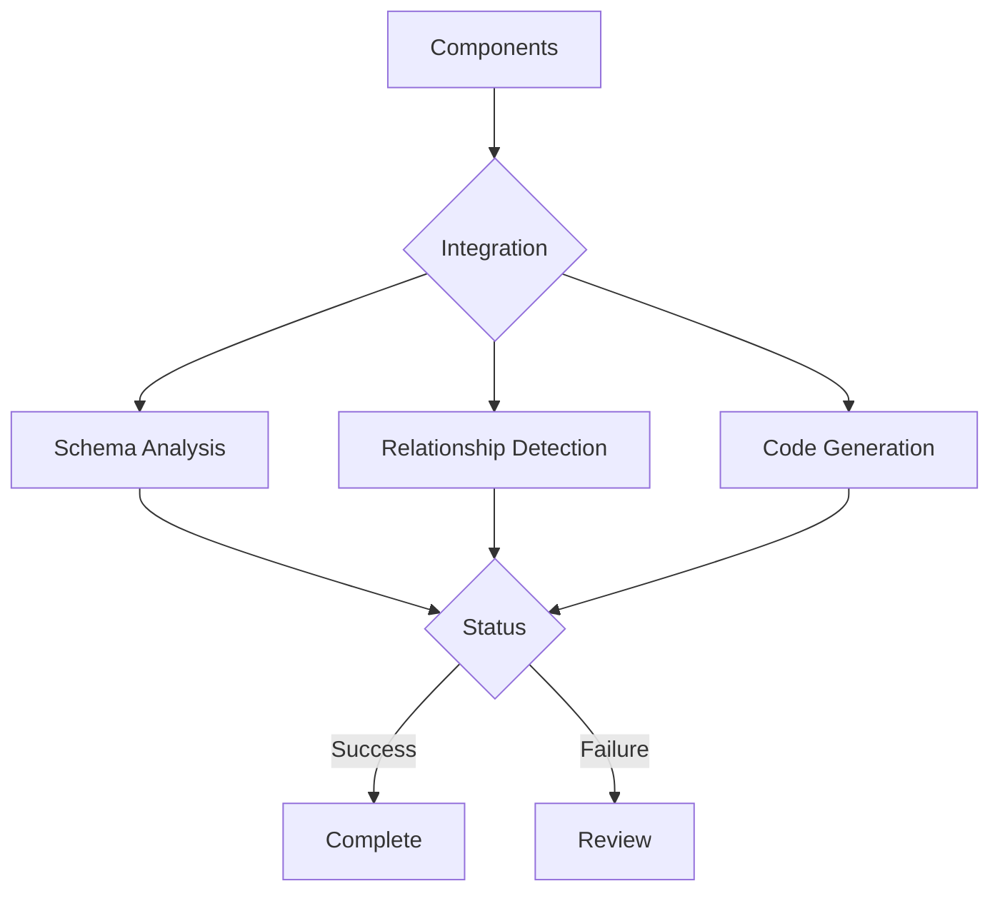

# Project Tracking Document

## Project Overview

## Sprint Progress

### Current Status

| Sprint | Status | Progress | Documentation | Tests | Risks |
|--------|--------|----------|---------------|--------|-------|
| 1: Core Setup | 🔄 In Progress | 0% | 0% | 0% | Low |
| 2: Schema Analysis | 📅 Planned | - | - | - | Medium |
| 3: Relationships | 📅 Planned | - | - | - | High |
| 4: Documentation | 📅 Planned | - | - | - | Low |
| 5: Testing | 📅 Planned | - | - | - | Medium |

## Risk Assessment

### Risk Matrix

### Active Risks

| Risk | Probability | Impact | Mitigation Strategy | Status |
|------|------------|---------|-------------------|---------|
| Memory Leaks | Medium | High | Implement chunking | 🔄 Active |
| SQL Injection | Low | Critical | Input validation | ✅ Mitigated |
| Performance | Medium | Medium | Caching strategy | 🔄 Active |
| Documentation | Low | Medium | Automated checks | ✅ Mitigated |

## Resource Utilization

### Development Resources

### Time Distribution

| Activity | Allocated | Used | Remaining |
|----------|-----------|------|-----------|
| Development | 160h | 0h | 160h |
| Testing | 100h | 0h | 100h |
| Documentation | 80h | 0h | 80h |
| Review | 60h | 0h | 60h |

## Documentation Structure

### Current Structure

### Coverage Metrics

| Section | Files | Coverage | Status |
|---------|-------|----------|--------|
| Architecture | 3 | 100% | ✅ |
| Implementation | 7 | 80% | 🔄 |
| API | 4 | 60% | ⚠️ |
| Guides | 5 | 90% | ✅ |

## Quality Metrics

### Code Quality

### Metrics Dashboard

| Metric | Target | Current | Trend |
|--------|--------|---------|-------|
| Code Coverage | 90% | 0% | - |
| Mutation Score | 85% | 0% | - |
| Complexity | < 15 | 0 | - |
| Dependencies | < 20 | 0 | - |

## Integration Status

### Component Integration

### Integration Metrics

| Component | Status | Tests | Issues |
|-----------|--------|-------|---------|
| Schema Analysis | 📅 | - | - |
| Relationships | 📅 | - | - |
| Code Generation | 📅 | - | - |

## Review Schedule

### Upcoming Reviews

| Date | Type | Focus | Stakeholders |
|------|------|-------|--------------|
| Mar 1 | Sprint | Architecture | Tech Lead |
| Mar 7 | Technical | Schema | Developer |
| Mar 14 | Security | Access | Security Team |
| Mar 21 | Quality | Testing | QA Team |

## Action Items

### High Priority

1. [ ] Set up development environment
2. [ ] Initialize core classes
3. [ ] Configure CI/CD pipeline
4. [ ] Create test infrastructure

### Medium Priority

1. [ ] Complete documentation structure
2. [ ] Set up monitoring
3. [ ] Configure automation
4. [ ] Prepare templates

[← Back to Implementation](index.md)
