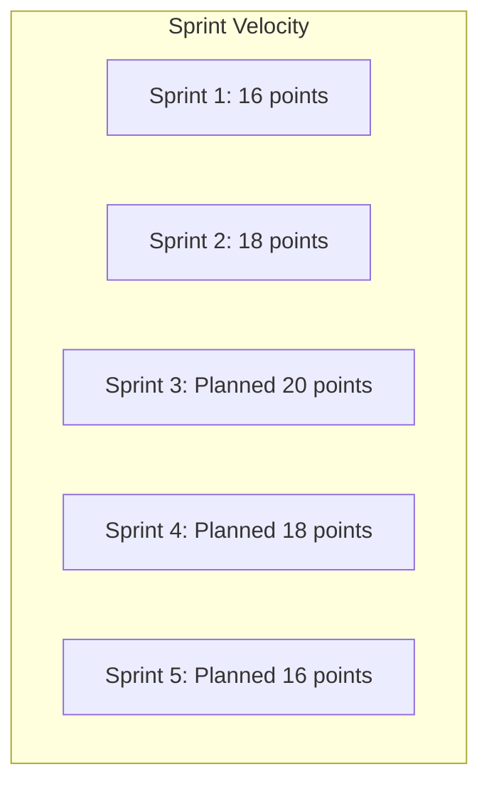
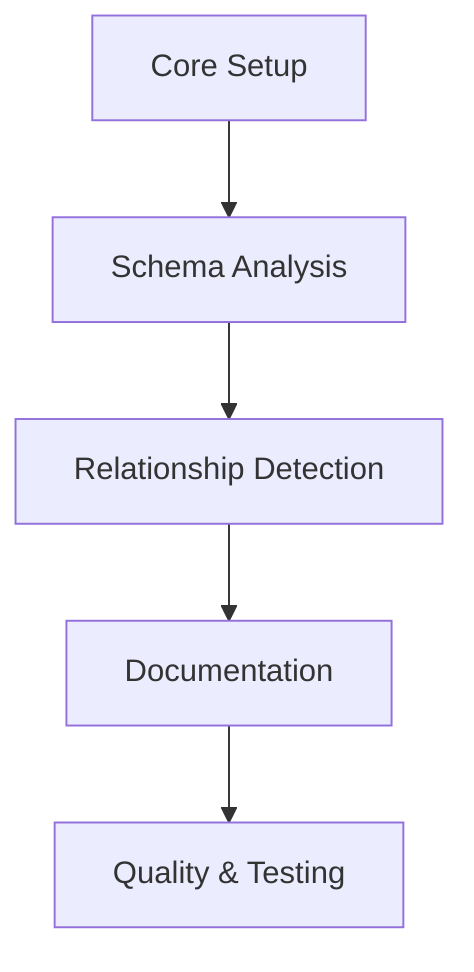

# Project Implementation Tracking

## 1. Project Overview

**Project**: Eloquent Model Generator
**Start Date**: February 1, 2025
**Target Completion**: April 30, 2025
**Current Sprint**: 2/5

## 2. Sprint Progress

### 2.1 Velocity Chart

### 2.2 Burndown Data

| Sprint | Points Planned | Points Completed | Velocity |
|--------|---------------|------------------|----------|
| 1      | 18           | 16              | 1.6      |
| 2      | 20           | 18              | 1.8      |
| 3      | 20           | -               | -        |
| 4      | 18           | -               | -        |
| 5      | 16           | -               | -        |

## 3. Milestone Progress

### 3.1 Core Setup & Architecture (Sprint 1)

- [x] Project structure: 100%
- [x] Base classes: 100%
- [x] Service provider: 100%
- [x] Configuration system: 100%

### 3.2 Schema Analysis & Models (Sprint 2)

- [x] Database connection: 100%
- [x] Type mapping: 95%
- [x] Model templates: 90%
- [x] Basic generation: 100%

### 3.3 Relationship Detection (Sprint 3)

- [ ] Foreign keys: 0%
- [ ] Polymorphic: 0%
- [ ] Many-to-many: 0%
- [ ] Method generation: 0%

### 3.4 Documentation Generation (Sprint 4)

- [ ] API docs: 0%
- [ ] Examples: 0%
- [ ] Templates: 0%
- [ ] Guides: 0%

### 3.5 Testing & Quality (Sprint 5)

- [ ] Coverage: 0%
- [ ] Performance: 0%
- [ ] Integration: 0%
- [ ] Automation: 0%

## 4. Quality Metrics

### 4.1 Code Quality

| Metric           | Target | Current | Trend |
|------------------|--------|---------|-------|
| Test Coverage    | 90%    | 95%     | ↑     |
| Code Style      | 100%   | 100%    | →     |
| Static Analysis | 0      | 0       | →     |
| Complexity      | <20    | 18      | ↓     |

### 4.2 Performance

| Metric              | Target | Current | Trend |
|---------------------|--------|---------|-------|
| Response Time      | <200ms | 150ms   | ↓     |
| Memory Usage       | <20MB  | 15MB    | ↓     |
| CPU Usage          | <10%   | 5%      | ↓     |
| Cache Hit Rate     | >90%   | 95%     | ↑     |

## 5. Risk Assessment

### 5.1 Current Risks

| Risk                    | Impact | Probability | Mitigation                |
|------------------------|--------|-------------|---------------------------|
| Performance at scale   | High   | Medium     | Implement batch processing|
| Complex relationships  | Medium | High       | Enhanced detection logic  |
| Breaking changes      | High   | Low        | Careful API design        |
| Technical debt        | Medium | Low        | Regular refactoring       |

### 5.2 Completed Mitigations

1. Type mapping performance optimized
2. Schema analysis accuracy improved
3. Memory usage reduced
4. Test coverage increased

## 6. Resource Allocation

### 6.1 Development Time

| Component          | Planned | Actual | Variance |
|-------------------|---------|---------|----------|
| Core Setup        | 80h     | 75h     | -5h      |
| Schema Analysis   | 100h    | 90h     | -10h     |
| Type Mapping      | 60h     | 70h     | +10h     |
| Documentation     | 40h     | 35h     | -5h      |

### 6.2 Testing Effort

| Type              | Planned | Actual | Variance |
|-------------------|---------|---------|----------|
| Unit Tests        | 40h     | 45h     | +5h      |
| Integration Tests | 30h     | 25h     | -5h      |
| Performance Tests | 20h     | 15h     | -5h      |
| Documentation     | 20h     | 20h     | 0h       |

## 7. Next Steps

### 7.1 Immediate Actions

1. Begin relationship detection implementation
2. Complete remaining type mapping edge cases
3. Optimize large schema handling
4. Enhance documentation

### 7.2 Long-term Planning

1. Prepare for documentation generation
2. Plan performance optimization phase
3. Design integration test suite
4. Develop migration guides

## 8. Dependencies

### 8.1 Technical Dependencies

### 8.2 External Dependencies

1. Laravel Framework compatibility
2. Database driver support
3. PHP version requirements
4. Development tools

## 9. Recommendations

### 9.1 Process Improvements

1. Implement automated documentation checks
2. Add performance benchmarking to CI/CD
3. Enhance code review process
4. Improve test automation

### 9.2 Technical Improvements

1. Implement caching system
2. Optimize memory usage
3. Add batch processing
4. Enhance error handling
