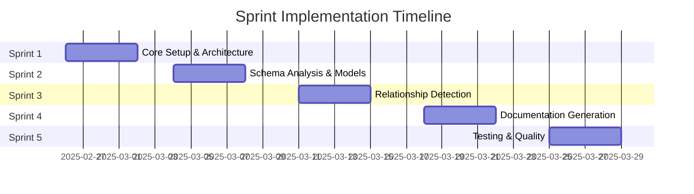
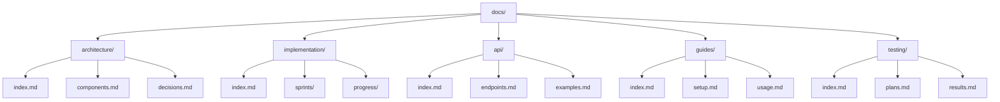
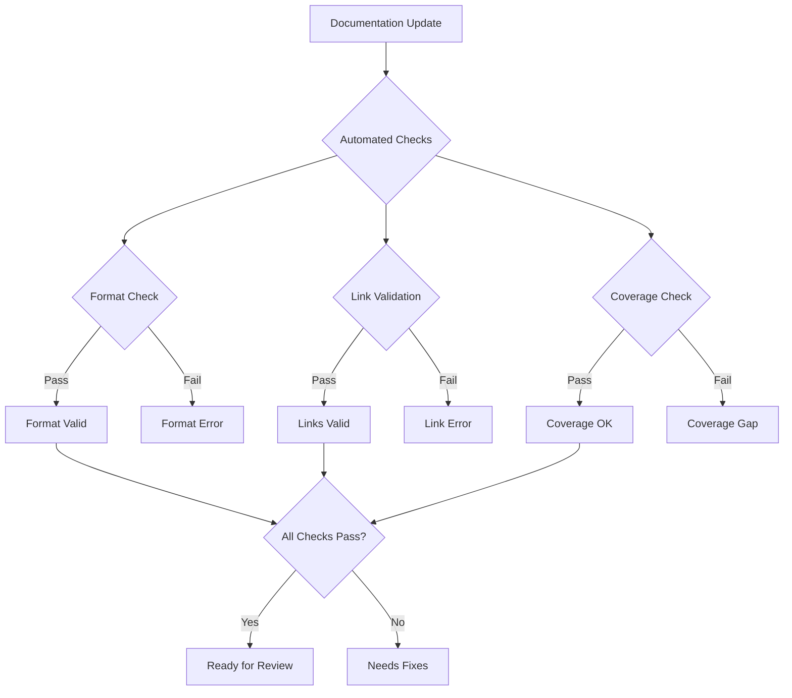

# SAC Eloquent Model Generator Documentation

## Implementation Strategy

## Documentation Structure

## Sprint Overview

### Sprint 1: Core Setup & Architecture

- Duration: 4 days (Feb 26 - Mar 1)
- Focus: Basic infrastructure and architecture
- Documentation: System design and setup guides
- [View Sprint 1 Details](implementation/sprints/sprint-1.md)

### Sprint 2: Schema Analysis & Models

- Duration: 4 days (Mar 4 - Mar 7)
- Focus: Database schema analysis and model generation
- Documentation: API specifications and examples
- [View Sprint 2 Details](implementation/sprints/sprint-2.md)

### Sprint 3: Relationship Detection

- Duration: 4 days (Mar 11 - Mar 14)
- Focus: Table relationship analysis and mapping
- Documentation: Relationship handling guides
- [View Sprint 3 Details](implementation/sprints/sprint-3.md)

### Sprint 4: Documentation Generation

- Duration: 4 days (Mar 18 - Mar 21)
- Focus: Automated documentation generation
- Documentation: Template system and examples
- [View Sprint 4 Details](implementation/sprints/sprint-4.md)

### Sprint 5: Testing & Quality

- Duration: 4 days (Mar 25 - Mar 28)
- Focus: Testing infrastructure and quality tools
- Documentation: Test plans and results
- [View Sprint 5 Details](implementation/sprints/sprint-5.md)

## Navigation

- [Architecture Documentation](architecture/index.md)
- [Implementation Guide](implementation/index.md)
- [API Reference](api/index.md)
- [User Guides](guides/index.md)
- [Testing Documentation](testing/index.md)

## Quality Gates

## Implementation Progress

| Sprint | Status | Documentation | Code Coverage | Quality Score |
|--------|--------|---------------|---------------|---------------|
| 1      | 🔄 Planned | - | - | - |
| 2      | 📅 Scheduled | - | - | - |
| 3      | 📅 Scheduled | - | - | - |
| 4      | 📅 Scheduled | - | - | - |
| 5      | 📅 Scheduled | - | - | - |

## Resource Requirements

### Development Environment

- PHP 8.2+
- Laravel 10.x
- SQLite 3.8.8+
- Composer 2.x

### Documentation Tools

- MkDocs
- PHP_CodeSniffer
- PHPUnit
- phpDocumentor

## Review Schedule

| Sprint | Review Date | Stakeholders | Focus Areas |
|--------|-------------|--------------|-------------|
| 1      | Mar 1, 2025 | Tech Lead, Developer | Architecture, Setup |
| 2      | Mar 7, 2025 | Tech Lead, Developer | Schema Analysis |
| 3      | Mar 14, 2025 | Tech Lead, Developer | Relationships |
| 4      | Mar 21, 2025 | Tech Lead, Developer | Documentation |
| 5      | Mar 28, 2025 | Tech Lead, Developer | Testing, Quality |

[View Implementation Details →](implementation/index.md)
