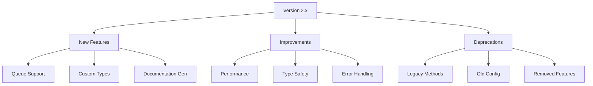

# Migration Guide

## 14.1. Version Compatibility

### Compatibility Matrix

| Package Version | PHP Version | Laravel Version | SQLite Version |
|----------------|-------------|-----------------|----------------|
| 2.x            | ≥ 8.2       | ≥ 10.0         | ≥ 3.8.8       |
| 1.x            | ≥ 8.1       | ≥ 9.0          | ≥ 3.8.0       |
| 0.x            | ≥ 8.0       | ≥ 8.0          | ≥ 3.7.0       |

### Feature Support



## 14.2. Breaking Changes

### Version 2.0

1. **Namespace Changes**

```php
// Before (1.x)
use SAC\EloquentModelGenerator\Generator;

// After (2.x)
use SAC\EloquentModelGenerator\Services\ModelGenerator;
```

2. **Configuration Structure**

```php
// Before (1.x)
return [
    'path' => 'app/Models',
    'namespace' => 'App\\Models',
];

// After (2.x)
return [
    'generation' => [
        'path' => 'app/Models',
        'namespace' => 'App\\Models',
    ],
];
```

3. **Method Signatures**

```php
// Before (1.x)
public function generate(string $table): bool;

// After (2.x)
public function generate(array $tables): GenerationResult;
```

### Version 1.0

1. **Interface Changes**

```php
// Before (0.x)
interface GeneratorInterface
{
    public function generateModel($table);
}

// After (1.x)
interface ModelGeneratorInterface
{
    public function generate(string $table): bool;
}
```

2. **Event System**

```php
// Before (0.x)
Event::fire('model.generated', [$model]);

// After (1.x)
event(new ModelGeneratedEvent($model));
```

## 14.3. Upgrade Steps

### Upgrading to 2.x

1. **Update Dependencies**

```json
{
    "require": {
        "php": "^8.2",
        "s-a-c/eloquent-model-generator": "^2.0"
    }
}
```

2. **Publish New Configuration**

```bash
php artisan vendor:publish --provider="SAC\EloquentModelGenerator\ModelGeneratorServiceProvider" --tag="model-generator-config" --force
```

3. **Update Code**

```php
// Update namespace imports
use SAC\EloquentModelGenerator\Contracts\ModelGeneratorInterface;
use SAC\EloquentModelGenerator\Domain\ValueObjects\GenerationResult;

// Update method calls
public function generate(): void
{
    $generator = app(ModelGeneratorInterface::class);
    $result = $generator->generate(['users', 'posts']);

    if ($result->isSuccessful()) {
        foreach ($result->generatedFiles as $file) {
            $this->info("Generated: {$file}");
        }
    }
}
```

4. **Update Event Listeners**

```php
// Update event handling
use SAC\EloquentModelGenerator\Events\ModelGenerationProgressEvent;

class ModelGenerationListener
{
    public function handle(ModelGenerationProgressEvent $event): void
    {
        if ($event->isComplete) {
            // Handle completion
        }
    }
}
```

### Upgrading to 1.x

1. **Update Dependencies**

```json
{
    "require": {
        "php": "^8.1",
        "s-a-c/eloquent-model-generator": "^1.0"
    }
}
```

2. **Update Configuration**

```php
return [
    'path' => 'app/Models',
    'namespace' => 'App\\Models',
    'base_class' => 'Illuminate\\Database\\Eloquent\\Model',
];
```

## 14.4. Rollback Procedures

### Emergency Rollback

```bash
# Revert to previous version
composer require s-a-c/eloquent-model-generator:"^1.0"

# Restore configuration
php artisan vendor:publish --provider="SAC\EloquentModelGenerator\ModelGeneratorServiceProvider" --tag="model-generator-config" --force

# Clear cache
php artisan cache:clear
php artisan config:clear
```

### Backup Strategy

```php
class BackupManager
{
    public function backupConfiguration(): void
    {
        $config = config_path('model-generator.php');
        copy($config, $config . '.bak');
    }

    public function backupModels(): void
    {
        $path = config('model-generator.generation.path');
        $backup = $path . '_backup_' . date('Y_m_d_His');

        File::copyDirectory($path, $backup);
    }

    public function restore(): void
    {
        // Restore from backups
    }
}
```

### Version Lock

```json
{
    "require": {
        "s-a-c/eloquent-model-generator": "1.0.*"
    },
    "config": {
        "preferred-stable": true
    }
}
```

[← Back to Performance](./performance.md) | [Continue to Release Notes →](./release-notes.md)
