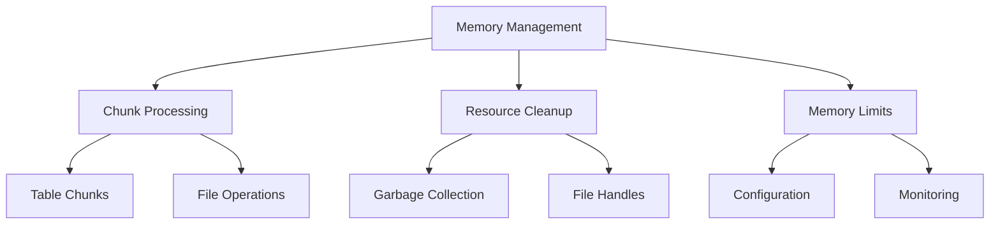
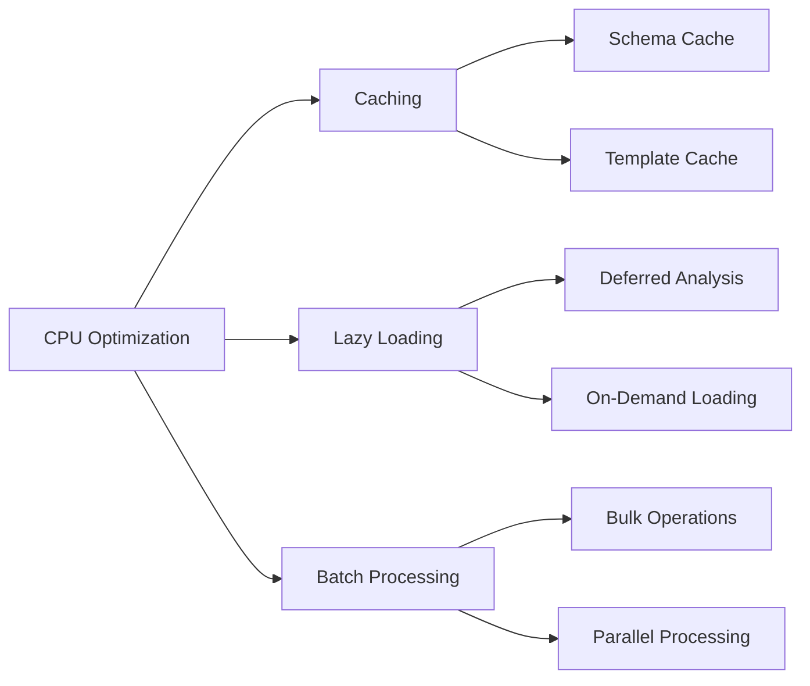
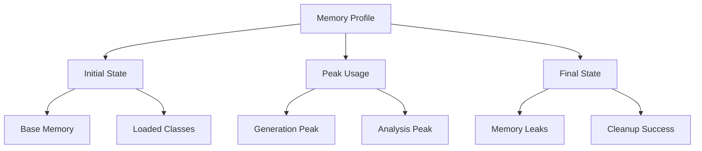
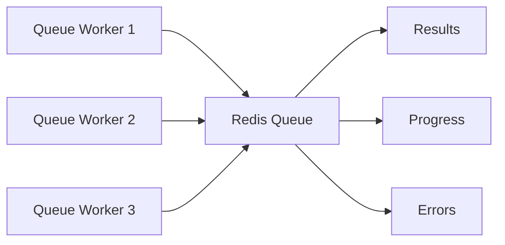

# Performance

## 13.1. Optimization Guidelines

### Memory Management



#### Chunk Processing

```php
class ChunkedGenerator
{
    private const CHUNK_SIZE = 100;

    public function generateModels(array $tables): void
    {
        collect($tables)
            ->chunk(self::CHUNK_SIZE)
            ->each(function ($chunk) {
                $this->processChunk($chunk);
                $this->cleanup();
            });
    }

    private function cleanup(): void
    {
        gc_collect_cycles();
    }
}
```

#### Resource Management

```php
class ResourceManager
{
    private array $handles = [];

    public function openFile(string $path): mixed
    {
        $handle = fopen($path, 'w');
        $this->handles[] = $handle;
        return $handle;
    }

    public function __destruct()
    {
        foreach ($this->handles as $handle) {
            fclose($handle);
        }
    }
}
```

### CPU Optimization



## 13.2. Benchmarks

### Performance Metrics

| Operation | Target Time | Memory Usage |
|-----------|------------|--------------|
| Schema Analysis | < 100ms/table | < 5MB/table |
| Model Generation | < 50ms/model | < 2MB/model |
| File Writing | < 10ms/file | < 1MB/file |
| Documentation | < 200ms/model | < 3MB/model |

### Benchmark Results

```php
class PerformanceBenchmark
{
    public function runBenchmarks(): array
    {
        return [
            'schema_analysis' => $this->benchmarkSchemaAnalysis(),
            'model_generation' => $this->benchmarkModelGeneration(),
            'file_operations' => $this->benchmarkFileOperations(),
            'documentation' => $this->benchmarkDocumentation(),
        ];
    }

    private function benchmark(callable $operation): array
    {
        $start = microtime(true);
        $startMemory = memory_get_usage();

        $operation();

        return [
            'time' => microtime(true) - $start,
            'memory' => memory_get_usage() - $startMemory,
        ];
    }
}
```

## 13.3. Memory Management

### Memory Profiling



### Memory Optimization Techniques

1. **Streaming File Operations**

```php
class StreamingFileWriter
{
    public function writeModel(string $path, Generator $content): void
    {
        $handle = fopen($path, 'w');

        foreach ($content as $chunk) {
            fwrite($handle, $chunk);
            yield;
        }

        fclose($handle);
    }
}
```

2. **Lazy Loading**

```php
class LazyTableAnalyzer
{
    private array $analyzedTables = [];

    public function getTableDefinition(string $table): TableDefinition
    {
        return $this->analyzedTables[$table] ??= $this->analyze($table);
    }
}
```

## 13.4. Scaling Strategies

### Horizontal Scaling



### Queue Configuration

```php
return [
    'queue' => [
        'connection' => 'redis',
        'queue' => 'model-generator',
        'retry_after' => 90,
        'concurrent_jobs' => 3,
        'chunk_size' => 100,
        'memory_limit' => '256M',
    ],
];
```

### Load Distribution

```php
class LoadBalancer
{
    public function distribute(array $tables): array
    {
        return collect($tables)
            ->chunk(ceil(count($tables) / $this->workerCount))
            ->map(function ($chunk) {
                return new GenerateModelJob($chunk->toArray());
            })
            ->toArray();
    }
}
```

### Caching Strategy

```php
class CacheManager
{
    public function getCachedSchema(string $table): ?TableDefinition
    {
        $key = "schema:{$table}";

        return Cache::remember($key, now()->addHour(), function () use ($table) {
            return $this->analyzer->analyze($table);
        });
    }

    public function getCachedTemplate(string $name): ?string
    {
        $key = "template:{$name}";

        return Cache::remember($key, now()->addDay(), function () use ($name) {
            return $this->loadTemplate($name);
        });
    }
}
```

### Performance Monitoring

```php
class PerformanceMonitor
{
    public function recordMetrics(string $operation, callable $callback): mixed
    {
        $start = microtime(true);
        $startMemory = memory_get_usage(true);

        try {
            return $callback();
        } finally {
            $this->metrics->record([
                'operation' => $operation,
                'duration' => microtime(true) - $start,
                'memory' => memory_get_usage(true) - $startMemory,
                'peak_memory' => memory_get_peak_usage(true),
            ]);
        }
    }
}
```

[← Back to Security](./security.md) | [Continue to Migration Guide →](./migration.md)
