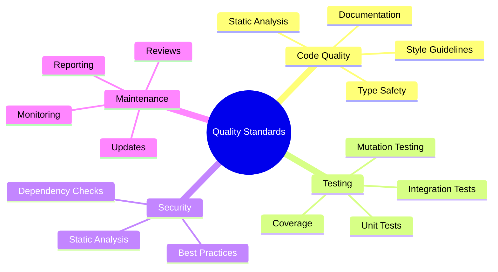
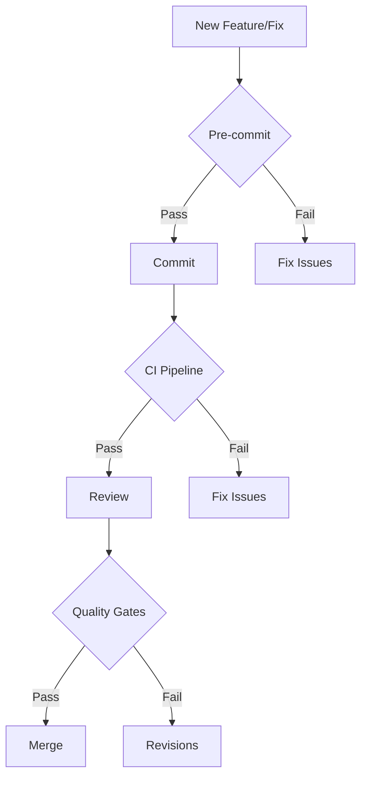
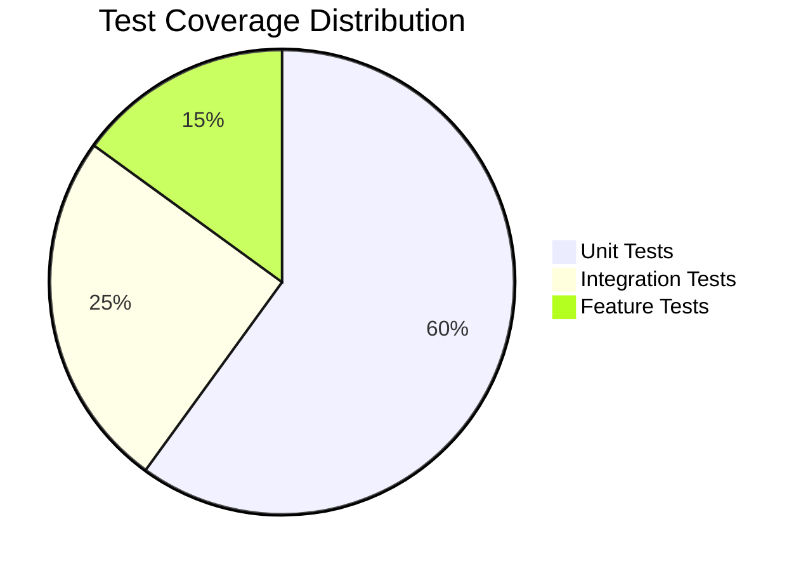
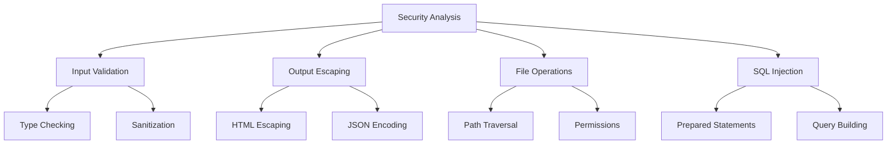
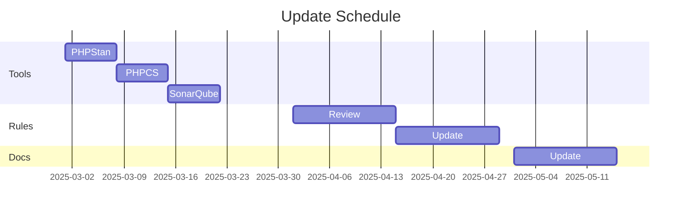
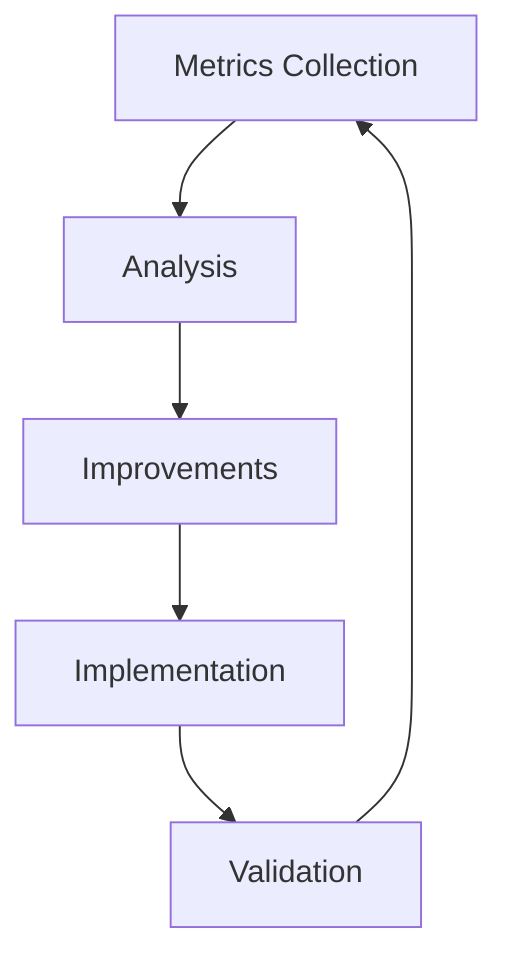

# Quality Standards Guide

## Overview

This guide outlines the quality standards and maintenance procedures for the SAC Eloquent Model Generator package.



## Implementation Process

### 1. Development Workflow



### 2. Quality Gates

| Stage | Tools | Threshold |
|-------|-------|-----------|
| Pre-commit | PHP Lint, PHPCS | No errors |
| CI Pipeline | PHPStan, Tests | Level 10, 100% pass |
| Review | SonarQube | Quality Gate pass |
| Final | Coverage | >90% lines, >85% branches |

## Code Quality Standards

### 1. Static Analysis

#### PHPStan Requirements

- Level 10 (Maximum strictness)
- All strict rules enabled
- No ignored errors
- Generic type checking
- Uninitialized property checking

#### Example Compliance

```php
// ✅ Compliant Code
final class UserRepository
{
    public function __construct(
        private readonly EntityManagerInterface $em
    ) {}

    /**
     * @return array<int, User>
     */
    public function findActive(): array
    {
        return $this->em->getRepository(User::class)
            ->findBy(['active' => true]);
    }
}

// ❌ Non-Compliant Code
class UserRepository
{
    private $em;  // Missing type

    public function findActive()  // Missing return type
    {
        return $this->em->getRepository('User')  // String class name
            ->findBy(['active' => true]);
    }
}
```

### 2. Coding Style

#### PSR-12 Compliance

```php
// ✅ Compliant Code
declare(strict_types=1);

namespace SAC\EloquentModelGenerator\Repository;

use SAC\EloquentModelGenerator\Entity\User;
use Doctrine\ORM\EntityManagerInterface;

final class UserRepository
{
    public function __construct(
        private readonly EntityManagerInterface $em
    ) {}
}

// ❌ Non-Compliant Code
namespace SAC\EloquentModelGenerator\Repository;
use SAC\EloquentModelGenerator\Entity\User;
class userRepository {
    private $em;
    function __construct($em) {
        $this->em = $em;
    }
}
```

## Testing Standards

### 1. Test Coverage Requirements



### 2. Test Quality Metrics

| Metric | Requirement | Tool |
|--------|-------------|------|
| Line Coverage | >90% | PHPUnit |
| Branch Coverage | >85% | PHPUnit |
| Mutation Score | >85% | Infection |
| Test Quality | >90% | Pest |

### 3. Example Test Structure

```php
class UserRepositoryTest extends TestCase
{
    #[Test]
    public function it_finds_active_users(): void
    {
        // Arrange
        $repository = new UserRepository($this->em);

        // Act
        $users = $repository->findActive();

        // Assert
        expect($users)
            ->toBeArray()
            ->toHaveCount(2)
            ->each->toBeInstanceOf(User::class)
            ->each->active->toBeTrue();
    }
}
```

## Security Standards

### 1. Static Analysis Security Rules



### 2. Dependency Management

- Weekly dependency updates
- Automatic security patches
- Lock file verification
- Composer audit checks

## Maintenance Procedures

### 1. Regular Reviews

| Activity | Frequency | Responsibility |
|----------|-----------|----------------|
| Code Review | Per PR | Team |
| Security Audit | Weekly | Security Team |
| Quality Metrics | Daily | CI/CD |
| Dependencies | Weekly | Automation |

### 2. Update Process



## Reporting and Monitoring

### 1. Quality Dashboards

- SonarQube metrics
- Test coverage reports
- Security scan results
- Performance metrics

### 2. Alert Thresholds

| Metric | Warning | Critical |
|--------|---------|----------|
| Coverage | <95% | <90% |
| Quality Gate | Warning | Failed |
| Security | Medium | High |
| Performance | >100ms | >200ms |

## Continuous Improvement

### 1. Feedback Loop



### 2. Documentation Updates

- Keep standards current
- Document new rules
- Update examples
- Maintain changelog

[← Back to Quality Documentation](index.md)
