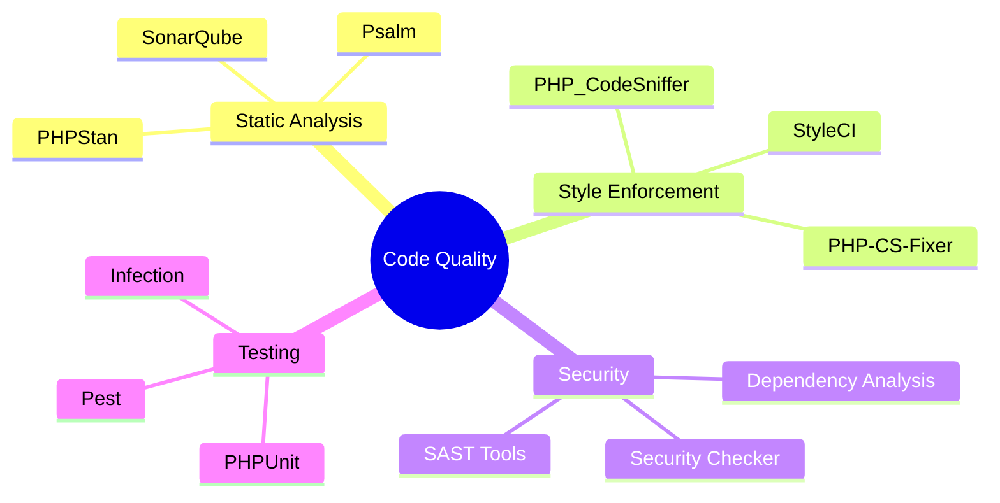
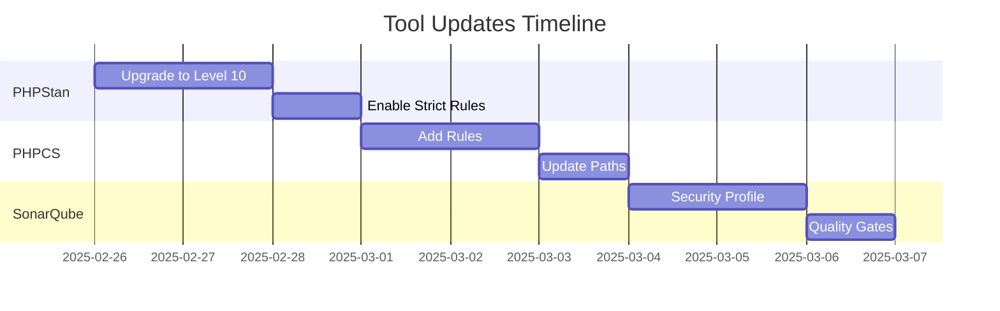
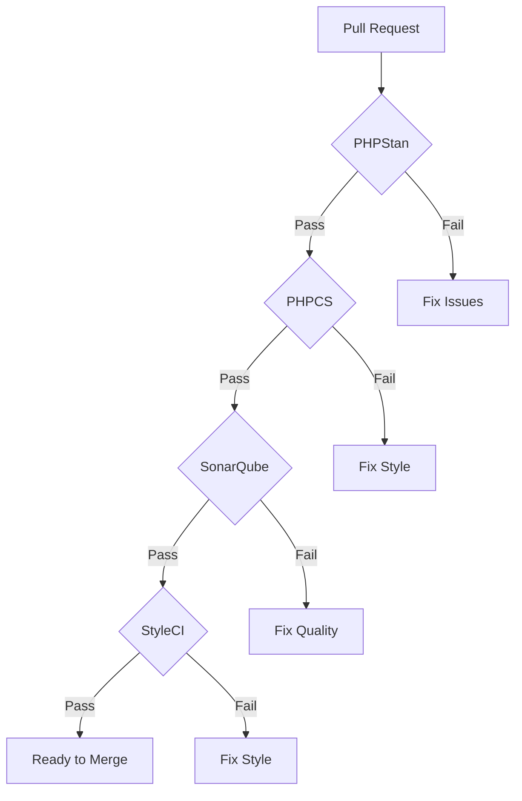

# Code Quality Tooling Audit

## Executive Summary

This document outlines the comprehensive audit of code quality tools and their configurations, comparing current settings against industry best practices and maximum stringency requirements.



## Current State Analysis

### 1. PHP Static Analysis

#### PHPStan Configuration

```yaml
# Current (phpstan.neon)
parameters:
    level: 8
    paths:
        - src
        - tests
    checkMissingIterableValueType: false

# Target (phpstan.neon)
parameters:
    level: 10
    paths:
        - src
        - tests
    checkMissingIterableValueType: true
    checkGenericClassInNonGenericObjectType: true
    checkUninitializedProperties: true
    strictRules:
        allRules: true
    ignoreErrors: []
```

#### Gap Analysis

| Feature | Current | Target | Status |
|---------|---------|--------|--------|
| Level | 8 | 10 | ⚠️ Upgrade |
| Paths | Partial | Complete | ⚠️ Add Missing |
| Generic Types | Off | On | ❌ Enable |
| Strict Rules | Partial | All | ⚠️ Enable All |

### 2. Code Style Enforcement

#### PHP_CodeSniffer

```xml
<!-- Current (phpcs.xml) -->
<ruleset>
    <rule ref="PSR12"/>
    <file>src/</file>
    <file>tests/</file>
</ruleset>

<!-- Target (phpcs.xml) -->
<ruleset>
    <rule ref="PSR12"/>
    <rule ref="Generic.Arrays.DisallowLongArraySyntax"/>
    <rule ref="Generic.Classes.DuplicateClassName"/>
    <rule ref="Generic.CodeAnalysis.EmptyStatement"/>
    <rule ref="Generic.CodeAnalysis.UnusedFunctionParameter"/>
    <rule ref="Generic.Commenting.DocComment"/>
    <rule ref="Generic.Files.LineLength">
        <properties>
            <property name="lineLimit" value="80"/>
            <property name="absoluteLineLimit" value="120"/>
        </properties>
    </rule>
    <file>src/</file>
    <file>tests/</file>
    <file>config/</file>
</ruleset>
```

### 3. SonarQube Integration

#### Current Configuration

```yaml
sonar.projectKey=sac-eloquent-model-generator
sonar.sources=src
sonar.tests=tests
sonar.php.coverage.reportPaths=coverage.xml
sonar.php.tests.reportPath=junit.xml

# Target Configuration
sonar.projectKey=sac-eloquent-model-generator
sonar.sources=src,config
sonar.tests=tests
sonar.php.coverage.reportPaths=coverage.xml
sonar.php.tests.reportPath=junit.xml
sonar.qualitygate.wait=true
sonar.qualityProfiles.php=Sonar way
sonar.security.enabled=true
sonar.security.securityHotspots.enabled=true
```

### 4. StyleCI

```yaml
# Current (.styleci.yml)
preset: psr12
enabled:
  - alpha_ordered_imports
  - concat_with_spaces

# Target (.styleci.yml)
preset: psr12
risky: true
enabled:
  - alpha_ordered_imports
  - concat_with_spaces
  - const_separation
  - declare_strict_types
  - dir_constant
  - is_null
  - modernize_types_casting
  - no_empty_comment
  - no_unused_imports
  - ordered_class_elements
  - phpdoc_order
  - strict_comparison
  - strict_param
```

## Required Updates

### 1. Immediate Actions



### 2. Configuration Updates

#### PHPStan

- [ ] Upgrade to level 10
- [ ] Enable strict rules
- [ ] Add generic type checks
- [ ] Configure baseline

#### PHPCS

- [ ] Add additional rules
- [ ] Update file paths
- [ ] Configure line length
- [ ] Add documentation rules

#### SonarQube

- [ ] Enable security scanning
- [ ] Configure quality gates
- [ ] Add coverage requirements
- [ ] Enable hotspot detection

#### StyleCI

- [ ] Enable risky rules
- [ ] Add strict type rules
- [ ] Configure ordering
- [ ] Add documentation rules

## Quality Gates

### 1. Merge Requirements



### 2. Quality Metrics

| Tool | Metric | Threshold |
|------|--------|-----------|
| PHPStan | Level | 10 |
| PHPCS | Errors | 0 |
| SonarQube | Quality Gate | Pass |
| StyleCI | Checks | All Pass |
| Coverage | Line | > 90% |
| Coverage | Branch | > 85% |

## Automated Enforcement

### 1. CI/CD Integration

```yaml
name: Code Quality

on: [push, pull_request]

jobs:
  quality:
    runs-on: ubuntu-latest
    steps:
      - uses: actions/checkout@v3

      - name: PHPStan
        run: vendor/bin/phpstan analyse

      - name: PHPCS
        run: vendor/bin/phpcs

      - name: SonarQube
        uses: sonarsource/sonarqube-scan-action@master

      - name: Quality Gate
        uses: sonarsource/sonarqube-quality-gate-action@master
```

### 2. Pre-commit Hooks

```bash
#!/bin/bash

# Run PHPStan
vendor/bin/phpstan analyse --no-progress

# Run PHPCS
vendor/bin/phpcs --standard=phpcs.xml

# Run PHP-CS-Fixer
vendor/bin/php-cs-fixer fix --dry-run --diff
```

## Documentation Updates

### 1. Contributing Guidelines

Update `CONTRIBUTING.md` to include:

- Tool configuration requirements
- Quality gate thresholds
- Pre-commit hook setup
- CI/CD pipeline details

### 2. Development Setup

Update development setup documentation:

- Tool installation instructions
- Configuration file locations
- Common error resolutions
- Troubleshooting guides

## Monitoring and Maintenance

### 1. Regular Audits

- Monthly configuration review
- Quarterly tool version updates
- Semi-annual rule set review
- Annual comprehensive audit

### 2. Metrics Collection

- Track quality scores over time
- Monitor false positive rates
- Measure fix times
- Report technical debt

[← Back to Documentation](../index.md)
