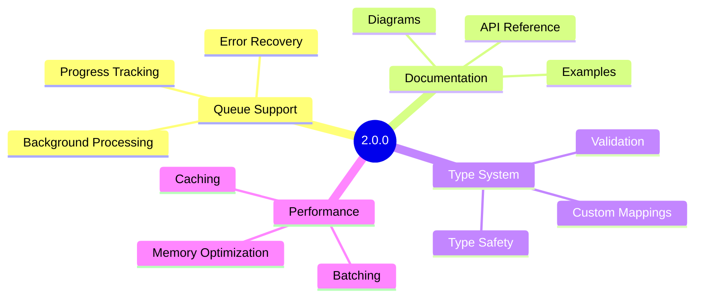
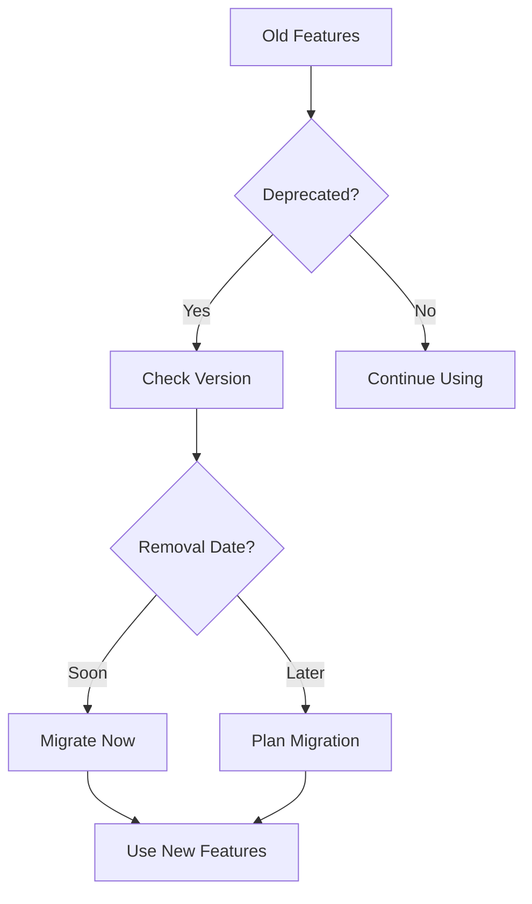
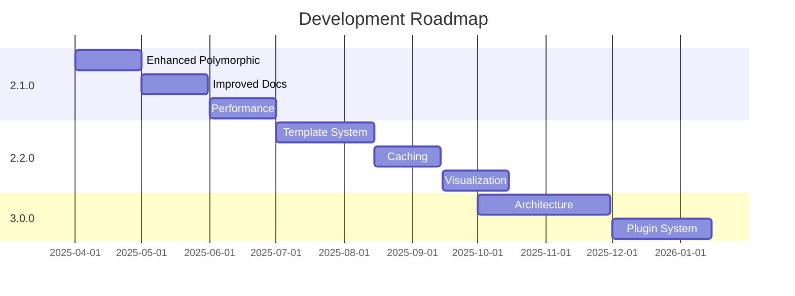

# Release Notes

## 15.1. Version History

### Release Timeline

```mermaid
gitGraph
    commit id: "0.1.0" tag: "Initial Release"
    commit id: "0.2.0"
    branch develop
    commit id: "Feature Development"
    checkout main
    merge develop id: "1.0.0" tag: "First Stable"
    branch develop
    commit id: "New Features"
    commit id: "Bug Fixes"
    checkout main
    merge develop id: "2.0.0" tag: "Current"
```

### Version Details

#### Version 2.0.0 (Current)

**Major Features**

- Queue support for large-scale model generation
- Advanced relationship detection
- Documentation generation
- Custom type mapping system

**Improvements**

- Performance optimizations
- Enhanced error handling
- Better type safety
- Improved test coverage

**Breaking Changes**

- Updated namespace structure
- New configuration format
- Changed method signatures
- Removed deprecated features

#### Version 1.0.0

**Features**

- Basic model generation
- Simple relationship detection
- Configuration system
- Event system

**Improvements**

- Code quality
- Documentation
- Test coverage

#### Version 0.x

**Features**

- Initial implementation
- Basic SQLite support
- Simple model generation

## 15.2. Current Release

### Version 2.0.0

**Release Date**: February 24, 2025

**Requirements**

- PHP 8.2+
- Laravel 10.0+
- SQLite 3.8.8+

**Features**



**Installation**

```bash
composer require s-a-c/eloquent-model-generator:^2.0
```

**Configuration**

```php
return [
    'generation' => [
        'path' => 'app/Models',
        'namespace' => 'App\\Models',
    ],
    'queue' => [
        'enabled' => true,
        'connection' => 'redis',
    ],
];
```

## 15.3. Deprecation Notices

### Deprecated Features

| Feature | Deprecated In | Removed In | Alternative |
|---------|--------------|------------|-------------|
| `generate()` | 1.5.0 | 2.0.0 | `generate(array $tables)` |
| Old Config | 1.8.0 | 2.0.0 | New Config Structure |
| Events | 1.9.0 | 2.0.0 | New Event System |

### Migration Path



## 15.4. Future Roadmap

### Planned Features

#### Version 2.1.0

**Q2 2025**

- Enhanced polymorphic relationship detection
- Improved documentation generation
- Additional type mappings
- Performance optimizations

#### Version 2.2.0

**Q3 2025**

- Custom template system
- Advanced caching
- Relationship visualization
- Code quality tools

#### Version 3.0.0

**Q4 2025**

- Complete architecture refresh
- New plugin system
- Enhanced customization
- Real-time generation

### Development Timeline



### Feature Requests

We welcome feature requests through our GitHub issues. When submitting a feature request:

1. **Check Existing Issues**
   - Search for similar requests
   - Look at the roadmap

2. **Provide Details**

   ```markdown
   ### Feature Description
   Clear description of the feature

   ### Use Case
   Why this feature is needed

   ### Proposed Implementation
   How it might work (optional)

   ### Additional Context
   Any other relevant information
   ```

3. **Discussion**
   - Engage in community discussion
   - Provide additional information
   - Consider alternatives

### Contributing Features

Want to contribute a feature? Here's how:

1. **Discuss First**
   - Open an issue
   - Get feedback
   - Align with roadmap

2. **Development**
   - Fork repository
   - Create feature branch
   - Follow guidelines
   - Write tests

3. **Submit PR**
   - Clear description
   - Link issues
   - Pass checks

[← Back to Migration Guide](./migration.md)
