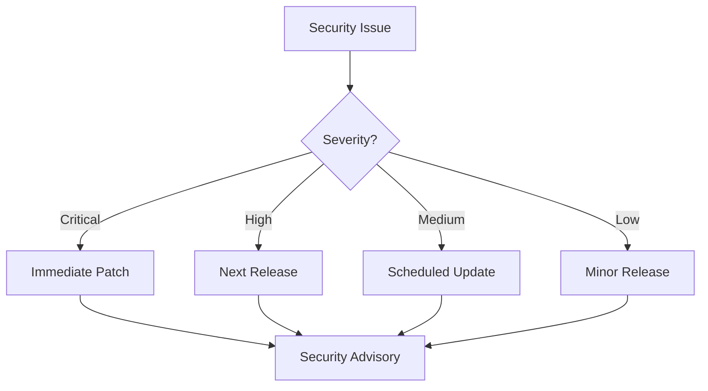
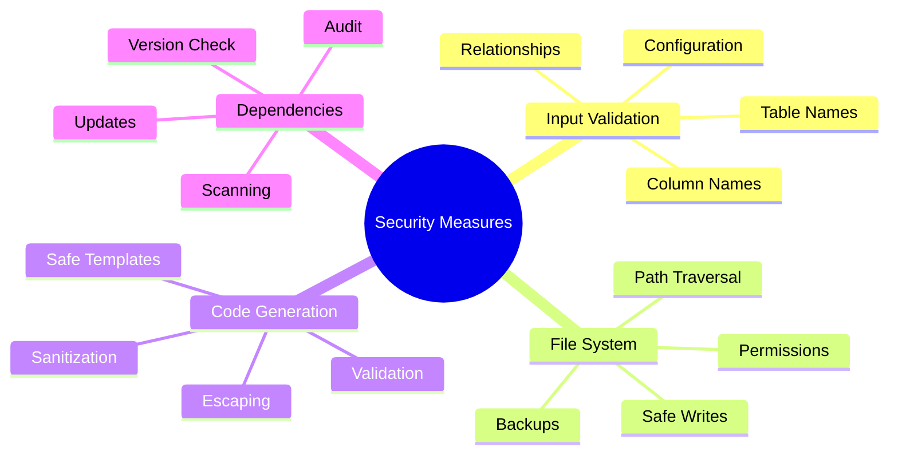
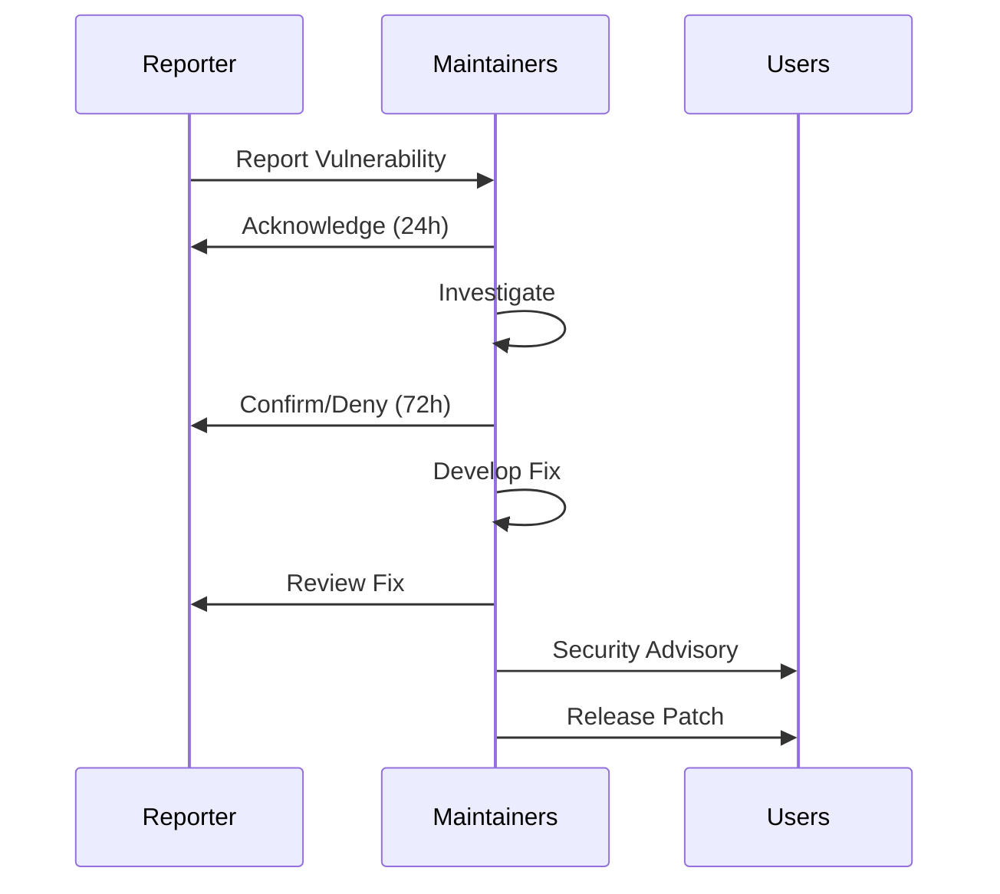

# Security

## 12.1. Security Policy

### Supported Versions

We actively maintain and provide security updates for the following versions:

| Version | PHP Support | Laravel Support | Security Updates |
|---------|------------|-----------------|------------------|
| 2.x     | 8.2+       | 10.x           | ✅ Active       |
| 1.x     | 8.1+       | 9.x            | ⚠️ Until 2025   |
| 0.x     | 8.0+       | 8.x            | ❌ End of Life  |

### Update Policy



## 12.2. Best Practices

### Code Generation Safety

1. **Input Validation**

```php
class ModelGenerator
{
    private function validateTableName(string $table): void
    {
        if (!preg_match('/^[a-zA-Z_][a-zA-Z0-9_]*$/', $table)) {
            throw new InvalidArgumentException(
                'Table name contains invalid characters'
            );
        }
    }
}
```

2. **File System Security**

```php
class FileWriter
{
    private function ensureSafePath(string $path): void
    {
        $realPath = realpath(dirname($path));
        $basePath = realpath($this->basePath);

        if (!str_starts_with($realPath, $basePath)) {
            throw new SecurityException('Path traversal detected');
        }
    }
}
```

3. **Code Injection Prevention**

```php
class CodeGenerator
{
    private function sanitizeClassName(string $name): string
    {
        return preg_replace(
            '/[^a-zA-Z0-9_]/',
            '',
            $name
        );
    }
}
```

### Security Measures



## 12.3. Vulnerability Reporting

### Reporting Process

1. **Do NOT create public issues** for security vulnerabilities

2. **Email security concerns** to:
   - <security@s-a-c.dev>
   - Include "SECURITY" in subject line

3. **Include in report**:

   ```markdown
   ### Environment
   - Package Version: x.y.z
   - PHP Version: x.y.z
   - Laravel Version: x.y.z

   ### Vulnerability Details
   - Type: (e.g., SQL Injection, XSS)
   - Impact: (What can an attacker do?)
   - Steps to Reproduce: (Clear steps)

   ### Additional Information
   - POC Code (if available)
   - Suggested Fix (if any)
   ```

### Response Timeline



## 12.4. Security Updates

### Update Process

1. **Security Advisories**

```bash
# Check for security advisories
composer audit

# Update dependencies
composer update --with-dependencies
```

2. **Version Updates**

```json
{
    "require": {
        "s-a-c/eloquent-model-generator": "^2.0",
        "php": "^8.2"
    },
    "config": {
        "allow-plugins": {
            "s-a-c/security-checker": true
        }
    }
}
```

3. **Automated Security Checks**

```yaml
# .github/workflows/security.yml
name: Security Checks

on:
  push:
    branches: [ main ]
  pull_request:
    branches: [ main ]
  schedule:
    - cron: '0 0 * * *'

jobs:
  security:
    runs-on: ubuntu-latest
    steps:
      - uses: actions/checkout@v3

      - name: Security Check
        uses: s-a-c/security-checker@v2
        with:
          scan_type: 'all'

      - name: Dependency Audit
        run: composer audit

      - name: Static Analysis
        run: composer stan
```

### Security Features

1. **File Permission Management**

```php
class FileManager
{
    private const SAFE_PERMISSIONS = 0644;
    private const SAFE_DIRECTORY_PERMISSIONS = 0755;

    public function writeFile(string $path, string $content): void
    {
        file_put_contents($path, $content);
        chmod($path, self::SAFE_PERMISSIONS);
    }

    public function createDirectory(string $path): void
    {
        mkdir($path, self::SAFE_DIRECTORY_PERMISSIONS, true);
    }
}
```

2. **Input Sanitization**

```php
class InputSanitizer
{
    public function sanitizeInput(array $input): array
    {
        return array_map(function ($value) {
            if (is_string($value)) {
                return $this->sanitizeString($value);
            }
            return $value;
        }, $input);
    }

    private function sanitizeString(string $value): string
    {
        return htmlspecialchars(
            strip_tags($value),
            ENT_QUOTES | ENT_HTML5,
            'UTF-8'
        );
    }
}
```

3. **Security Headers**

```php
class SecurityHeaders
{
    public static function getHeaders(): array
    {
        return [
            'X-Content-Type-Options' => 'nosniff',
            'X-Frame-Options' => 'DENY',
            'X-XSS-Protection' => '1; mode=block',
            'Content-Security-Policy' => "default-src 'self'",
        ];
    }
}
```

[← Back to Contributing](./contributing.md) | [Continue to Performance →](./performance.md)
