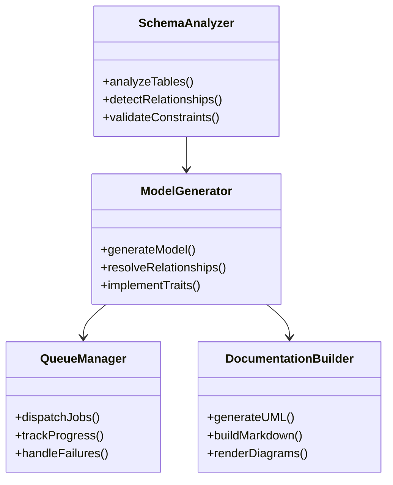
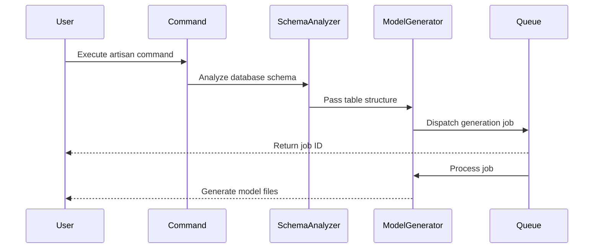

# Software Requirements Specification

## Laravel Artisan Model Generator Command

### Version 1.0.0

## Table of Contents

1. Introduction
   1.1. Purpose
   1.2. Scope
   1.3. Definitions and Acronyms
   1.4. References
   1.5. Overview

2. System Description
   2.1. System Context
   2.2. System Features
   2.3. User Classes and Characteristics
   2.4. Operating Environment
   2.5. Design and Implementation Constraints
   2.6. Assumptions and Dependencies

3. Domain Components
   3.1. Schema Analysis Domain
   3.2. Model Generation Domain
   3.3. Queue Management Domain
   3.4. Documentation Domain

4. System Features
   4.1. SQLite Schema Analysis
   4.2. Model Generation Features
   4.3. Queue Processing
   4.4. Documentation Generation

5. Performance Requirements
   5.1. Memory Optimization
   5.2. Queue Management
   5.3. Error Handling

6. Integration Specifications
   6.1. Laravel Framework Integration
   6.2. Testing Requirements

7. Domain Models and Relationships



8. Sequence Flows



9. Implementation Examples

## 1. Introduction

### 1.1. Purpose

This Software Requirements Specification (SRS) document provides a detailed description of the Laravel Artisan Model Generator Command. The command is designed to automate the generation of Eloquent models through SQLite schema introspection, supporting advanced ORM mapping capabilities and polymorphic relationships within bounded contexts.

### 1.2. Scope

The system encompasses a command-line utility that:

- Analyzes SQLite database schemas
- Generates Eloquent models with proper relationships
- Processes generation tasks through Laravel's queue system
- Produces comprehensive documentation

### 1.3. Definitions and Acronyms

- DDD: Domain-Driven Design
- ORM: Object-Relational Mapping
- SRS: Software Requirements Specification
- CLI: Command-Line Interface

### 1.4. References

- IEEE 29148-2018 Standards
- Laravel Documentation
- SQLite Documentation
- Domain-Driven Design Reference

### 1.5. Overview

The remainder of this document provides detailed information about the system features, requirements, and constraints. It includes technical specifications, architectural diagrams, and implementation examples.

## 2. System Description

### 2.1. System Context

The Model Generator Command operates within a Laravel application environment, interfacing with:

- SQLite databases
- Laravel's Artisan CLI
- Queue processing system
- File system for model generation

### 2.2. System Features

Key features include:

- Automated schema analysis
- Intelligent relationship detection
- Queued processing for large schemas
- Documentation generation

### 2.3. User Classes and Characteristics

Primary users are:

- Laravel developers
- Database administrators
- System architects
- DevOps engineers

### 2.4. Operating Environment

- PHP 8.1 or higher
- Laravel 10.x or higher
- SQLite 3.x
- Composer package manager

### 2.5. Design and Implementation Constraints

- Must follow Laravel's coding standards
- SQLite-specific schema introspection
- Memory management for large schemas
- Queue system dependencies

### 2.6. Assumptions and Dependencies

- Laravel framework installation
- SQLite database availability
- Queue driver configuration
- Sufficient system resources

## 3. Domain Components

### 3.1. Schema Analysis Domain

The Schema Analysis Domain handles database introspection and structure mapping:

```php
interface SchemaAnalyzerInterface
{
    public function analyzeTables(): Collection;
    public function detectRelationships(): Collection;
    public function validateConstraints(): ValidationResult;
}
```

### 3.2. Model Generation Domain

The Model Generation Domain manages code generation and relationship mapping:

```php
interface ModelGeneratorInterface
{
    public function generateModel(string $table): Model;
    public function resolveRelationships(Collection $relations): void;
    public function implementTraits(array $traits): void;
}
```

### 3.3. Queue Management Domain

The Queue Management Domain handles job processing and monitoring:

```php
interface QueueManagerInterface
{
    public function dispatchJobs(Collection $tables): void;
    public function trackProgress(string $jobId): ProgressStatus;
    public function handleFailures(Exception $e): void;
}
```

### 3.4. Documentation Domain

The Documentation Domain generates technical documentation and diagrams:

```php
interface DocumentationBuilderInterface
{
    public function generateUML(): string;
    public function buildMarkdown(): string;
    public function renderDiagrams(): Collection;
}
```

## 4. System Features

### 4.1. SQLite Schema Analysis

Detailed specifications for schema analysis:

```php
class SQLiteSchemaAnalyzer implements SchemaAnalyzerInterface
{
    public function analyzeTables(): Collection
    {
        // Table structure mapping
        // Column type detection
        // Index pattern recognition
        // Constraint resolution
    }

    public function detectRelationships(): Collection
    {
        // Foreign key analysis
        // Polymorphic pattern detection
        // Many-to-many resolution
    }
}
```

### 4.2. Model Generation Features

Model generation capabilities:

```php
class EloquentModelGenerator implements ModelGeneratorInterface
{
    public function generateModel(string $table): Model
    {
        // Namespace organization
        // Interface implementation
        // Trait integration
        // Custom attribute casting
    }

    public function implementPolymorphic(): void
    {
        // Morph map configuration
        // Relationship method generation
        // Interface binding
    }
}
```

### 4.3. Queue Processing

Queue management specifications:

```php
class ModelGenerationJob implements ShouldQueue
{
    public function handle(): void
    {
        // Chunk processing
        // Memory management
        // Progress reporting
        // Error recovery
    }

    public function failed(Exception $e): void
    {
        // Failure logging
        // Retry logic
        // Notification dispatch
    }
}
```

### 4.4. Documentation Generation

Documentation generation features:

```php
class ModelDocumentationBuilder implements DocumentationBuilderInterface
{
    public function generateUML(): string
    {
        // Class diagram generation
        // Relationship mapping
        // Method documentation
    }

    public function buildMarkdown(): string
    {
        // API documentation
        // Usage examples
        // Configuration guide
    }
}
```

## 5. Performance Requirements

### 5.1. Memory Optimization

Memory management strategies:

- Chunk size configuration
- Garbage collection triggers
- Resource monitoring
- Cache implementation

### 5.2. Queue Management

Queue processing requirements:

- Job prioritization rules
- Retry policies
- Progress tracking
- Resource allocation

### 5.3. Error Handling

Error management specifications:

- Exception hierarchy
- Recovery procedures
- Logging protocols
- Alert systems

## 6. Integration Specifications

### 6.1. Laravel Framework Integration

Framework integration requirements:

- Service provider registration
- Configuration publishing
- Event broadcasting
- Cache integration

### 6.2. Testing Requirements

Testing specifications:

- Unit test coverage
- Integration test scenarios
- Performance benchmarks
- Quality metrics

## 7. Implementation Guide

### Configuration Example

```php
return [
    'schema' => [
        'chunk_size' => 100,
        'analyze_indexes' => true,
        'detect_polymorphic' => true,
    ],
    'generation' => [
        'namespace' => 'App\\Models',
        'traits' => [
            'App\\Traits\\HasUuid',
            'App\\Traits\\Searchable',
        ],
    ],
    'queue' => [
        'connection' => 'redis',
        'queue' => 'model-generation',
        'timeout' => 3600,
    ],
    'documentation' => [
        'output_path' => 'docs/models',
        'generate_diagrams' => true,
        'include_examples' => true,
    ],
];
```

### Usage Example

```bash
# Generate models for all tables
php artisan model:generate

# Generate specific model
php artisan model:generate --table=users

# Generate with documentation
php artisan model:generate --with-docs

# Analyze schema only
php artisan model:analyze
```

## 8. Quality Assurance

### Test Coverage Requirements

- Minimum 90% code coverage
- Integration test scenarios
- Performance benchmarks
- Security testing

### Code Quality Metrics

- PSR-12 compliance
- Cyclomatic complexity < 10
- Maintainability index > 85
- SOLID principles adherence

## 9. Operational Guide

### Deployment Procedure

1. Package installation
2. Configuration publishing
3. Queue worker setup
4. Documentation generation

### Monitoring Strategy

- Queue monitoring
- Performance metrics
- Error tracking
- Resource usage

### Maintenance Protocol

- Regular updates
- Schema synchronization
- Cache management
- Log rotation

### Troubleshooting Guide

- Common issues
- Resolution steps
- Support contacts
- Debug procedures
