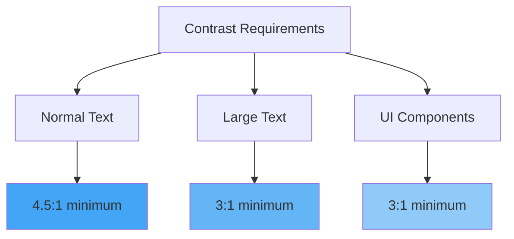
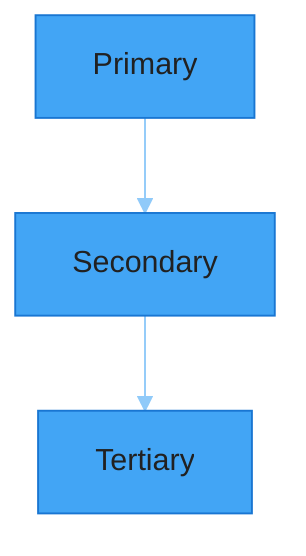
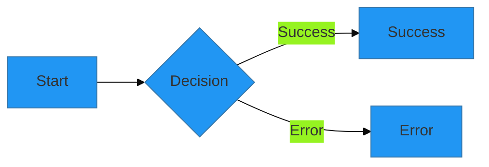

# Color System Specification

## Brand Colors

```scss
// Primary Colors
$primary-100: #E3F2FD; // Light background
$primary-200: #BBDEFB; // Hover states
$primary-300: #90CAF9; // Active states
$primary-400: #64B5F6; // Secondary elements
$primary-500: #42A5F5; // Primary elements
$primary-600: #2196F3; // Main brand color
$primary-700: #1E88E5; // Interactive elements
$primary-800: #1976D2; // Focus states
$primary-900: #1565C0; // Dark accents

// Semantic Colors
$success-500: #4CAF50; // Success states
$warning-500: #FFC107; // Warning states
$error-500:   #F44336; // Error states
$info-500:    #2196F3; // Info states

// Neutral Colors
$neutral-100: #F5F5F5; // Background
$neutral-200: #EEEEEE; // Subtle backgrounds
$neutral-300: #E0E0E0; // Borders
$neutral-400: #BDBDBD; // Disabled states
$neutral-500: #9E9E9E; // Secondary text
$neutral-600: #757575; // Tertiary text
$neutral-700: #616161; // Primary text
$neutral-800: #424242; // Headings
$neutral-900: #212121; // Dark text
```

## Accessibility Guidelines

### Contrast Ratios



### Color Combinations

| Element | Light Mode | Dark Mode | Contrast Ratio |
|---------|------------|-----------|----------------|
| Body Text | neutral-700 on neutral-100 | neutral-200 on neutral-900 | 7.5:1 |
| Headings | neutral-800 on neutral-100 | neutral-100 on neutral-900 | 8:1 |
| Links | primary-700 on neutral-100 | primary-300 on neutral-900 | 4.8:1 |
| Buttons | neutral-100 on primary-600 | neutral-900 on primary-300 | 5:1 |

## Dark Mode Support

```scss
[data-theme="dark"] {
    --background: #{$neutral-900};
    --text-primary: #{$neutral-100};
    --text-secondary: #{$neutral-300};
    --primary: #{$primary-300};
    --border: #{$neutral-700};
}

[data-theme="light"] {
    --background: #{$neutral-100};
    --text-primary: #{$neutral-900};
    --text-secondary: #{$neutral-700};
    --primary: #{$primary-600};
    --border: #{$neutral-300};
}
```

## Diagram Color Schemes

### Architecture Diagrams



### Flow Diagrams



## Visual Hierarchy

### Information Levels

1. **Primary Information**
   - Color: primary-600
   - Usage: Main headings, key actions
   - Contrast: 7:1 minimum

2. **Secondary Information**
   - Color: primary-400
   - Usage: Subheadings, supporting content
   - Contrast: 5:1 minimum

3. **Tertiary Information**
   - Color: neutral-600
   - Usage: Additional details
   - Contrast: 4.5:1 minimum

### Interactive States

```scss
.interactive-element {
    // Default state
    background: $primary-600;

    // Hover state
    &:hover {
        background: $primary-700;
    }

    // Focus state
    &:focus {
        outline: 3px solid $primary-300;
        outline-offset: 2px;
    }

    // Active state
    &:active {
        background: $primary-800;
    }

    // Disabled state
    &:disabled {
        background: $neutral-400;
    }
}
```

## Implementation Guidelines

### CSS Variables

```scss
:root {
    // Brand colors
    --color-primary: #{$primary-600};
    --color-primary-light: #{$primary-300};
    --color-primary-dark: #{$primary-800};

    // Text colors
    --text-primary: #{$neutral-900};
    --text-secondary: #{$neutral-700};
    --text-tertiary: #{$neutral-600};

    // Background colors
    --background-primary: #{$neutral-100};
    --background-secondary: #{$neutral-200};
    --background-tertiary: #{$neutral-300};

    // Semantic colors
    --color-success: #{$success-500};
    --color-warning: #{$warning-500};
    --color-error: #{$error-500};
    --color-info: #{$info-500};
}
```

### Usage Examples

```scss
// Documentation sections
.doc-section {
    background: var(--background-primary);
    color: var(--text-primary);
    border: 1px solid var(--border);

    h1, h2, h3 {
        color: var(--text-primary);
    }

    a {
        color: var(--color-primary);

        &:hover {
            color: var(--color-primary-dark);
        }
    }

    code {
        background: var(--background-secondary);
        color: var(--text-primary);
    }
}

// Alert components
.alert {
    &--info {
        background: rgba($info-500, 0.1);
        border-left: 4px solid var(--color-info);
    }

    &--success {
        background: rgba($success-500, 0.1);
        border-left: 4px solid var(--color-success);
    }

    &--warning {
        background: rgba($warning-500, 0.1);
        border-left: 4px solid var(--color-warning);
    }

    &--error {
        background: rgba($error-500, 0.1);
        border-left: 4px solid var(--color-error);
    }
}
```

[← Back to Styles](index.md) | [Continue to Typography →](typography.md)
