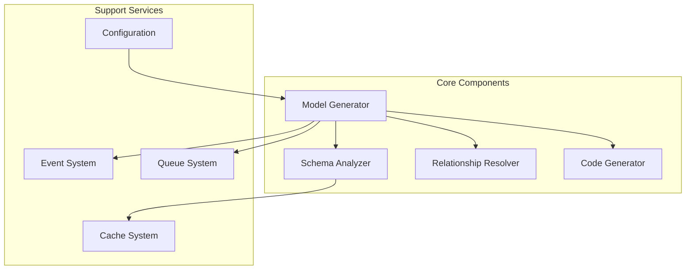
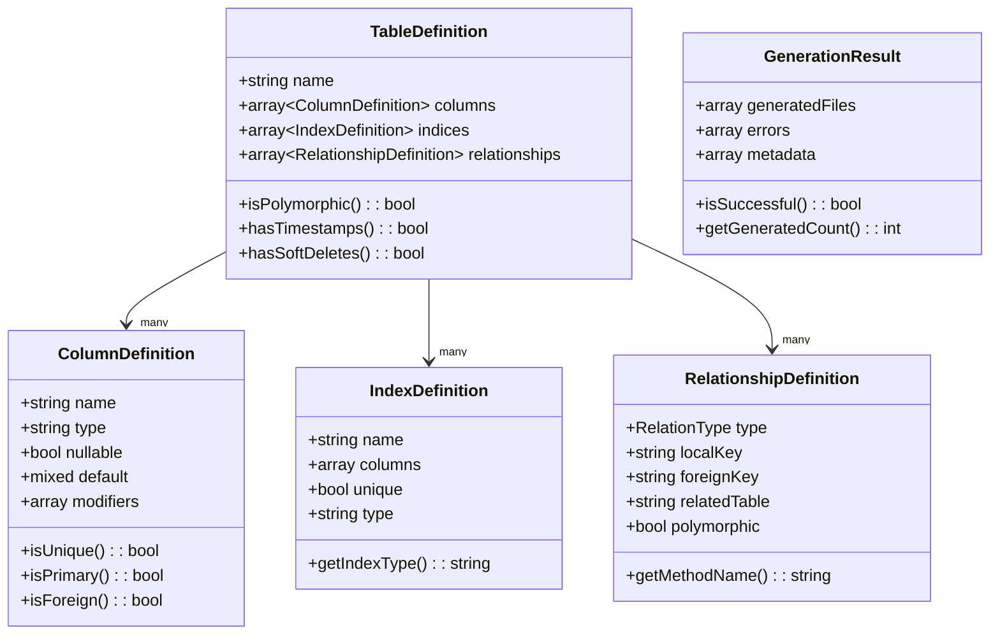
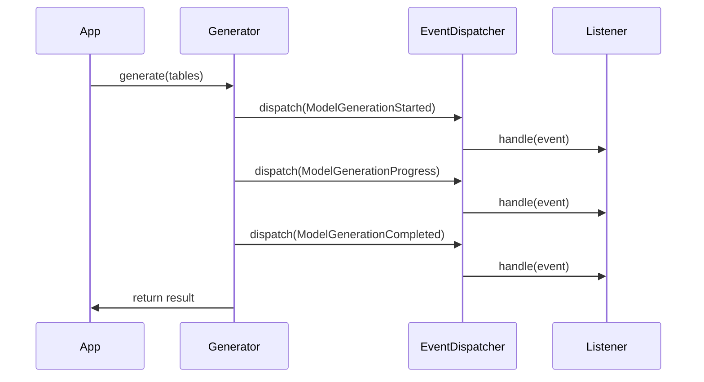
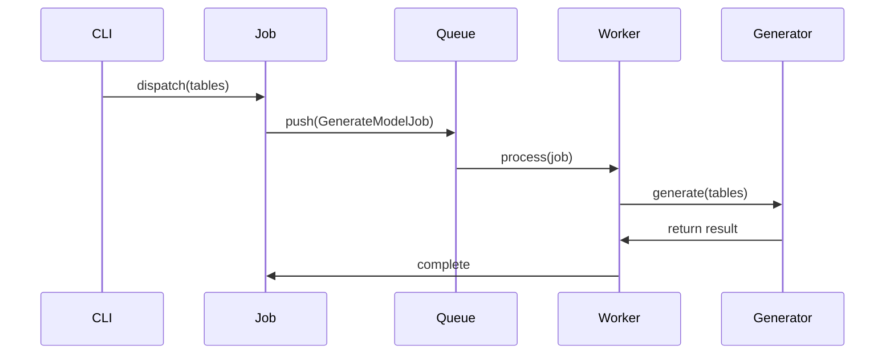

# Technical Design

## 3.1. Core Components

The SAC Eloquent Model Generator is built on several core components that work together to analyze database schemas and generate Eloquent models:



### Component Responsibilities

1. **Model Generator**
   - Orchestrates the generation process
   - Manages dependencies between components
   - Handles error recovery and reporting
   - Provides public API interface

2. **Schema Analyzer**
   - Introspects SQLite database schema
   - Analyzes table structures
   - Detects column types and constraints
   - Caches schema information

3. **Relationship Resolver**
   - Identifies table relationships
   - Resolves foreign key constraints
   - Detects polymorphic relationships
   - Maps many-to-many associations

4. **Code Generator**
   - Applies model templates
   - Generates PHP code
   - Formats output
   - Manages file operations

## 3.2. Domain Model

The package uses immutable value objects to represent domain concepts:



## 3.3. Service Layer

The service layer provides the core functionality through well-defined interfaces:

### ModelGeneratorInterface

```php
interface ModelGeneratorInterface
{
    /**
     * Generate models for the specified tables.
     *
     * @param array<string> $tables
     * @param array<string, mixed> $options
     * @return GenerationResult
     */
    public function generate(array $tables, array $options = []): GenerationResult;

    /**
     * Analyze database tables.
     *
     * @return array<TableDefinition>
     */
    public function analyzeTables(): array;
}
```

### SchemaAnalyzerInterface

```php
interface SchemaAnalyzerInterface
{
    /**
     * Analyze a database table.
     *
     * @param string $table
     * @return TableDefinition
     */
    public function analyze(string $table): TableDefinition;

    /**
     * Get all table names from the database.
     *
     * @return array<string>
     */
    public function getTables(): array;
}
```

### RelationshipResolverInterface

```php
interface RelationshipResolverInterface
{
    /**
     * Resolve relationships for tables.
     *
     * @param array<TableDefinition> $tables
     * @return array<RelationshipDefinition>
     */
    public function resolve(array $tables): array;
}
```

### CodeGeneratorInterface

```php
interface CodeGeneratorInterface
{
    /**
     * Generate model code.
     *
     * @param TableDefinition $definition
     * @return string
     */
    public function generate(TableDefinition $definition): string;
}
```

## 3.4. Integration Points

The package provides several integration points for extending functionality:

### 1. Custom Type Mappings

```php
// config/model-generator.php
return [
    'type_mappings' => [
        'custom_types' => [
            'point' => 'App\\Casts\\PointCast',
            'json_array' => 'array',
        ],
    ],
];
```

### 2. Custom Templates

```php
// Custom model template
class {{ className }} extends {{ baseClassName }}
{
    {{ properties }}

    {{ relationships }}

    {{ methods }}

    // Custom code here
}
```

### 3. Event System



### 4. Queue System



[← Back to Getting Started](./getting-started.md) | [Continue to Features and Capabilities →](./features.md)
