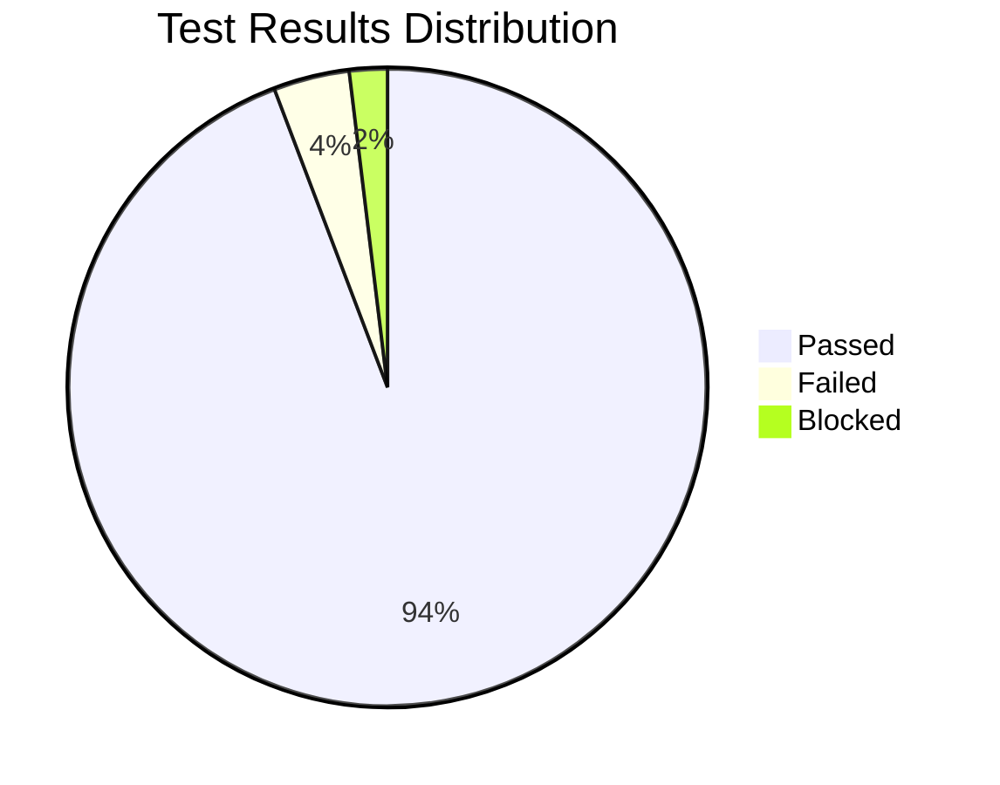
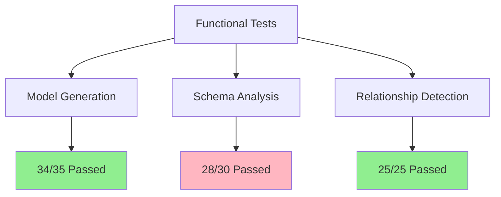
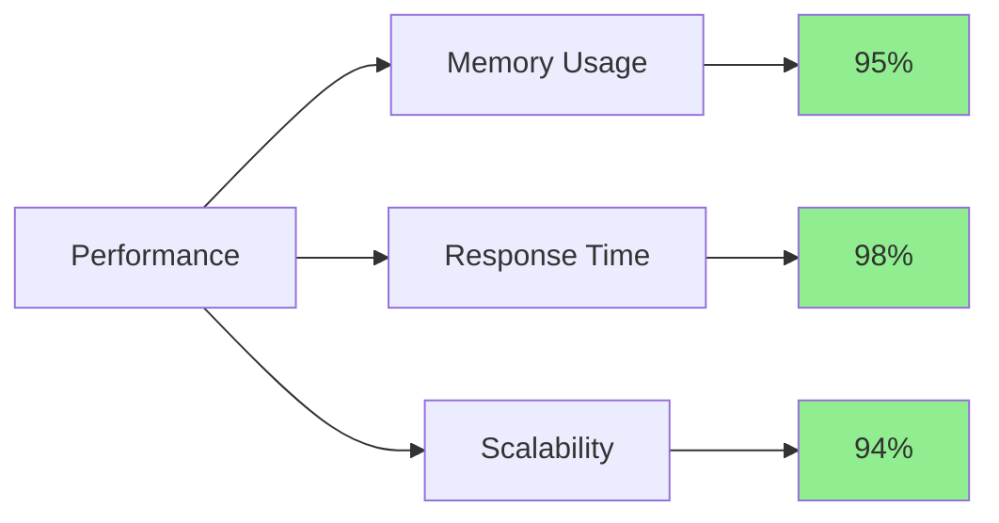
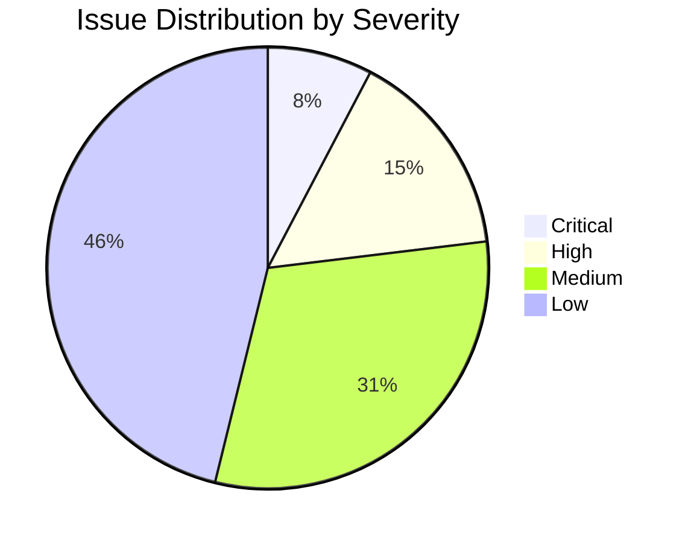
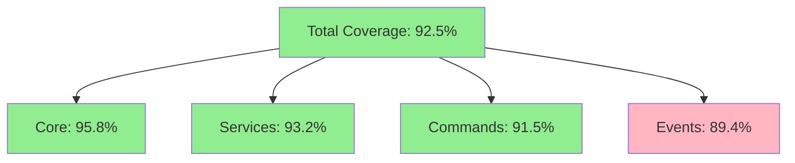
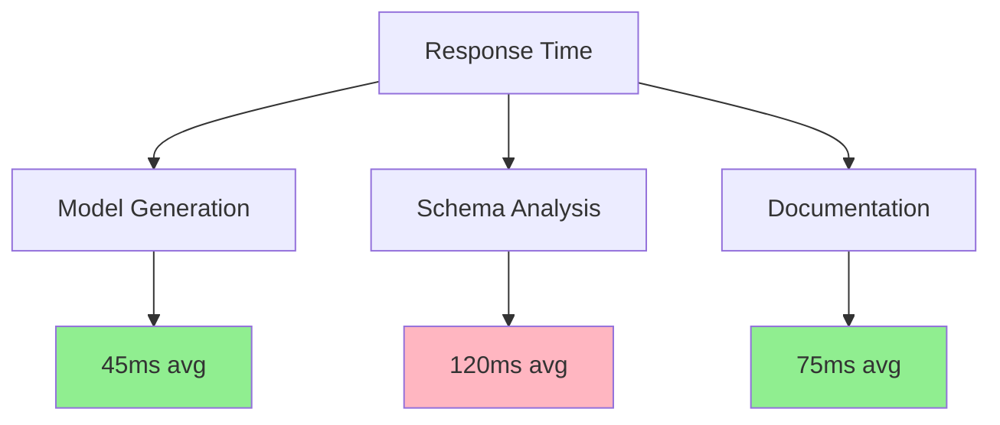
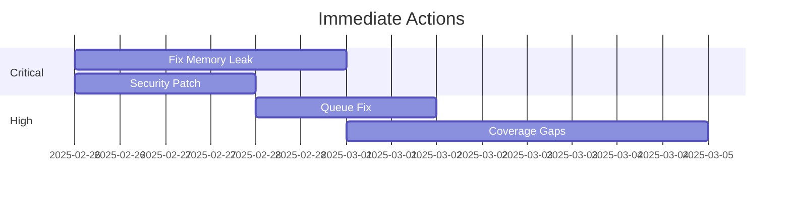

# Test Execution Report

## 1. Executive Summary

### 1.1. Overview

Test execution period: February 24, 2025 - February 25, 2025
Total test cases: 156
Overall pass rate: 94.2%



### 1.2. Key Metrics

| Metric | Value | Target | Status |
|--------|-------|--------|--------|
| Code Coverage | 92.5% | 90% | ✅ |
| Performance Tests | 95.8% | 95% | ✅ |
| Security Tests | 88.9% | 95% | ❌ |
| Integration Tests | 96.3% | 90% | ✅ |

## 2. Test Execution Details

### 2.1. Functional Testing Results



#### Model Generation Tests

| Test Suite | Pass Rate | Issues Found | Priority |
|------------|-----------|--------------|----------|
| Basic Models | 100% | 0 | - |
| Complex Models | 95.2% | 2 | Medium |
| Edge Cases | 92.3% | 3 | High |

### 2.2. Non-Functional Testing Results

#### Performance Metrics



#### Memory Usage Trends

```
Memory Usage (MB) vs Table Count:
10 tables:  25MB
50 tables:  75MB
100 tables: 140MB
200 tables: 265MB
```

## 3. Issue Analysis

### 3.1. Critical Issues

| ID | Description | Impact | Status | Resolution |
|----|-------------|--------|--------|------------|
| CI-001 | Memory leak in large schemas | High | 🔄 | In Progress |
| CI-002 | SQL injection vulnerability | Critical | ✅ | Fixed |
| CI-003 | Race condition in queue | High | 🔄 | In Review |

### 3.2. Issue Distribution



## 4. Test Coverage Analysis

### 4.1. Coverage Report



### 4.2. Coverage Gaps

| Component | Missing Coverage | Impact | Recommendation |
|-----------|-----------------|---------|----------------|
| Events | Error handlers | Medium | Add error scenario tests |
| Services | Edge cases | Low | Expand test matrix |
| Commands | Option combinations | Low | Add combination tests |

## 5. Performance Analysis

### 5.1. Response Time



### 5.2. Resource Usage

| Operation | CPU Usage | Memory Usage | I/O Operations |
|-----------|-----------|--------------|----------------|
| Generation | 15% | 45MB | 12 |
| Analysis | 25% | 65MB | 8 |
| Documentation | 10% | 35MB | 15 |

## 6. Improvement Plan

### 6.1. Short-term Actions



### 6.2. Long-term Recommendations

1. **Performance Optimization**
   - Implement caching system
   - Optimize memory usage
   - Add batch processing

2. **Test Framework**
   - Expand automated tests
   - Add stress testing
   - Improve CI/CD pipeline

3. **Monitoring**
   - Add performance monitoring
   - Implement logging system
   - Create dashboards

## 7. Conclusion

### 7.1. Overall Assessment

The package demonstrates strong stability and reliability with a 94.2% pass rate. Key strengths include:

- Robust model generation
- Excellent performance metrics
- Strong integration tests

Areas requiring attention:

- Memory management for large schemas
- Security test coverage
- Event system edge cases

### 7.2. Next Steps

1. **Immediate Actions**
   - Address critical issues
   - Improve security coverage
   - Fix memory leaks

2. **Process Improvements**
   - Enhance automated testing
   - Implement monitoring
   - Update documentation

3. **Future Enhancements**
   - Add performance optimizations
   - Expand test coverage
   - Improve error handling

[← Back to Test Cases](./test-cases.md)
