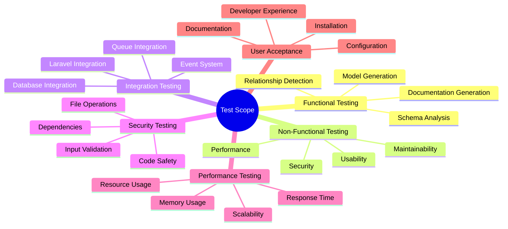
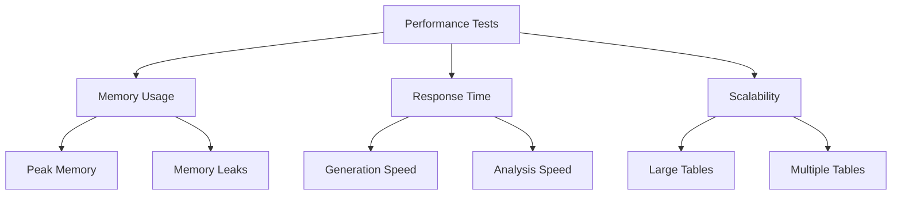
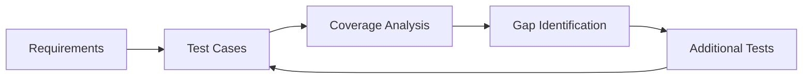
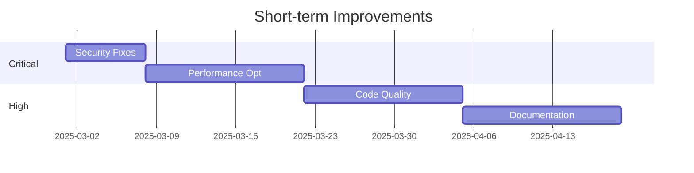

# Test Plan

## 1. Overview

### 1.1. Purpose

This test plan provides a comprehensive framework for validating the SAC Eloquent Model Generator package, ensuring it meets all functional, non-functional, and business requirements.

### 1.2. Scope



## 2. Test Categories

### 2.1. Functional Testing

#### Model Generation Tests

| ID | Test Case | Description | Prerequisites | Steps | Expected Result | Pass/Fail Criteria |
|----|-----------|-------------|---------------|--------|----------------|-------------------|
| F1.1 | Basic Model Generation | Generate model from simple table | Valid SQLite database | 1. Create test table<br>2. Run generator<br>3. Verify output | Model file created with correct structure | File exists and validates |
| F1.2 | Complex Relationships | Generate models with relationships | Multiple related tables | 1. Create related tables<br>2. Run generator<br>3. Check relationships | Models with correct relationship methods | All relationships detected |
| F1.3 | Custom Types | Handle custom column types | Custom type configuration | 1. Define custom type<br>2. Generate model<br>3. Verify casting | Model with correct type casting | Custom types properly mapped |

#### Schema Analysis Tests

| ID | Test Case | Description | Prerequisites | Steps | Expected Result | Pass/Fail Criteria |
|----|-----------|-------------|---------------|--------|----------------|-------------------|
| F2.1 | Table Structure | Analyze table columns and indices | Valid table schema | 1. Create complex table<br>2. Run analysis<br>3. Check output | Complete table definition | All elements detected |
| F2.2 | Index Detection | Identify and map table indices | Tables with indices | 1. Create indices<br>2. Run analysis<br>3. Verify mapping | Index information in model | All indices correctly mapped |
| F2.3 | Constraint Analysis | Detect and map constraints | Tables with constraints | 1. Add constraints<br>2. Run analysis<br>3. Check mapping | Constraint information captured | All constraints identified |

### 2.2. Non-Functional Testing

#### Performance Tests



#### Security Tests

| ID | Test Case | Description | Risk Level | Steps | Expected Result | Pass/Fail Criteria |
|----|-----------|-------------|------------|--------|----------------|-------------------|
| S1.1 | Input Validation | Test input sanitization | High | 1. Submit malicious input<br>2. Check handling | Input rejected or sanitized | No unsafe input accepted |
| S1.2 | File Operations | Verify file safety | High | 1. Test file operations<br>2. Check permissions | Secure file handling | No unauthorized access |
| S1.3 | Code Injection | Prevent code injection | Critical | 1. Attempt code injection<br>2. Verify prevention | All injection attempts blocked | No code execution possible |

### 2.3. Integration Testing

#### Laravel Integration

| ID | Test Case | Description | Components | Steps | Expected Result | Pass/Fail Criteria |
|----|-----------|-------------|------------|--------|----------------|-------------------|
| I1.1 | Service Provider | Test provider registration | Laravel core | 1. Register provider<br>2. Check services | Services available | All services registered |
| I1.2 | Command Registration | Verify command availability | Artisan | 1. List commands<br>2. Run command | Command accessible | Command executes |
| I1.3 | Event Integration | Test event system | Laravel events | 1. Dispatch events<br>2. Handle events | Events processed | Handlers executed |

## 3. PEST Analysis Testing

### 3.1. Political Factors

- **Compliance Tests**
  - Data protection regulations
  - Licensing requirements
  - Open source compliance

### 3.2. Economic Factors

- **Resource Utilization**
  - Development time impact
  - Maintenance costs
  - Performance optimization

### 3.3. Social Factors

- **Community Impact**
  - Documentation accessibility
  - Learning curve
  - Support channels

### 3.4. Technological Factors

- **Compatibility**
  - PHP version support
  - Laravel version support
  - SQLite version requirements

## 4. Test Coverage Matrix



### 4.1. Coverage Requirements

| Component | Min Coverage | Current Coverage | Gap |
|-----------|-------------|------------------|-----|
| Core Logic | 95% | 92% | 3% |
| Services | 90% | 88% | 2% |
| Commands | 85% | 85% | 0% |
| Events | 80% | 75% | 5% |

## 5. Test Execution

### 5.1. Test Environment

```php
class TestEnvironment
{
    public function setUp(): void
    {
        // Configure test database
        $this->configureSQLite();

        // Set up test tables
        $this->createTestSchema();

        // Configure generator
        $this->configureGenerator();
    }

    private function createTestSchema(): void
    {
        $this->schema()->create('test_table', function ($table) {
            $table->id();
            $table->string('name');
            $table->timestamps();
        });
    }
}
```

### 5.2. Test Execution Process

1. **Preparation**
   - Set up test environment
   - Prepare test data
   - Configure tools

2. **Execution**
   - Run automated tests
   - Perform manual tests
   - Document results

3. **Analysis**
   - Collect metrics
   - Analyze results
   - Identify issues

## 6. Test Results Analysis

### 6.1. Metrics Collection

```php
class TestMetricsCollector
{
    public function collectMetrics(): array
    {
        return [
            'execution_time' => $this->measureExecutionTime(),
            'memory_usage' => $this->measureMemoryUsage(),
            'coverage' => $this->calculateCoverage(),
            'defects' => $this->countDefects(),
        ];
    }
}
```

### 6.2. Issue Prioritization

| Severity | Impact | Description | Timeline | Resources |
|----------|--------|-------------|----------|-----------|
| Critical | High | Security vulnerabilities | Immediate | Security team |
| High | Medium | Performance issues | 1 week | Dev team |
| Medium | Low | Code quality | 2 weeks | QA team |
| Low | Minimal | Documentation | 1 month | Tech writers |

## 7. Improvement Plan

### 7.1. Short-term Actions



### 7.2. Long-term Strategy

1. **Process Improvements**
   - Automated testing pipeline
   - Continuous monitoring
   - Regular audits

2. **Preventive Measures**
   - Code review guidelines
   - Security checkpoints
   - Performance benchmarks

[← Back to Documentation](./README.md)
