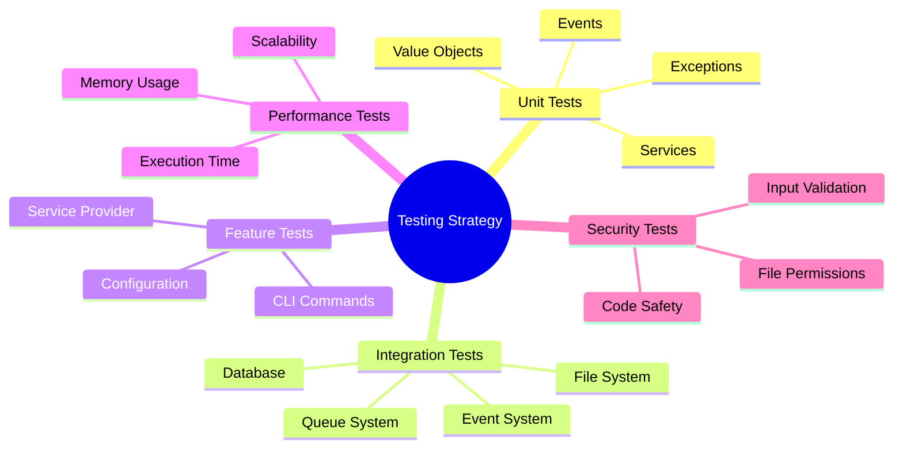
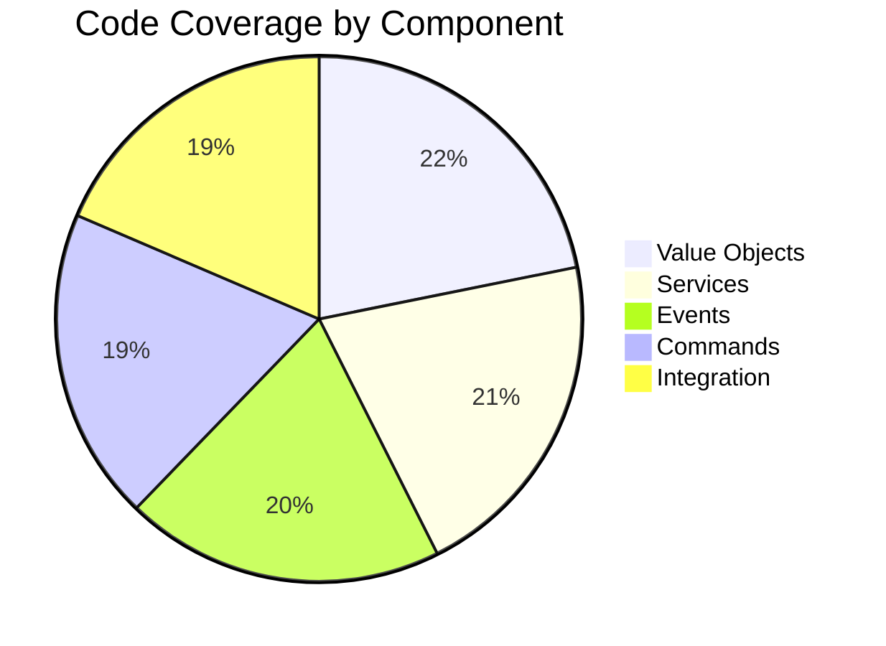

# Testing and Quality

## 8.1. Testing Strategy

### Test Categories



### Test Structure

```
tests/
├── Feature/
│   ├── GenerateModelsCommandTest.php
│   └── ModelGeneratorServiceProviderTest.php
├── Integration/
│   ├── DatabaseIntegrationTest.php
│   ├── QueueProcessingTest.php
│   ├── SecurityTest.php
│   └── PerformanceTest.php
├── Unit/
│   ├── Config/
│   │   └── ModelGeneratorConfigTest.php
│   ├── Domain/
│   │   └── ValueObjects/
│   │       ├── TableDefinitionTest.php
│   │       └── RelationshipDefinitionTest.php
│   ├── Services/
│   │   ├── SchemaAnalyzerTest.php
│   │   └── CodeGeneratorTest.php
│   └── Events/
│       └── ModelGenerationProgressEventTest.php
└── TestCase.php
```

## 8.2. Test Coverage

### Coverage Requirements

| Component           | Min Coverage | Target Coverage |
|--------------------|--------------|-----------------|
| Value Objects      | 100%         | 100%           |
| Services           | 90%          | 95%            |
| Event Handlers     | 85%          | 90%            |
| Commands           | 85%          | 90%            |
| Integration Points | 80%          | 85%            |

### Running Tests

```bash
# Run all tests
composer test

# Run with coverage report
composer test:coverage

# Run mutation tests
composer test:mutation

# Run specific test suite
composer test -- --testsuite=Unit
```

### Coverage Report Example



## 8.3. Performance Testing

### Memory Usage Benchmarks

```php
use SAC\EloquentModelGenerator\Tests\Benchmarks\MemoryBenchmark;

class MemoryTest extends TestCase
{
    public function testMemoryUsage(): void
    {
        $benchmark = new MemoryBenchmark();

        $result = $benchmark->measureMemoryUsage(function () {
            return $this->generator->generate(['users', 'posts']);
        });

        expect($result->peakMemory)->toBeLessThan(100 * 1024 * 1024); // 100MB
        expect($result->averageMemory)->toBeLessThan(50 * 1024 * 1024); // 50MB
    }
}
```

### Performance Metrics

```php
use SAC\EloquentModelGenerator\Tests\Benchmarks\PerformanceBenchmark;

class PerformanceTest extends TestCase
{
    public function testGenerationSpeed(): void
    {
        $benchmark = new PerformanceBenchmark();

        $result = $benchmark->measureExecutionTime(function () {
            return $this->generator->generate(['users', 'posts']);
        });

        expect($result->duration)->toBeLessThan(5.0); // 5 seconds
        expect($result->tablesPerSecond)->toBeGreaterThan(10.0); // 10 tables/sec
    }
}
```

## 8.4. Security Testing

### Input Validation Tests

```php
class SecurityTest extends TestCase
{
    public function testInputValidation(): void
    {
        $maliciousInput = [
            '"; DROP TABLE users; --',
            '../../../etc/passwd',
            'users; DELETE FROM users; --',
        ];

        foreach ($maliciousInput as $input) {
            expect(fn () => $this->generator->generate([$input]))
                ->toThrow(InvalidConfigurationException::class);
        }
    }
}
```

### File System Security

```php
class FileSystemSecurityTest extends TestCase
{
    public function testFilePermissions(): void
    {
        $result = $this->generator->generate(['users']);

        foreach ($result->generatedFiles as $file) {
            expect(fileperms($file) & 0777)->toBe(0644);
        }

        expect(fileperms($this->outputPath) & 0777)->toBe(0755);
    }
}
```

### Code Safety Tests

```php
class CodeSafetyTest extends TestCase
{
    public function testCodeInjectionPrevention(): void
    {
        $this->createTable('malicious_table', [
            'id' => 'id',
            'name' => "string'; system('rm -rf /'); '",
        ]);

        $result = $this->generator->generate(['malicious_table']);

        expect(file_get_contents($result->generatedFiles[0]))
            ->not->toContain("system(")
            ->not->toContain("exec(")
            ->not->toContain("shell_exec(");
    }
}
```

## Quality Tools Configuration

### PHPStan Configuration

```yaml
# phpstan.neon
parameters:
    level: 8
    paths:
        - src
        - tests
    excludePaths:
        - tests/temp/*
    checkMissingIterableValueType: false
```

### PHP-CS-Fixer Configuration

```php
// .php-cs-fixer.php
$config = new PhpCsFixer\Config();
return $config
    ->setRules([
        '@PSR12' => true,
        'strict_param' => true,
        'array_syntax' => ['syntax' => 'short'],
        'ordered_imports' => ['sort_algorithm' => 'alpha'],
        'no_unused_imports' => true,
        'declare_strict_types' => true,
    ])
    ->setFinder(
        PhpCsFixer\Finder::create()
            ->in([
                __DIR__ . '/src',
                __DIR__ . '/tests',
            ])
    );
```

### Infection Configuration

```json
{
    "source": {
        "directories": [
            "src"
        ]
    },
    "logs": {
        "text": "infection.log",
        "html": "infection.html",
        "summary": "summary.log"
    },
    "mutators": {
        "@default": true
    },
    "testFramework": "pest"
}
```

[← Back to Advanced Usage](./advanced-usage.md) | [Continue to Development Workflow →](./development-workflow.md)
