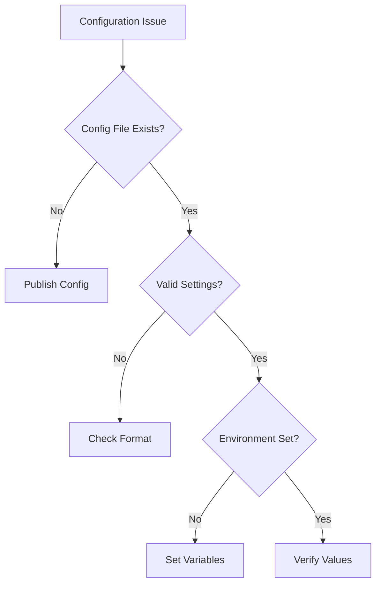
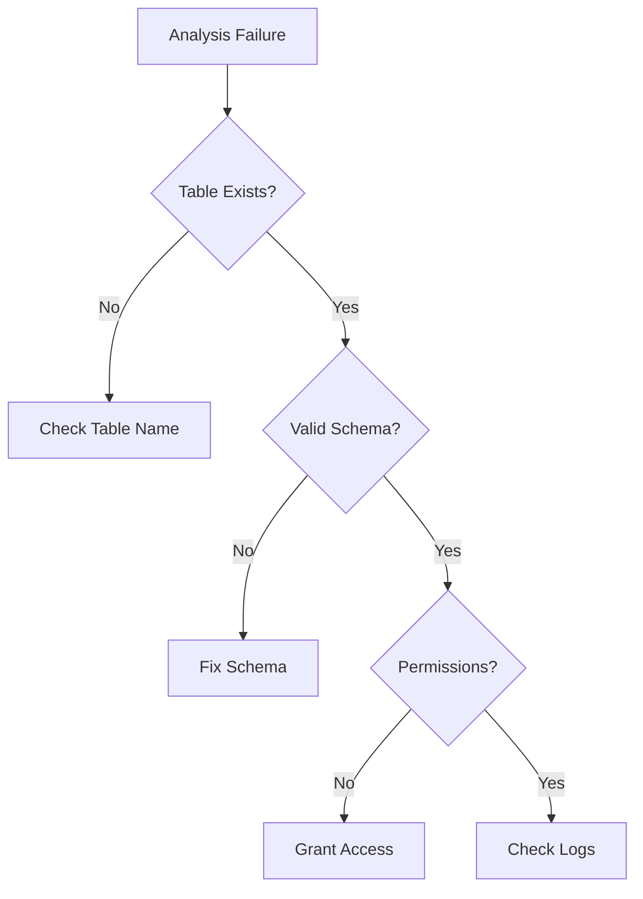
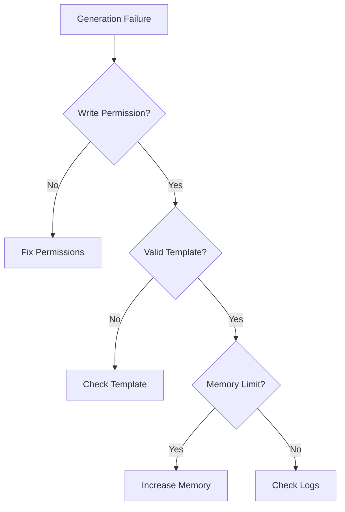
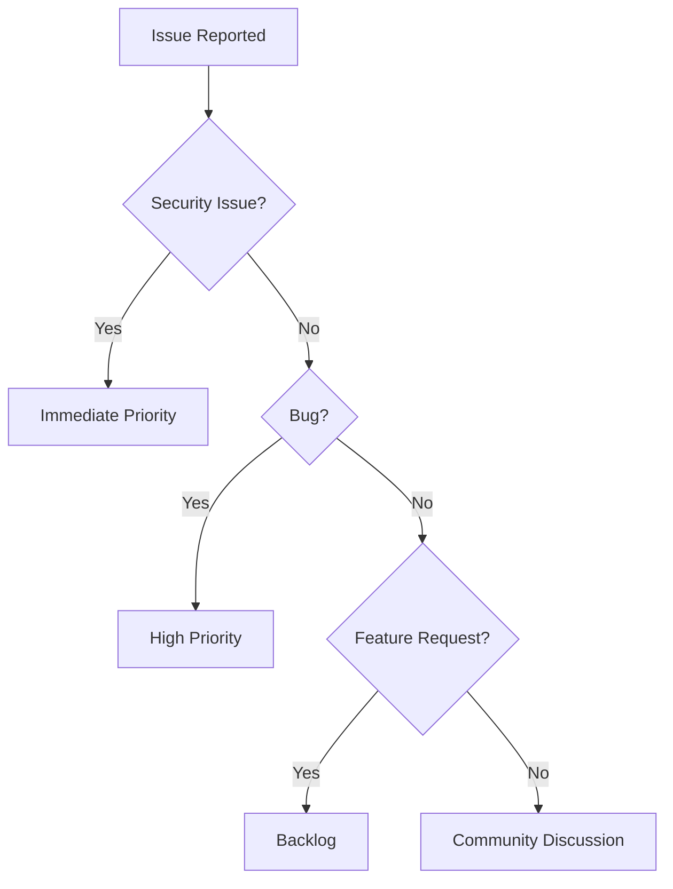

# Troubleshooting

## 10.1. Common Issues

### Installation Issues

| Issue | Possible Cause | Solution |
|-------|---------------|----------|
| Composer install fails | PHP version mismatch | Ensure PHP 8.2+ is installed |
| Package not found | Invalid repository URL | Verify composer.json configuration |
| Dependency conflicts | Incompatible packages | Check package version constraints |

### Configuration Issues



#### Common Configuration Errors

1. **Invalid Database Configuration**

```php
// Incorrect
'database' => [
    'driver' => 'mysql', // Wrong driver
],

// Correct
'database' => [
    'driver' => 'sqlite',
    'database' => database_path('database.sqlite'),
],
```

2. **Invalid Namespace Configuration**

```php
// Incorrect
'namespace' => 'App/Models', // Wrong separator

// Correct
'namespace' => 'App\\Models',
```

### Generation Issues

#### Table Analysis Failures



Common Analysis Errors:

```php
try {
    $generator->analyzeTables();
} catch (SchemaAnalysisException $e) {
    match ($e->getCode()) {
        1001 => 'Table does not exist',
        1002 => 'Invalid column type',
        1003 => 'Missing primary key',
        1004 => 'Circular reference detected',
        default => 'Unknown error',
    };
}
```

#### Code Generation Failures



## 10.2. Error Messages

### Error Categories

1. **Configuration Errors**

```php
InvalidConfigurationException: Missing required option: database_path
Solution: Ensure database path is set in config or .env
```

2. **Schema Analysis Errors**

```php
SchemaAnalysisException: Failed to analyze table 'users': Invalid column type
Solution: Verify table schema and supported column types
```

3. **Generation Errors**

```php
ModelGenerationException: Failed to generate model for table 'posts'
Solution: Check file permissions and template validity
```

### Debug Mode

Enable debug mode for detailed error information:

```php
// config/model-generator.php
return [
    'debug' => true,
    'logging' => [
        'level' => 'debug',
        'separate_channel' => true,
    ],
];
```

## 10.3. Debug Mode

### Enabling Debug Output

```bash
# Via environment variable
MODEL_GENERATOR_DEBUG=true php artisan model:generate

# Via configuration
php artisan model:generate --debug
```

### Debug Information

```php
[
    'context' => [
        'table' => 'users',
        'operation' => 'analysis',
        'timestamp' => '2025-02-24 23:43:46',
    ],
    'memory' => [
        'current' => '24.5 MB',
        'peak' => '32.1 MB',
    ],
    'timing' => [
        'start' => 1708816426.123,
        'end' => 1708816426.456,
        'duration' => 0.333,
    ],
    'stack_trace' => [
        // Stack trace information
    ],
]
```

## 10.4. Support Channels

### Getting Help

1. **GitHub Issues**
   - Report bugs
   - Request features
   - Ask questions

2. **Documentation**
   - [Online Documentation](https://s-a-c.github.io/eloquent-model-generator)
   - [API Reference](https://s-a-c.github.io/eloquent-model-generator/api)

3. **Community Support**
   - [Laravel Forums](https://laravel.io/forum)
   - [Stack Overflow](https://stackoverflow.com/questions/tagged/eloquent-model-generator)

### Reporting Issues

When reporting issues, include:

```markdown
### Environment
- PHP Version: 8.2.x
- Laravel Version: 10.x
- Package Version: 1.x
- Database Type: SQLite
- Operating System: Linux/macOS/Windows

### Description
A clear description of the issue

### Steps to Reproduce
1. Step one
2. Step two
3. Step three

### Expected Behavior
What you expected to happen

### Actual Behavior
What actually happened

### Additional Information
- Error messages
- Stack traces
- Configuration
- Database schema
```

### Support Policy



[← Back to Development Workflow](./development-workflow.md) | [Continue to Contributing →](./contributing.md)
