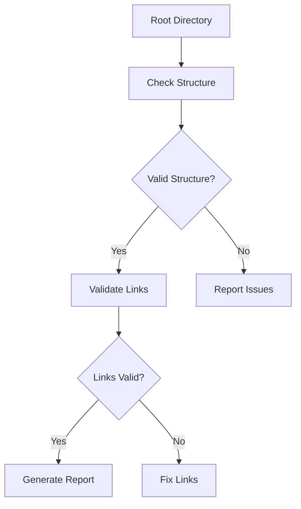
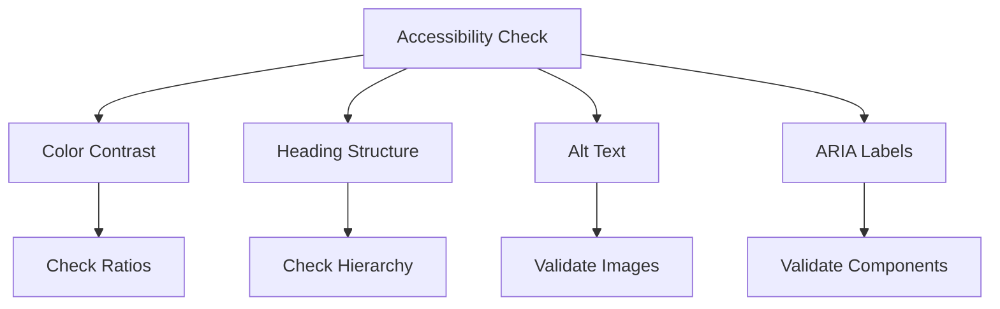
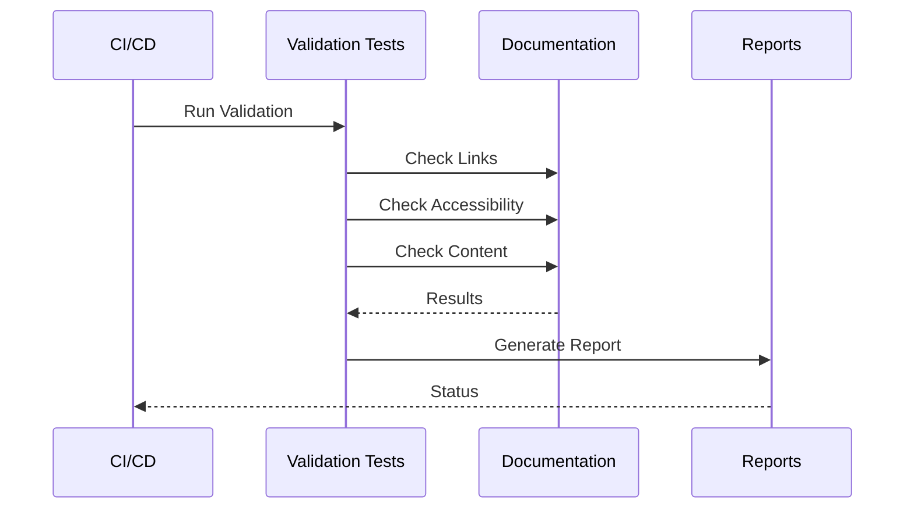

# Documentation Validation Framework

## Overview

This framework ensures documentation quality through automated validation of links, accessibility, and content completeness.

## Link Validation

### Directory Structure Validation



### Required Files

```json
{
    "required_files": {
        "root": [
            "index.md",
            "README.md"
        ],
        "sections": [
            "architecture/index.md",
            "implementation/index.md",
            "api/index.md",
            "guides/index.md",
            "testing/index.md"
        ],
        "styles": [
            "styles/index.md",
            "styles/color-system.md",
            "styles/typography.md"
        ]
    }
}
```

### Link Patterns

| Pattern | Example | Validation Rule |
|---------|---------|----------------|
| Section Links | `[Architecture](../architecture/index.md)` | Must exist, relative path |
| API Links | `[API Reference](../api/index.md#methods)` | Must exist, valid anchor |
| External Links | `[Laravel](https://laravel.com)` | Must be reachable |
| Asset Links | `` | Must exist, valid image |

## Accessibility Validation

### WCAG 2.1 Compliance



### Color Contrast Requirements

| Element | Minimum Ratio | Target Ratio |
|---------|--------------|--------------|
| Normal Text | 4.5:1 | 7:1 |
| Large Text | 3:1 | 4.5:1 |
| UI Components | 3:1 | 4:1 |

### Heading Structure Rules

```markdown
# Page Title (H1)
## Major Section (H2)
### Subsection (H3)
#### Detail Section (H4)
##### Minor Detail (H5)
###### Fine Detail (H6)
```

## Content Validation

### Required Sections

```json
{
    "section_requirements": {
        "api": {
            "required": [
                "Overview",
                "Methods",
                "Parameters",
                "Returns",
                "Examples"
            ]
        },
        "implementation": {
            "required": [
                "Prerequisites",
                "Installation",
                "Configuration",
                "Usage"
            ]
        }
    }
}
```

### Content Quality Rules

| Aspect | Rule | Validation |
|--------|------|------------|
| Headers | Follow hierarchy | Automated check |
| Code Blocks | Language specified | Syntax check |
| Links | No dead links | Link checker |
| Images | Alt text present | Accessibility check |

## Automated Testing

### Test Suite Structure

```php
namespace SAC\DocsValidation\Tests;

class DocumentationTest extends TestCase
{
    public function testLinkValidity(): void
    {
        $validator = new LinkValidator();
        $results = $validator->validateAll();

        expect($results->broken)->toBeEmpty();
        expect($results->invalid)->toBeEmpty();
    }

    public function testAccessibility(): void
    {
        $checker = new AccessibilityChecker();
        $results = $checker->checkAll();

        expect($results->contrastIssues)->toBeEmpty();
        expect($results->structureIssues)->toBeEmpty();
    }
}
```

### Validation Pipeline



## Quality Gates

### Documentation Quality Score

```typescript
interface QualityScore {
    links: {
        valid: number;
        total: number;
        score: number;
    };
    accessibility: {
        contrast: number;
        structure: number;
        score: number;
    };
    content: {
        coverage: number;
        completeness: number;
        score: number;
    };
    overall: number;
}
```

### Minimum Requirements

| Component | Minimum Score | Target Score |
|-----------|--------------|--------------|
| Links | 95% | 100% |
| Accessibility | 90% | 100% |
| Content | 85% | 95% |
| Overall | 90% | 98% |

## Reporting

### Validation Report

```json
{
    "validation_results": {
        "timestamp": "2025-02-25T00:57:04Z",
        "summary": {
            "total_files": 45,
            "total_links": 312,
            "broken_links": 0,
            "accessibility_issues": 0,
            "content_issues": 0
        },
        "details": {
            "links": [
                {
                    "file": "api/index.md",
                    "links": 23,
                    "valid": 23
                }
            ],
            "accessibility": [
                {
                    "file": "styles/color-system.md",
                    "contrast_ratio": "7.1:1",
                    "status": "pass"
                }
            ]
        }
    }
}
```

[← Back to Documentation](../index.md) | [Continue to Testing →](../testing/index.md)
